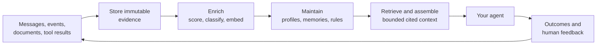

# Memseek

**The declarative context engine for AI agents.**

Memseek turns the messages, events, documents, tool results, and outcomes your
application records into the **current, cited, and budgeted context** an agent
needs for the task in front of it. It combines durable agent memory, retrieval,
maintained state, and prompt assembly in one self-hosted system.

> **Building an agent that should remember decisions instead of rediscovering
> them every session?** Run the included agent-memory design locally, point your
> agent at its MCP endpoint, and trace every memory back to the evidence that
> produced it.

[Try it locally](#try-it-locally) · [Read the docs](https://memseekai.github.io/memseek/) · [Explore the agent-memory example](https://memseekai.github.io/memseek/agent-memory-example/) · [Visit memseek.ai](https://memseek.ai)

## Why Memseek?

RAG can find a relevant old document. A memory store can retain facts. Memseek
goes one step further: it continuously decides what an agent should know **now**
from changing evidence you control.

Use it when an agent needs to carry useful context across conversations, actions,
and time without relying on an ever-growing prompt or opaque summaries. For
example:

- A coding agent remembers project decisions, deployment constraints, and what
  changed since the last session.
- A customer assistant maintains a current, evidence-backed profile from CRM,
  support, and product events.
- An operations or research agent retrieves the relevant history and receives a
  bounded briefing for one task.
- A review workflow turns outcomes and corrections into proposed, auditable
  updates to a procedure or policy.

## What you get

- **Durable, cited memory.** Store immutable source records and require derived
  claims to cite the records that support them.
- **Current state that maintains itself.** Use versioned derivations to turn a
  stream of evidence into profiles, scenes, reflections, and other live state.
- **Retrieval you can trust.** Search candidates are rechecked against canonical
  PostgreSQL data, scopes, and typed filters before they are returned.
- **Prompt-ready context.** Render deterministic context artifacts with explicit
  token budgets, stable content hashes, and the inputs that produced them.
- **A controlled agent surface.** Expose only the views, artifacts, answers,
  record reads, and ingest operations you declare through MCP.
- **Versioned memory designs.** Describe collections, processors, derivations,
  views, artifacts, and MCP tools in reviewable YAML packages.

## How it works



Your application owns its business logic, permissions, and actions. Memseek owns
the memory layer: it records evidence, runs the catalog you publish, maintains
derived state, and serves context through the Python SDK, HTTP API, or MCP.

The key concepts are intentionally small:

| Concept | Purpose |
| --- | --- |
| **Record** | An immutable observation or a version of a named current value. |
| **Collection** | A versioned schema and processing policy for records. |
| **Processor** | Enriches a record or derives cited records from bounded input. |
| **Derivation** | A declared process that keeps state current as new evidence arrives. |
| **View** | A typed, versioned query an application or agent can use. |
| **Artifact** | A deterministic, task-specific context render under a token budget. |
| **Package** | The versioned YAML catalog that ties the design together. |

Read [Core concepts](https://memseekai.github.io/memseek/concepts/) for the full
model and [the glossary](https://memseekai.github.io/memseek/glossary/) for the
vocabulary.

## Try it locally

The quickest path runs a complete local stack: PostgreSQL with pgvector, the
Memseek API, a background worker, and the included four-layer agent-memory
catalog. Docker is the only runtime requirement; the example catalog uses a
real OpenAI-compatible model for embeddings and memory derivations.

**You need:** Docker with Compose and an `OPENAI_API_KEY` with access to the
models named in `examples/agent_memory_catalog/conf/models.yaml`.

Clone the repository:

```console
git clone https://github.com/memseekai/memseek.git
cd memseek
```

Add your `OPENAI_API_KEY` to a `.env` file in the repository root. Docker
Compose reads this file automatically. Then start the stack:

```console
make up

export MEMSEEK_URL=http://127.0.0.1:8000
export MEMSEEK_API_KEY="$(cat .memseek/api_key)"
make tools
```

`make up` builds and starts the service, creates an isolated local workspace,
writes its API key to `.memseek/api_key`, and publishes `agent_memory@0.3.0`.
`make tools` prints the exact MCP tools that catalog makes available.

The stack is ready at:

```text
API  http://127.0.0.1:8000
MCP  http://127.0.0.1:8000/mcp
```

To follow background processing, run `make logs`. To stop the stack while
keeping the local data, run `make down`; use `make down CLEAN=1` only when you
want to remove the local database volume and workspace key.

For the guided, end-to-end first run—including a real record, derived memory,
retrieval, and a rendered briefing—follow
[Getting started](https://memseekai.github.io/memseek/getting-started/).

## Connect an agent

The starter catalog exposes a deliberately narrow agent-memory interface over
MCP. It can render task context, recall memory, list standing rules, replay a
conversation, append source messages, open cited records, and answer questions
from memory.

### Codex and other MCP clients

With the local stack running:

```console
codex mcp add memseek \
  --url "$MEMSEEK_URL/mcp" \
  --bearer-token-env-var MEMSEEK_API_KEY
```

For remote deployment, serve the endpoint over HTTPS and keep the workspace key
in an environment variable rather than in configuration files. See the
[MCP guide](https://memseekai.github.io/memseek/mcp/) for client configuration,
transport details, and production proxy requirements.

### Claude Code

The included Claude Code plugin captures project context across sessions and
supplies a bounded memory brief automatically. It is a good place to experience
the intended loop: state a project rule today, start a new session later, and
ask Claude to show the source that supports the remembered rule.

Follow the
[Claude Code plugin guide](https://memseekai.github.io/memseek/claude-code-plugin/)
for the installation and verification steps.

## Build your own memory design

The bundled catalog is an example, not a fixed product model. Replace it with a
YAML package that describes the memory your application needs:

```text
catalog/
├── collections/   # What enters memory and its schema
├── conf/          # Model aliases, processors, ranking, search profiles
├── derivations/   # How evidence becomes maintained state
├── views/         # Typed retrieval contracts
├── artifacts/     # Task-specific context formats
├── mcp/           # The only tools an MCP client can call
└── packages/      # The versioned package manifest
```

Publish a package atomically to a workspace. Every request then resolves against
that exact catalog, so schemas, processing rules, retrieval contracts, and the
agent tool surface move together.

Start with
[Authoring a workspace catalog](https://memseekai.github.io/memseek/authoring-definitions/),
then use the
[CRM profile quickstart](https://memseekai.github.io/memseek/sdk-user-profile-quickstart/)
or [Generative Agents example](https://memseekai.github.io/memseek/generative-agents-example/)
as working patterns.

## Use it from your application

Memseek has an async Python SDK, a JSON HTTP API, and MCP. The SDK keeps common
operations compact while preserving the same workspace authentication and API
contracts:

```python
import os

from memseek.sdk import MemseekClient


async with MemseekClient(
    os.environ["MEMSEEK_URL"], os.environ["MEMSEEK_API_KEY"]
) as memory:
    await memory.records.ingest(
        collection="messages",
        entity="project:apollo",
        type="message",
        text="Never deploy billing changes without explicit approval.",
        content={
            "text": "Never deploy billing changes without explicit approval.",
            "role": "user",
            "session_id": "planning-01",
            "ordinal": 0,
        },
        dedupe_key="planning-01:0",
    )

    context = await memory.render_artifact(
        "agent_context",
        entity="project:apollo",
        task="Plan the next billing deployment.",
        skill="skill:billing",
    )
```

New records may be temporarily `ready: false` while required enrichment runs.
They are stored immediately, but they do not enter search or trigger derivations
until the worker has completed the declared processing. This prevents an agent
from acting on half-processed memory.

See the [Python SDK guide](https://memseekai.github.io/memseek/sdk/) and
[HTTP API guide](https://memseekai.github.io/memseek/api-surface/) for complete
request and response examples.

## Trust, review, and operations

Memseek is designed for agents whose context should be inspectable:

- PostgreSQL is canonical; vector and other indexes are disposable projections.
- Derived records carry provenance, allowing a conclusion to be traced back to
  supporting records.
- Keyed current state preserves superseded history instead of silently editing
  it away.
- Context artifacts record their definition and input identities, making a past
  render reproducible and reviewable.
- Erasure follows provenance from selected evidence to affected derived records.
- Workspace bearer keys are secrets. Keep them out of source control and use
  TLS for any Internet-facing API or MCP endpoint.

Read [Operations](https://memseekai.github.io/memseek/operations/),
[Changing definitions](https://memseekai.github.io/memseek/changing-definitions/),
and [Artifact uses & feedback](https://memseekai.github.io/memseek/artifact-uses/)
before operating a long-lived or Internet-facing deployment.

## Documentation map

| If you want to… | Start here |
| --- | --- |
| Run a local example | [Getting started](https://memseekai.github.io/memseek/getting-started/) |
| Understand the data model | [Core concepts](https://memseekai.github.io/memseek/concepts/) |
| Define collections and derivations | [Authoring definitions](https://memseekai.github.io/memseek/authoring-definitions/) |
| Add retrieval and prompt context | [Views & search](https://memseekai.github.io/memseek/views-search/) and [Artifacts](https://memseekai.github.io/memseek/artifacts/) |
| Connect an agent through MCP | [MCP](https://memseekai.github.io/memseek/mcp/) |
| Give Claude Code project memory | [Claude Code plugin](https://memseekai.github.io/memseek/claude-code-plugin/) |
| Use the SDK or HTTP API | [SDK](https://memseekai.github.io/memseek/sdk/) and [API surface](https://memseekai.github.io/memseek/api-surface/) |
| Operate and evolve a catalog | [Operations](https://memseekai.github.io/memseek/operations/) and [Changing definitions](https://memseekai.github.io/memseek/changing-definitions/) |

The complete documentation site is available at
[memseekai.github.io/memseek](https://memseekai.github.io/memseek/). To preview
it from this checkout, run `uv sync --frozen --all-groups` and then `make docs`.

## Develop and contribute

Requirements for local Python development are Python 3.14.6, `uv`, and Docker
with Compose for the isolated PostgreSQL/pgvector test service.

```console
uv sync --frozen --all-groups
make test
```

Useful commands:

| Command | Purpose |
| --- | --- |
| `make up` | Start the complete local service and publish the starter catalog. |
| `make tools` | Inspect the MCP tools available from that catalog. |
| `make logs` | Follow API and worker logs. |
| `make lint` | Check formatting and lint rules. |
| `make typecheck` | Type-check `src/` and `tests/`. |
| `make test` | Run the complete local verification suite. |
| `make e2e` | Run the focused HTTP and worker smoke test. |
| `make docs` | Serve the documentation site locally. |

Before proposing a substantial change, open an issue describing the problem and
the expected behavior. Never include API keys, workspace tokens, or private
record content in issues, logs, or pull requests.

## License

Memseek is licensed under the [Apache License 2.0](LICENSE).
