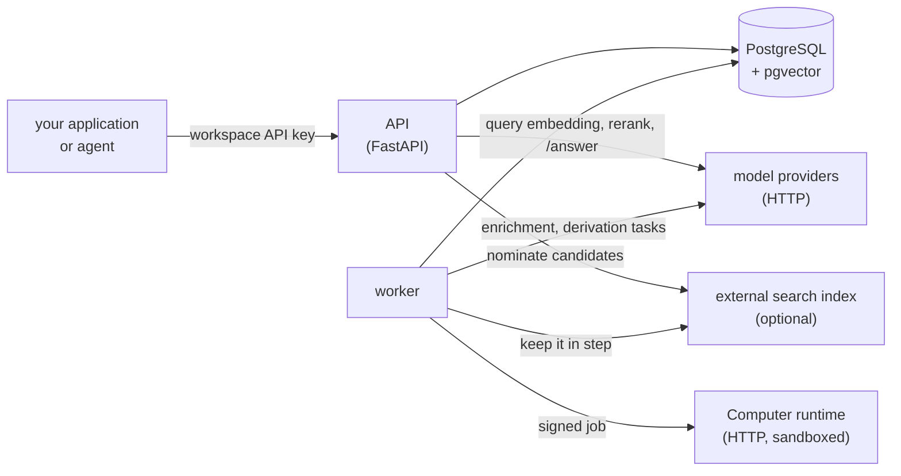
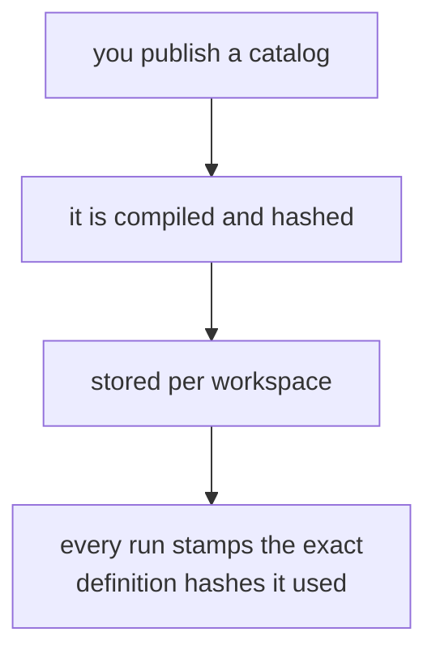
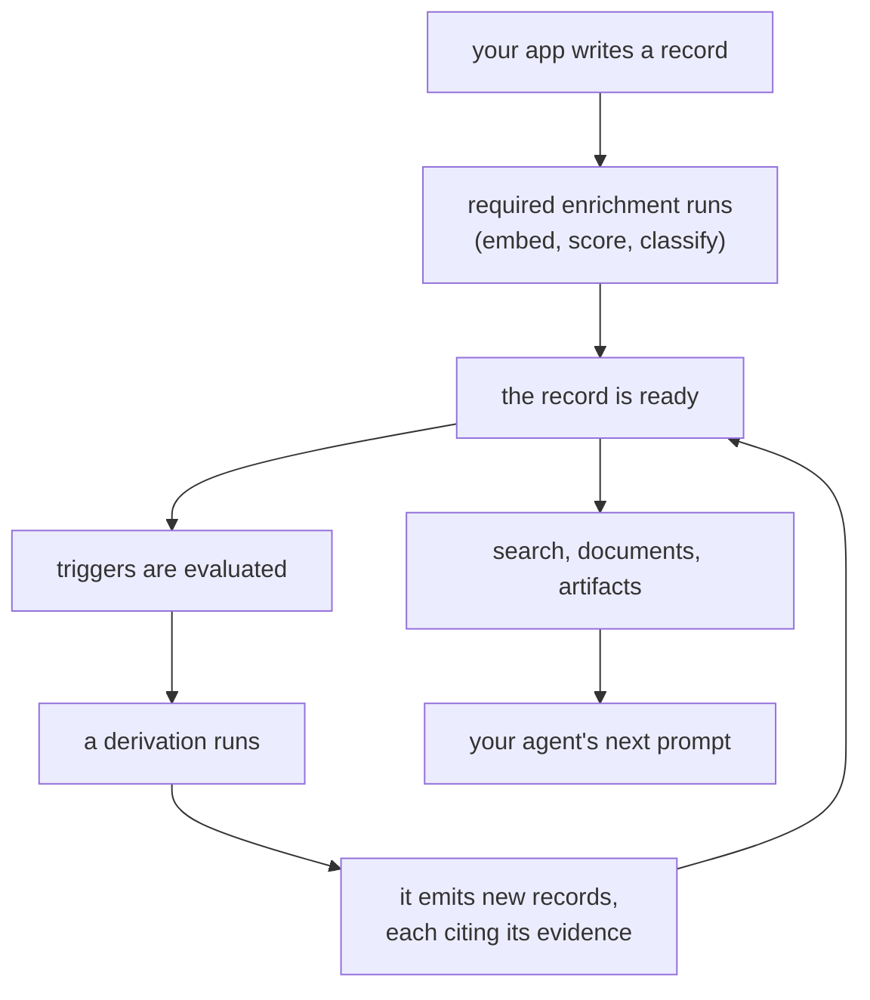

This page is the map. Not the vocabulary ([Core concepts](concepts.md) has
that), and not the YAML ([Catalog layout](catalog-layout.md) has that) — just
the shape of the running system: which processes exist, what each one owns,
what crosses the wires between them, and which of them are trusted.

## The whole system in one picture

Everything durable is in PostgreSQL. Everything else is replaceable: kill the
API and the worker mid-flight and nothing is lost, because no step keeps state
in a process.

**Both processes call the model providers, for different work.** The worker does
the bulk of it — embedding and scoring each record it enriches, and running the
model tasks inside derivations. The API's calls happen per request, on the read
side: embedding a search query for vector or hybrid search, the optional rerank
of a candidate prefix, and `POST /answer`. Rendering an artifact calls no model
at all; it is deterministic assembly from records.

This has one operational consequence. Records are embedded by the worker and
queries by the API, so **both processes must run against the same provider**.
Pointing one at a real provider and the other at `LLM_FAKE=1` produces vectors
from two unrelated spaces, and search silently stops returning meaningful
results.

**The external search index is read by the API and written by the worker.** A
search asks it for candidate IDs; projection jobs keep it in step as records
change. With the default `pg` backend there is no separate service at all —
pgvector is the index, and that node collapses into the database.

## The processes you run

| Process | What it owns | State | How many |
| --- | --- | --- | --- |
| **PostgreSQL** (with `pgvector`) | Every record, every job, every run and journal. The source of truth. | All of it | One (your database, however you run it) |
| **API** (`uvicorn memseek.api:app`) | The request surface: writes, reads, search, artifact rendering, catalog publishing, invocation control. Also serves [MCP](mcp.md) at `/mcp`. | None | As many as you like, behind a load balancer |
| **worker** (`memseek worker`) | Everything that happens *without* a request: enrichment, triggers, derivations, cron, durable invocations, retention, index maintenance. | None | One or more; they share work through the job table |
| **Computer runtime** (optional) | Executing catalog-authored code and agent loops, in a sandbox. | Per-session workspace files | One deployment, only if your catalog has [Computers](computers.md) |

The API and the worker are the same package with different entry points. They
read the same settings, compile the same catalogs, and neither one is "the
master" — they coordinate exclusively through rows in PostgreSQL.

## The two things a workspace is made of

A **workspace** is the isolation unit: one API key, one catalog, one island of
records. Inside it there are exactly two kinds of thing.

**Records** — immutable rows. Every observation, every conclusion, every draft
proposal is a record. Nothing is edited in place: a newer version of a fact is a
*new record* that names what it superseded and the evidence it used.

**The catalog** — the YAML you publish (`POST /catalog`, or `catalog.publish` in
the SDK). It declares what kinds of records exist, how they are enriched, what
should run when something arrives, how prompts are assembled, and what an agent
may be offered. It is *data in the database*, not code you deploy — which is why
two workspaces on the same server can run completely different designs, and why
one of them changing its mind never touches the other.

Because those hashes are stamped into every run, a record written years ago can
still name the exact version of the definition that produced it.

## The loop

One sentence: **a record arrives, the worker notices, something runs, and new
records come out that cite the old ones.**

Two properties hold at every step:

- **Nothing is silently overwritten.** Supersession is recorded, not applied.
- **Nothing is uncited.** A derived record names the records it was built from,
  so any conclusion opens back to the raw evidence underneath it.

## Inside the worker

The worker runs one **pass** over and over. A pass is a fixed set of *lanes*,
each of which claims a bounded amount of work and returns. A lane that fails
does not stop the others, and nothing is scheduled in-process — everything is a
row in the `job` table.

| Lane | Job kind | What it does |
| --- | --- | --- |
| Enrichment | *(no job; a sweep)* | Embeds and scores newly written records, then marks them ready — which is what makes triggers fire |
| Cron | `cron_scan` | Wakes scheduled derivations for the entities that are due |
| Derivations | `derive` | Runs one entity-scoped pipeline: gather evidence, run its tasks, emit |
| Invocations | `invocation` | Advances one durable Agent run by a turn |
| Projections | `index_upsert`, `index_delete` | Keeps the search projection in step with the records |
| Retention | `retention_purge` | Applies retention policy |
| Backfill | `annotation_backfill` | Applies a new processor to records that already exist |

Jobs are claimed with a **lease**, heartbeated while running, retried a bounded
number of times, and dead-lettered after that. Five workers divide the work
between them without coordination; if one dies mid-job, its lease expires and
another picks the job up. Scaling out is starting another worker.

## Where state lives

The canonical schema is small enough to hold in your head:

| Table | Holds |
| --- | --- |
| `workspace` | The isolation unit and its API key hash |
| `record` | Everything remembered — content, scores, status, `derived_from`, the run that wrote it |
| `record_embedding` | Vectors, per embedding *space*, so a re-embedding can be staged before cutover |
| `cursor` | How far each consumer has read, per entity — what makes derivations incremental |
| `job` | The queue |
| `workspace_catalog` | Each workspace's published, compiled catalog |
| `artifact_use` | The handle connecting a rendered prompt to what happened next |
| `computer_session`, `invocation`, `invocation_event`, `invocation_memory_node`, `invocation_artifact` | Durable agent runs: the session, its status, its ordered journal, its receipts, its preserved files |

Two things that are *not* separate state: audited **runs** are records too (in a
`_system` collection), and the **search index**, if you use an external one, is
disposable — it only nominates candidates, and every hit is re-checked against
PostgreSQL before you see it. You can drop and rebuild it at any time.

## The four places code can run

Extending Memseek means four different things, and they run in two different
places under two different trust levels.

| You write… | Where it runs | Trusted? | Use it for |
| --- | --- | --- | --- |
| A **processor** (`conf/processors.yaml`) | In the API/worker process | Yes — it is your deployment's code | Scoring, embedding, classifying each record as it arrives |
| A **derivation task** (`use: llm`, or an installed custom task) | In the worker process | Yes — it is your deployment's code | One bounded model call, or your own Python over evidence |
| A **Program** (`programs/*.yaml`) | In the Computer runtime | **No** | Deterministic code that ships *in the catalog* |
| An **Agent** (`agents/*.yaml`) | In the Computer runtime | **No** | A model that works: several steps, files, tools |

The dividing line is not what the code can do; it is who wrote it. A custom task
is Python installed in your own deployment, reviewed and shipped like any other
part of it. A Program is JavaScript inside a YAML file, and catalogs are
published over HTTP by anyone holding a workspace API key. Code that arrives
that way cannot run in the process that holds the database connection, so it
runs in the sandbox instead.

## The trust boundary

Four wires cross into or out of Memseek, and each is authenticated differently.

| Wire | Who authenticates | With what |
| --- | --- | --- |
| your app → API | The caller | A workspace API key. It scopes everything to one workspace; there is no cross-workspace read. |
| Memseek → model provider | Memseek | A credential named by the catalog (`api_key_env`) and read from the environment. The key never lives in the catalog. |
| Memseek → Computer runtime | Both, by shared secret | HMAC over the exact request bytes plus a timestamp, ±300 s. The runtime gets **no** database access and **no** workspace key. |
| records → prompts | Nobody — it is data | Retrieved text is escaped and fenced as untrusted. Only versioned instruction artifacts are authoritative. |

One rule governs the Computer runtime in particular: **its answer is a claim,
not a fact.** Before anything is written, Memseek re-checks that

- every citation is inside the evidence that run was given,
- the value matches the schema the catalog declared,
- the output is under its byte and step limits, and
- every file written back landed on a path declared in advance — with a matching
  size and hash.

If any of those fails, the run fails and nothing is written. This is why an
Agent can be given a filesystem and a tool loop without being given trust.

## Three request paths, end to end

**A write.** `POST /records` validates against the collection schema and inserts
immutably → the worker's enrichment lane embeds and scores it → the record is
marked ready → triggers are evaluated → a `derive` job is enqueued → the
derivation runs and emits cited records → those are enriched too, and can
trigger the next thing.

**A read.** `POST /search` or `GET /document` resolves against the workspace's
catalog, asks the search backend for candidates, re-checks them against
PostgreSQL, ranks them with the rank expression, and returns. An artifact render
does the same and then packs the result into a template under a token budget,
returning a **manifest** of exactly which record IDs went in.

**A durable invocation.** `POST /invocations` writes the session, the invocation,
a `queued` event, and a job → the worker claims it, renders the Agent's context
artifacts, and posts a signed job to the runtime → the runtime returns a value,
citations, and a receipt → Memseek re-checks it, ingests any declared writeback,
appends `completed` to the journal, and stores the result artifact. If the
runtime instead returns `awaiting_input`, the invocation parks as a row and
waits — indefinitely, across restarts — until someone posts a turn.

## What Memseek is not

Memseek is not an agent framework. The division of labour is:

| Your application | Memseek |
| --- | --- |
| Decides what to do, and when | Stores what happened, immutably |
| Makes its own model calls for its own behavior | Enriches, derives, retrieves, assembles |
| Owns the user, the world, the clock | Owns provenance, versioning, and the audit trail |
| Reviews drafts and approves changes | Refuses to change behavior without that approval |

The generative half of an application — the dialogue, the decisions, the
personality — stays in your code. What Memseek replaces is the part every team
rebuilds badly: durable memory with citations, scheduled maintenance of derived
state, retrieval, prompt assembly under a budget, and a record of why the agent
believed what it believed.

## Where to go next

- The words used above, defined: [Core concepts](concepts.md)
- The files you write: [Catalog layout](catalog-layout.md)
- Running it for real: [Operations](operations.md)
- The sandbox in detail: [Computers, Programs & Agents](computers.md),
  [How a Computer stays trustworthy](computer-resources-and-durable-agents.md),
  and [The Cloudflare Computer runtime](computer-cloudflare.md)
- A working system, end to end: [Run an agent inside a Computer](computer-renewal-example.md)
