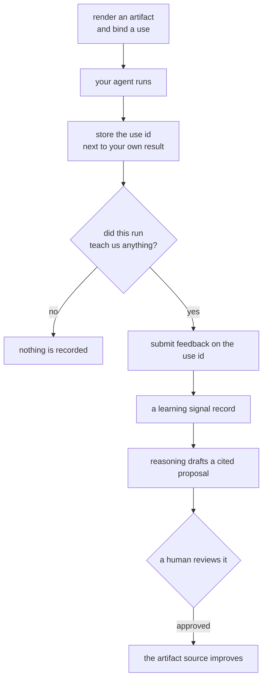

Memseek can always tell you which records and definitions produced a render.
What it cannot tell you on its own is what happened next: *this* render went
into *that* agent run, and the customer said the answer was wrong.

An **artifact use** is the small handle that closes that gap. Binding one
renders the artifact, resolves which maintained component feedback should
improve, and returns a short ID. Your application stores that ID next to its
own result — the way it already stores a payment-intent ID or a job ID — and
later hands it back with the outcome.

An artifact use is deliberately *not* an invocation. It does not claim a model
ran, and there is nowhere in it to put a prompt, a response, a tool call, a
token count, or a span. Execution observability belongs to your OpenTelemetry
backend. Memseek keeps only what should change future knowledge.

## The shape of the loop



Most runs end at "nothing is recorded", and that is intended. Only the few
outcomes that actually teach something become evidence.

Most runs never create a Memseek record. Binding a use is cheap; submitting
feedback is the deliberate act of saying "this one is worth learning from."

The one arrow that is not automatic is **route into evidence**: a signal is
recorded against the artifact that should improve, and getting it in front of the
derivation that improves it is an application decision.
[Getting signals to the derivation](#getting-signals-to-the-derivation-that-improves-the-skill)
explains why, and what your two options are.

The specification behind this page frames it as three evidence levels, and the
implementation keeps that split:

| Level | What you store | When |
| --- | --- | --- |
| Handle only | Bind a use; attach telemetry; stop | Every normal run |
| Learning signal | Handle plus a `learning_signals` record | The run taught something |
| Signal plus snapshot | Bind with `snapshot=True`, then the signal cites it | Regulated decisions, benchmarks, incidents, high-value corrections, sampled evaluations |

## Using a rendered artifact

The context manager binds once, keeps the correlation attributes active while
your own SDK call runs, and never inspects that call's request or response — so
it stays correct for any provider.

```python
handle = memseek.artifact("daily_agent_prompt")

async with handle.use({"entity": f"agent:{agent_id}", "task": message}) as use:
    response = await openai.responses.create(
        model="gpt-5",
        instructions=use.content,
        input=message,
    )

await messages.create(role="assistant", text=response.output_text, memseek_use_id=use.id)
```

`bind()` is the same operation without the telemetry scope, for runtimes that
own their own tracing:

```python
use = await handle.bind({"entity": f"agent:{agent_id}", "task": message})
result = await custom_runtime.execute(use.content)
```

### What a bind gives you back

`BoundArtifact` is a frozen dataclass:

| Attribute | Type | What it is |
| --- | --- | --- |
| `id` | `str` | The use ID — the one field to persist beside your result |
| `content` | `str` | The rendered artifact, to pass to your own SDK |
| `artifact` | mapping | `{name, version, definition_hash}` of the artifact that rendered |
| `render_sha256` | `str` | Stable hash of the rendered bytes |
| `telemetry_attributes` | mapping | Reserved scalars, safe to put on a span |
| `snapshot_id` | `str \| None` | The snapshot record, when one was requested |
| `learning_target` | mapping \| `None` | The resolved improvement target (below) |
| `expires_at` | `str \| None` | When this handle stops accepting feedback |
| `truncated` | `bool` | Whether any block hit its token budget |

`truncated` is worth checking. A silently truncated block is exactly the
["artifact packing failure"](#what-this-loop-can-and-cannot-diagnose) case, and
it is not visible in the render text itself.

## Declaring what should learn

A composed prompt carries several maintained values — a policy, a skill, a
profile, retrieved history. When feedback arrives, which one should improve?
The client should not have to decide, so the artifact declares it:

This is the shipped `daily_agent_prompt`, trimmed to the parts that matter — it
composes a profile, a skill, a calendar, and retrieved memory, and declares that
feedback is about the skill:

```yaml
artifacts:
  - name: daily_agent_prompt
    version: 1
    kind: prompt
    lifecycle: live
    blocks:
      skill:
        document:
          entity: "{{entity}}"
          collections: [skills]
          status: active
        max_tokens: 4000
      # ... profile, calendar, and memory blocks
    learning:
      target_block: skill               # which block carries the target
      artifact: maintained_skill@1      # who owns its promotion lifecycle
```

Both fields are required when `learning` is present:

| Field | Rules |
| --- | --- |
| `target_block` | Names a block declared by this artifact. That block must be a `document` block, must read `status: active`, and must be `required: true`. |
| `artifact` | An exact `name@version` reference to an artifact with `lifecycle: reviewed` that maintains the target block's collections. The package must list it. |

### What resolution produces

At bind time Memseek resolves that declaration to the **exact keyed heads that
were in force** — their record IDs and the run that promoted them:

```json
{
  "artifact": {
    "name": "maintained_skill",
    "version": 1,
    "definition_hash": "3c21…",
    "kind": "skill"
  },
  "entity": "agent:ada",
  "block": "skill",
  "heads": [
    {"collection": "skills", "key": "steps",    "record_id": "…", "run_id": "…"},
    {"collection": "skills", "key": "pitfalls", "record_id": "…", "run_id": "…"},
    {"collection": "skills", "key": "examples", "record_id": "…", "run_id": "…"}
  ],
  "base_run_id": "…"
}
```

This is the part that makes delayed feedback actionable. A candidate must
replace the version that actually influenced the run, not whatever happens to
be active when the complaint arrives.

`base_run_id` is the single run shared by every head. One promotion writes
every head of a complete reviewed value, so a shared run *is* the exact base
version. Its edge cases are deliberate rather than incidental:

| Situation | Resolution | Why |
| --- | --- | --- |
| Every head shares one run | That run is `base_run_id` | They were promoted together, so there is one base |
| Heads carry different runs | `base_run_id: null`, `heads` still complete | They were not promoted together; naming one would be a guess |
| The target block read no head | `learning_target: null` for the whole use | No version was in force, so no signal may be attributed to one |
| The artifact declares no `learning` | `learning_target: null` | Feedback still records, routed to the artifact itself |

### Why the rules are what they are

Each constraint the loader enforces exists to keep a base version honest:

- **A document block, not a view block.** A view block is a ranked selection
  whose membership depends on scoring and budget. It is not a promotable unit,
  so it cannot name a base version.
- **`status: active`, not `all` or `draft`.** A base must be what the run
  actually ran on. Draft rows were proposals; superseded rows were history.
- **`required: true`.** An optional block can silently resolve to nothing, which
  would turn "no target" into an unremarkable normal case rather than a signal
  that something is misconfigured.
- **`lifecycle: reviewed`.** Only a reviewed artifact has the
  draft/promote/rollback lifecycle a candidate needs. Pointing a target at a
  live artifact would name something with no promotion to rebase onto.
- **Collections the referenced artifact maintains.** Otherwise a signal would be
  routed to an artifact with no authority over the value that misbehaved.

## Submitting feedback

Feedback needs the use ID and nothing else you had to keep:

```python
await memseek.feedback.submit(
    use_id=message.memseek_use_id,
    kind="thumbs_down",
    source="end_user",
    comment="It said the refund was complete.",
    label="incorrect_status",
    dedupe_key=f"message:{message.id}:thumbs_down",
)
```

### Every field

| Field | Required | Bounds | Meaning |
| --- | --- | --- | --- |
| `kind` | yes | one of the kinds below | What sort of outcome this is |
| `source` | yes | one of the sources below | Who is reporting it |
| `score` | no | `0.0`–`1.0` | A graded result, for evaluators |
| `label` | no | ≤ 128 chars | A stable machine label you can filter and group on |
| `comment` | no | `MAX_FEEDBACK_COMMENT_CHARS` (2,000) | Free text about what went wrong |
| `expected` | no | `MAX_FEEDBACK_EVIDENCE_CHARS` (4,000) | What the answer should have been |
| `actual_excerpt` | no | `MAX_FEEDBACK_EVIDENCE_CHARS` (4,000) | A bounded excerpt of what was produced |
| `dedupe_key` | no | ≤ 200 chars | Makes resubmission idempotent |
| `execution_refs` | no | ≤ 8 entries | Informational pointers into an external trace backend |

Evidence fields are stripped and dropped when blank, and truncated at their
bound rather than rejected. `expected` and `actual_excerpt` are the "selected
evidence" level from the specification: include them when a processor must
understand the failure without querying a trace backend.

### `kind` — what happened

| Kind | Use it for |
| --- | --- |
| `thumbs_up` | An explicit positive rating |
| `thumbs_down` | An explicit negative rating |
| `correction` | Someone supplied the right answer; pair with `expected` |
| `task_success` | An important success worth reinforcing |
| `task_failure` | The task did not complete correctly |
| `exception` | An error or policy violation worth recording as a pattern |
| `evaluation` | An automated judgement; pair with `score` and `label` |

`kind` becomes the record's `type`, which is what lets a candidate derivation
select the subset it cares about with an ordinary scope.

### `source` — who is reporting

| Source | Means |
| --- | --- |
| `end_user` | The person who received the answer |
| `operator` | A human reviewer, agent, or support staffer |
| `evaluator` | An automated judge or eval harness |
| `application` | The calling system itself (a detected failure, a caught exception) |

Source is recorded, not interpreted: Memseek never weights one source above
another. A candidate derivation's prompt is where that judgement belongs.

### The fluent form

```python
feedback = memseek.feedback.for_use(message.memseek_use_id)

await feedback.thumbs_down(comment="Wrong refund status.")
await feedback.correction(expected="Tell the customer the refund is pending.")
await feedback.evaluation(score=0.2, label="incorrect_status")
```

`thumbs_up`/`thumbs_down` default to `source="end_user"`, `correction` to
`operator`, and `evaluation` to `evaluator`. Pass `source=` to override, and any
other field as a keyword.

## The record that gets written

Each submission creates one ordinary record in the `learning_signals`
collection, so dedupe, schema validation, provenance, search, and erasure all
behave exactly as they do for any other record.

```json
{
  "text": "thumbs_down from end_user on daily_agent_prompt@1 [incorrect_status]\ncomment: It said the refund was complete.",
  "artifact_use": {
    "id": "…",
    "artifact": {"name": "daily_agent_prompt", "version": 1, "definition_hash": "3c21…"},
    "render_sha256": "af10…",
    "snapshot_id": null,
    "learning_target": {"…": "…"}
  },
  "signal": {"kind": "thumbs_down", "source": "end_user", "label": "incorrect_status"},
  "evidence": {"comment": "It said the refund was complete."}
}
```

The `text` projection is deterministic — header line plus any evidence lines —
because it is what a candidate derivation renders when it reads the signal.

Two conventions make the record selectable without any new machinery:

- **Entity** is `artifact:<the reviewed artifact that should improve>`, falling
  back to `artifact:<the artifact that rendered>` when no learning target
  resolved.
- **Type** is the signal kind.

Which entity a signal lands on has a consequence worth reading before you wire
anything up:
[Getting signals to the derivation](#getting-signals-to-the-derivation-that-improves-the-skill).

### Nulls and omissions

Optional signal members (`label`, `score`) and evidence members are **omitted**
when absent rather than written as `null`, because a declared field must hold
its declared scalar type when it is present. `snapshot_id` and
`learning_target` keep an explicit `null`, where the null is itself a claim:
*there is no snapshot*, *no target resolved*.

### Declared fields

`learning_signals` declares five filterable fields, so views and triggers can
scope on the signal itself:

| Field | Path | Filter | Sort | Project |
| --- | --- | --- | --- | --- |
| `signal_kind` | `content.signal.kind` | yes | | yes |
| `signal_source` | `content.signal.source` | yes | | yes |
| `signal_label` | `content.signal.label` | yes | | yes |
| `signal_score` | `content.signal.score` | yes | yes | yes |
| `target_artifact` | `content.artifact_use.artifact.name` | yes | | yes |

`target_artifact` is what makes one backlog workable when several subjects share
a reviewed artifact: filter on it to scope a query to the artifact you are
improving, and read `learning_target.entity` on each hit to recover the subject.

The collection requires no processors, so a signal is ready — searchable and
trigger-eligible — the moment it commits. Feedback should never wait on an
embedding queue.

### Idempotency

Submitting the same `dedupe_key` with the same payload is idempotent and
returns the original record with `"duplicate": true`. A different payload under
the same key is a `409 dedupe_conflict`, as with any record.

Keys are namespaced `feedback:<use_id>:<your key>` internally, so a feedback key
can never collide with one of your own record dedupe keys. Scope your half to
the thing the user actually rated:

```python
dedupe_key=f"message:{message.id}:thumbs_down"
```

## Getting signals to the derivation that improves the skill

This is the step most integrations get wrong, so it is worth being exact. A
signal does **not** land on the entity it was about. It lands on
`artifact:<reviewed artifact>` — one improvement backlog per reviewed artifact,
shared by every subject that renders it. The subject it was actually about is
recorded inside the record, as `learning_target.entity`.

That matters because a derivation run is *about one entity*, and most sources
cannot look outside it:

| Source kind | Entity it reads |
| --- | --- |
| `changes` / `snapshot` / `stale_citations` (the driver) | Always the run's entity. A `RecordScope` declares collections, types, statuses, and `keyed` — there is no entity field |
| `current` / `record` | Always the run's entity, same reason |
| `view` | Whatever the named view's own scope resolves to, so this one **can** read another entity |

So a run on `skill:refund-replies` cannot reach a backlog sitting on
`artifact:maintained_skill` with an ordinary `changes` source. There are two
honest ways to close the gap, and picking between them is a design decision:

### Route the signal into the maintained entity (recommended)

Have the application copy each signal it judges actionable into the evidence
collection the skill derivation already reads, under the entity the signal names.
`derived_from` keeps provenance connected:

```python
signal = await memseek.record(submission["record_id"])
content = signal["content"]
target = content["artifact_use"]["learning_target"] or {}

await memseek.records.ingest(
    entity=target["entity"],              # the subject, not artifact:<name>
    collection="outcomes",
    type="exception",                     # your routing policy — see below
    text=content["text"],                 # the signal's deterministic projection
    content={"kind": "failure", "signal": content["signal"]},
    derived_from=[submission["record_id"]],
    dedupe_key=f"signal:{submission['record_id']}",
)
```

This needs no catalog change: the shipped `skill` derivation reads `main` and
`outcomes`, its trigger fires on the new record, and the whole draft → review →
promote half proceeds exactly as in
[the skill-maintenance tutorial](skill-maintenance.md).

The mapping from signal kind to evidence type is **yours**, and deliberately so.
Memseek records what happened and who reported it, and never weights or
interprets a signal. Deciding that a `thumbs_down` is evidence of a *skill*
failure — rather than [missing data, a retrieval failure, a packing failure, or
a model failure](#what-this-loop-can-and-cannot-diagnose) — is a product
judgement, so it belongs in your code and not in a definition.

### Or read the backlog through a view source

If you would rather leave the signals where they are, a custom derivation can read
them cross-entity through a `view` source, because a view carries its own scope:

```yaml
sources:
  signals:
    kind: view
    view: refund_learning_signals@1
    params: {backlog: "artifact:maintained_skill"}
    max_tokens: 12000
```

The trade-off is that the run still has to be *driven* and triggered by
something on the skill's own entity — a driver source is entity-scoped — so this
suits a derivation you are already writing rather than the shipped one.

> **See it run.** `examples/skill_maintenance.py` performs this whole loop
> against a live stack: it binds a use of `daily_agent_prompt`, submits four
> signals against the one returned ID, routes them into `outcomes`, lets the
> shipped derivation draft, gates the promote on your keypress, and then re-binds
> to show `base_run_id` now naming the promotion run.

## Snapshots and what provenance can honestly claim

Pass `snapshot=True` when a run is important enough that the exact render must
survive its source records:

```python
use = await handle.bind(parameters, snapshot=True)
```

The snapshot is persisted from the *same* resolution as the handle, so the
record and the use name one identical `render_sha256`. The artifact must declare
a `snapshot:` target; a bind that asks for one without it fails before paying
for the reads.

This changes what feedback can claim:

| | Provenance of the signal |
| --- | --- |
| With a snapshot | The signal cites the snapshot in `derived_from`, so ordinary erasure closure reaches the signal and anything derived from it |
| Without a snapshot | Identity and hashes only, and `derived_from` is empty. The render cannot be reconstructed after its sources change |

A normal run can become interesting *later*, after the underlying records have
moved. There is no honest way to manufacture a historical snapshot at that
point, and Memseek does not pretend otherwise. The available choices are all
decided *before* execution: accept the limitation, sample probabilistically,
snapshot a high-risk class, or have the application store the rendered content
itself.

## OpenTelemetry correlation

`use.telemetry_attributes` is a small map of backend-neutral scalars:

| Attribute | Type | Present |
| --- | --- | --- |
| `memseek.use.id` | string | always |
| `memseek.artifact.name` | string | always |
| `memseek.artifact.version` | integer | always |
| `memseek.artifact.definition_hash` | string | always |
| `memseek.artifact.render_sha256` | string | always |
| `memseek.artifact.snapshot_id` | string | only when a snapshot exists |

No prompt text, record content, model output, customer identifier, or
input-record list is ever included, which is what makes them safe on a root
span. Install the optional extra to have `use()` open a span itself:

```text
memseek[opentelemetry]
```

Without the extra, `use()` is still correct — it simply yields the handle
inside a null context. Memseek never requires a specific backend and works
with none.

Prefer **root-span attributes** as the default. Baggage is acceptable for these
short IDs when a run crosses service boundaries, but never put prompt contents,
record contents, customer identifiers, model output, API keys, or manifests in
baggage.

With attributes in place, an observability system can answer questions Memseek
deliberately does not:

```text
Show failures for daily_agent_prompt version 1.
Compare success rates between version 1 and version 2.
Find the trace associated with artifact use <id>.
```

Note the direction: Memseek does **not** need the trace ID in order to receive
the feedback. Correlation flows outward.

### External references point back, weakly

A learning signal may carry `execution_refs`:

```python
execution_refs=[{"system": "logfire", "id": "trace-abc", "url": "https://…"}]
```

These are informational. They may expire, be sampled out, be deleted
independently, or live in another tenant, so **no processor may depend on
fetching one**, and a reference never becomes a provenance edge. Evidence a
derivation actually needs must be in the record or its snapshot.

## Retention

A use is operational metadata and expires:

```dotenv
ARTIFACT_USE_RETENTION_DAYS=90
ARTIFACT_USE_PURGE_BATCH=500
```

The worker deletes one bounded page of expired handles per pass; a purged page
marks the pass busy so a backlog drains without a poll delay. An expired use
rejects new feedback with `410 artifact_use_expired`, and `GET` on it reports
`"expired": true` until it is purged.

Learning signals and artifact snapshots are canonical records and follow their
own retention and erasure rules, so retiring a handle never takes durable
history with it. That means the retentions are deliberately mismatched, and the
mismatch is the point:

| Thing | Lifetime |
| --- | --- |
| Artifact use | `ARTIFACT_USE_RETENTION_DAYS`, then purged |
| Learning signal | Ordinary record retention and erasure |
| Artifact snapshot | Ordinary record retention and erasure |
| External trace | Whatever your observability backend keeps |

Choose the window from how long users can realistically still rate an answer
and how long an evaluation window stays meaningful. Lowering it is safe:
handles registered under a longer window become expired immediately and are
purged on the next pass.

## What a use ID is not

A use ID is **not a credential**. Feedback submission requires normal workspace
authentication, and a use ID grants no access to source records or artifact
content. A use belonging to another workspace is indistinguishable from one that
does not exist — both are `404`.

Neither is a use ID a claim that anything ran. It says only: *Memseek rendered
artifact X with identity Y.* It does not say a model ran, that the call
succeeded, what came back, which tools fired, or that a user ever saw the
result. Your application and your observability system own those facts.

## Errors

| Status | Code | Means |
| --- | --- | --- |
| `401` | `unauthorized` | Missing or bad workspace bearer key |
| `404` | `artifact_not_found` | No such artifact in this workspace catalog |
| `404` | `artifact_use_not_found` | Unknown use ID, or one owned by another workspace |
| `409` | `dedupe_conflict` | The same `dedupe_key` already names a different payload |
| `410` | `artifact_use_expired` | The handle outlived `ARTIFACT_USE_RETENTION_DAYS` |
| `422` | `request_schema` | Unknown `kind`/`source`, out-of-range `score`, or a malformed use ID |
| `422` | `artifact_parameter` | Missing or mistyped artifact parameter |
| `422` | `artifact_snapshot` | `snapshot: true` on an artifact declaring no snapshot target |
| `422` | `learning_signals_unavailable` | The workspace catalog defines no `learning_signals` collection |

## What this loop can and cannot diagnose

A use and its signals identify which artifact definition, which version, which
render hash, and which maintained skill version were in play, and whether an
exact snapshot exists. Your traces identify what the model received, what tools
ran, what failed, and how long it took. Together they separate causes that
demand very different fixes:

| Cause | Evidence | Action |
| --- | --- | --- |
| Missing data | The necessary record did not exist | Fix the connector or data freshness. **Do not** touch the skill |
| Retrieval failure | The record existed; the view did not select it | Update the view or retrieval profile |
| Packing failure | Selected but omitted — `truncated` is true | Change block priority, budget, or render policy |
| Skill failure | Correct evidence present; the active skill said the wrong thing | Create a reviewed skill candidate |
| Model or tool failure | Correct evidence and instructions; execution failed | Change model, add validation, fix the tool |

Memseek records inspectable associations and evidence. It does not claim causal
attribution, and it never promotes a candidate on its own.

## Where this sits in the wider system

- [Artifacts](artifacts.md) — the render recipe and the `learning:` declaration
- [Collections](collections.md) — the contract `learning_signals` is written under
- [Derivations](derivations.md) — writing the candidate processor that consumes signals
- [Evaluation bases & Candidate Sets](evaluation-bases.md) — how a draft becomes active
- [Real-LLM skill maintenance](skill-maintenance.md) — the review-and-promote half, end to end
- [API surface](api-surface.md#artifact-uses-and-feedback) — the raw HTTP contract
- `examples/skill_maintenance.py` — the whole loop, runnable, with a promote gate
