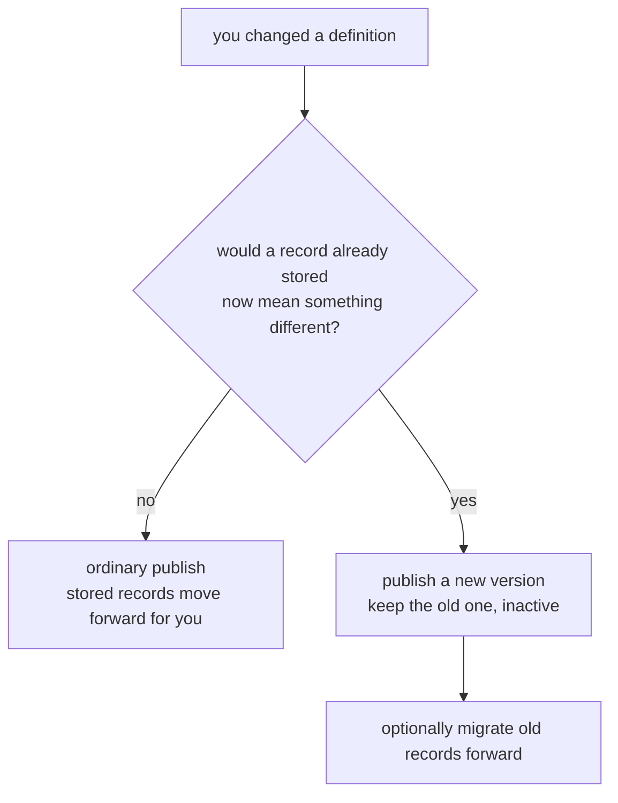

You wrote your YAML, ingested a month of records, and now the contract needs to
change: a new field to filter on, a better scorer prompt, a different embedding
model, a wider derivation source. This page is how you make each of those
changes, what happens to the records you already have, and which changes still
need a new version.

The rule everything follows:

> **A record is bound to the contract that admitted it, and Memseek never
> reinterprets a stored row.** So a change that would make an existing record
> mean something different arrives as a *new version*. A change that provably
> cannot — a new optional property, a new processor binding, a different search
> backend — is an ordinary publish.



That second half is the part worth internalizing. Most changes are ordinary
publishes.

If you would rather follow one catalog through four real changes than read a
reference, start with [A migration, start to finish](migration-walkthrough.md) and
come back here for the details.

## Before you publish: ask what it will do

Every publish can be run as a preflight first. It compiles the catalog, plans it
against the records the workspace actually holds, and returns the plan instead of
applying it.

```bash
uv run memseek catalog-check --workspace acme --dir ./catalog --package acme@1.4.0
```

```python
report = await client.catalog.check(package="acme@1.4.0", directory="./catalog")
```

```json
{
  "verdict": "additive",
  "publishable": true,
  "stored_rows": 41902,
  "changes": [
    {
      "family": "collection",
      "name": "customer_events",
      "version": 1,
      "status": "modified",
      "class": "additive",
      "detail": "record contract grew; new schema properties ['channel']",
      "required_action": "existing values for ['channel'] are verified against the new schema on publish"
    },
    {
      "family": "processor",
      "name": "sentiment_v1",
      "status": "modified",
      "class": "reinterpreting",
      "detail": "annotations already written keep their value and config hash; they are never recomputed",
      "required_action": "publish under a new processor name"
    }
  ],
  "rewrites": [
    {"collection": "customer_events", "version": 1, "rows": 41902, "reason": "additive_contract"}
  ],
  "blockers": [],
  "annotation_vintage": [{"processor": "sentiment_v1", "stale_annotations": 12034}]
}
```

Three fields carry the answer:

- **`verdict`** — the worst class among your changes: `invisible`, `additive`, or
  `reinterpreting`.
- **`publishable`** — whether it can proceed. Only `blockers` can make this
  false, and every blocker names the rows it protects and the action that fixes
  it.
- **`rewrites`** — records whose stored contract hash moves forward when you
  publish. This happens inside the publish transaction; you do not run anything.

`GET /catalog/compatibility` answers the same question about the catalog you have
already installed, which is the quickest way to see whether a workspace is
healthy. A refused publish returns `409 catalog_incompatible` with this exact
structure under `compatibility`, so a failure tells you what a preflight would
have.

## The three classes

**Invisible** — nothing stored references what changed. Bindings, `active`,
views, ranking. Publish freely.

**Additive** — something stored references it, but every stored value keeps its
meaning. Publish freely; stored hashes move forward for you.

**Reinterpreting** — stored values would be read differently. Needs a new
version or a new name, and the previous definition stays in the catalog while its
data exists.

## What a record is actually bound to

A record stores `collection`, `collection_version`, and `collection_hash`. That
last one covers the **record contract** — the fields that determine how a stored
row is *read*:

| In the contract (records depend on it) | Bindings (records do not) |
| --- | --- |
| `mode` | `active` |
| `schema` | `optional_processors` |
| `text_projection` | `search_profile` |
| `fields` | `allowed_search_profiles` |
| `required_processors` | |

`required_processors` is in the contract because readiness gates visibility.
`optional_processors` is not, because it changes what *else* happens to a row and
never what the row means. Search routing is not, because projection re-resolves
routing on every attempt anyway.

The practical result:

| Edit to a collection version with rows | Class |
| --- | --- |
| Flip `active` | Invisible |
| Add or remove an `optional_processors` entry | Invisible |
| Change `search_profile` or `allowed_search_profiles` | Invisible |
| Add an *optional* schema property | **Additive** |
| Declare a `fields` entry over an existing or new property | **Additive** |
| Relax `additionalProperties` from `false` to `true` | **Additive** |
| Reorder `required_processors` | **Additive** |
| Repoint a field onto a superseding annotation | **Additive** |
| Add a *required* schema property | Reinterpreting |
| Retype or re-path an existing field | Reinterpreting |
| Redefine or remove an existing property | Reinterpreting |
| Add or remove a `required_processors` entry | Reinterpreting |
| Change `mode` or `text_projection` | Reinterpreting |

### Why additive is *provable*, not assumed

The additive list is short and closed on purpose. Every entry has a subsumption
argument: every record valid under the old contract stays valid under the new
one. Two cases cannot be settled from the YAML alone, so the publish checks your
actual rows instead of assuming:

**A new property on an open schema.** If the collection is
`additionalProperties: true`, records may already carry that key with a value the
new declaration would reject. The publish counts the rows holding the key and
validates them against the new subschema. All valid, or no rows carry it →
accepted. Any row contradicts it → `409` naming the record. More rows than
`ADDITIVE_VERIFY_MAX_ROWS` (default 50,000) → `409` asking for a new version
rather than scanning an unbounded table inside a transaction.

**A field repointed along a supersession chain.** Safe only while no record holds
the newer annotation yet, which the publish verifies the same way.

## Recipes

### Add a content key

If the collection is `additionalProperties: true`, just write it. No catalog
change at all.

```python
await client.records.ingest(
    collection="customer_events", entity="cust:42", type="email",
    text="Asked about invoicing", content={"channel": "email"},
)
```

### Declare a field to filter, sort, or project on

An ordinary publish, even with a full corpus already stored — and it works
retroactively, because PostgreSQL resolves declared paths at query time.

```yaml
collections:
  - name: customer_events
    version: 1          # unchanged
    active: true
    schema:
      type: object
      required: [text]
      properties:
        text: {type: string}
        channel: {type: string}     # new, optional
      additionalProperties: true
    fields:
      channel: {path: content.channel, type: string, filter: true, sort: true}
    required_processors: [embedding_v1]
    search_profile: pg_default
```

Records written before the declaration answer the filter immediately if they
carry the value. If you use an external search backend, rebuild its projections so
the index carries the new attribute — `await client.reindex(since_seq=0)`, or
`memseek reindex --workspace acme --since-seq 0` from an operator shell.

### Bind a new processor, or switch search backend

Ordinary publishes. Add the name to `optional_processors`, or change
`search_profile` — neither touches the contract.

```yaml
    optional_processors: [sentiment_v2]
    search_profile: memory_tpuf
```

Binding a processor only annotates records ingested *after* the publish. To reach
the records you already have, run a [backfill](#apply-a-processor-to-records-you-already-have).

### Add a required property, or change what a field means

New version. Keep the old block byte-for-byte, flip `active`, and list both in
the package.

```yaml
collections:
  - name: customer_events
    version: 1
    active: false          # keep it while rows reference it
    # ... unchanged ...

  - name: customer_events
    version: 2
    active: true
    schema:
      type: object
      required: [text, channel]
      properties:
        text: {type: string}
        channel: {type: string, enum: [email, call, note]}
      additionalProperties: false
    required_processors: [embedding_v1]
    search_profile: pg_default
```

New records land in version 2; old rows stay valid, searchable, and enrichable in
version 1. When you want the old rows to *become* version 2, write a
[migration](#move-a-corpus-to-a-new-version).

### Apply a processor to records you already have

A backfill is the explicit way to reach stored records. It names its target, so
it works on any version — including a frozen one whose YAML must not change.

```bash
uv run memseek backfill --workspace acme \
    --collection customer_events --version 1 --processor sentiment_v2 --max-rows 50000
```

```python
handle = await client.backfill.start(
    collection="customer_events", version=1, processor="sentiment_v2", max_rows=50_000
)
progress = await client.backfill.retrieve(handle["id"])
await client.backfill.cancel(handle["id"])
```

It is worth understanding exactly what it does, because it spends provider budget
on your corpus. The next section is that, in full.

## How a backfill works

### One target, one handle

A backfill targets exactly one `(collection, version, processor)` triple. That
triple is the whole scope — a backfill never widens to other collections, other
versions, or other processors, and never re-runs anything already done.

Requesting one returns `202` with a **durable handle** immediately; the work
happens in the worker. Only one backfill per target can be live at a time; a
second request returns `409 backfill_exists` naming the one already running, so
two operators cannot race the same rows.

```json
{
  "id": "9f1c…", "workspace": "acme",
  "collection": "customer_events", "version": 1, "processor": "sentiment_v2",
  "state": "queued", "cursor_seq": 0, "scanned": 0, "annotated": 0,
  "max_rows": 50000, "last_error": null,
  "created_at": "…", "updated_at": "…", "completed_at": null
}
```

### Which records it selects

A record is **eligible** when all of these hold:

1. it is in the target collection *and* the target version;
2. it is enriched (`enriched_at` is set) — a record still waiting on required
   enrichment is left to the ingest path;
3. it does **not** already have an annotation under that processor name;
4. it does not carry a *terminal* marker for that processor (a previous attempt
   that permanently gave up);
5. its `type` is admitted by the processor's `input.types`, when that is declared.

Point 3 is the write-once guarantee doing the work: selection is by **absence**,
never by hash or vintage. A backfill can only ever *fill a gap* — it cannot
rewrite a value, so it cannot damage history, and running the same backfill twice
does nothing the second time.

### The two counters

These mean different things and it matters:

| Field | Counts |
| --- | --- |
| `scanned` | eligible records **read and attempted** |
| `annotated` | annotation values **actually written** |

`annotated` is lower than `scanned` when an attempt ends in a terminal failure —
the record gets a terminal marker instead of a value, so it is not retried
forever. `scanned == annotated` is the healthy case. A persistent gap between them
means the processor is failing on real content; read the run audit
(`GET /runs`) for those records.

`cursor_seq` is the resumption point: every record at or below it has been
considered once in the current sweep.

### No budget is needed — that is the default

**Omit `max_rows` and the backfill reaches every eligible record.** That is the
plain "just migrate everything" case, and it needs nothing else:

```bash
uv run memseek backfill --workspace acme \
    --collection customer_events --version 1 --processor sentiment_v2
```

```python
handle = await client.backfill.start(
    collection="customer_events", version=1, processor="sentiment_v2"
)
```

It runs until every eligible record is annotated and then reports `done`. You do
not need to size it, chunk it, or drive it — the worker picks it up and keeps going
across restarts. `max_rows` exists only for when you *want* a ceiling: a cost cap,
a canary on a slice of the corpus, or a controlled rollout.

### The two bounds

`max_rows` is yours and optional. `BACKFILL_BATCH` is the deployment's and always
applies:

| Bound | Default | Limits |
| --- | --- | --- |
| `max_rows` (per request) | **unlimited** | Total records this backfill will ever **scan** |
| `BACKFILL_BATCH` (deployment) | 200 | Records read and written per batch — and one batch is all a worker pass does |

**`max_rows` bounds records scanned, not annotations written.** A record that is
scanned and then terminal-fails still spent its provider call, so `scanned` is the
quantity that predicts cost.

`BACKFILL_BATCH` is the interleaving granularity. One worker pass runs exactly one
batch, completes its job, and queues a successor; the pass then continues through
every other lane before coming back. A pass that did backfill work is marked busy,
so the next pass starts immediately rather than waiting on the poll interval. The
effect is that an unbudgeted million-record backfill makes continuous progress
*without* stopping cron, derivations, projection, or retention for its duration —
and ingest enrichment runs before the backfill lane in every pass, so improving
history never delays admitting new records.

Worked example — 10,000 eligible records, no `max_rows`, defaults otherwise:

```
pass 1:  batch of 200  → scanned 200,   cursor at record 200,   successor queued
pass 2:  batch of 200  → scanned 400,   cursor at record 400,   successor queued
…
pass 50: batch of 200  → scanned 10000, cursor at record 10000, successor queued
pass 51: batch reads 0 → rewind to the start, successor queued
pass 52: batch reads 0 from the start → state: done
```

Each `worker.pass` log line carries `backfill_batches` and
`backfilled_annotations`, so throughput is visible without polling the handle.

### When you do set a budget

Reaching `max_rows` finishes the backfill as `done` with `scanned == max_rows`.
That is deliberately not a distinct state: **a budgeted backfill is a slice.** To
take another slice, request the same target again — selection is by absence, so the
new backfill continues where the old one stopped without needing to know anything
about it.

```python
while True:
    handle = await client.backfill.start(
        collection="customer_events", version=1, processor="sentiment_v2", max_rows=10_000
    )
    ...  # wait for state == "done"
    done = await client.backfill.retrieve(handle["id"])
    if done["scanned"] < 10_000:      # ran out of records, not budget
        break
```

If you find yourself writing that loop, you probably wanted no budget at all.

### Why `done` really means done

Row selection skips records another lane currently holds locked, and the cursor
moves past them. So reaching the end of a sweep is *not* proof of completion — a
single forward pass could leave a locked record behind and still report success.

Instead, an exhausted sweep **rewinds to the beginning and sweeps again**. The
backfill only becomes `done` when a sweep starting at the first record finds
nothing eligible. Anything skipped under a concurrent lock is still eligible, so
the confirming sweep is what finds it. This is why a completed handle reports
`cursor_seq: 0` — that zero is the evidence.

The cost is one extra filtered scan per backfill, and it is what lets you treat
`done` as a fact.

### States

| `state` | Meaning |
| --- | --- |
| `queued` | Registered; the worker has not claimed it yet |
| `running` | At least one claim has worked on it |
| `done` | Either every eligible record was reached, or `max_rows` was spent |
| `cancelled` | Stopped on request; annotations already written are kept |
| `failed` | The target became impossible; `last_error` says why |

Cancelling takes effect at the next batch boundary, never mid-write, and any
queued job for it becomes a no-op. A cancelled backfill's annotations are valid
data — cancelling stops future work, it does not roll anything back.

`failed` means the request can no longer be carried out at all — for example the
processor was removed from the catalog. The handle keeps `last_error` so the
reason survives the worker logs.

### What it costs

`scanned` is the billable quantity, and `max_rows` bounds it exactly, so a
backfill can be priced before it starts. Each batch of records is sub-batched into
provider calls by the same rules enrichment uses at ingest:

| Processor kind | Records per provider call |
| --- | --- |
| `json` / `score` with `source: llm` | up to `ENRICH_LLM_BATCH` (default 16), or fewer when the prompt hits the token budget |
| `embedding` | up to 64 |
| `constant` | no provider calls at all |

So a 50,000-record backfill of an `llm` processor is on the order of 50,000 ÷ 16 ≈
3,125 completion calls, more if individual records are long enough to split the
batches further. `BACKFILL_BATCH` does not change that arithmetic — it controls how
much work one database transaction does, not how many calls a batch makes.

A backfill writes exactly the same run-audit records as enrichment at ingest, so
every annotation it produces is traceable to its model, prompt hash, and attempt
history.

### Requests it will refuse

| Response | Cause |
| --- | --- |
| `422 unknown_collection` | No such collection version in the selected catalog |
| `422 unknown_processor` | No such processor |
| `422 processor_scope` | The processor's `input.collections` does not admit that collection |
| `422 processor_source` | A `source: client` processor — its values come from the client, so a server cannot compute them |
| `409 backfill_exists` | A live backfill already targets that triple |
| `422 max_rows` | `max_rows` was not positive |

`GET /backfill` lists recent backfills with their state, counters, and any error;
`GET /backfill/{id}` returns one.

### Change a processor's prompt, model, or output schema

A prompt is never part of a collection's contract, so the publish always
succeeds. What it does *not* do is recompute anything: annotation names are
write-once semantic identities, so records annotated under the old prompt keep
their value and their config hash forever. The preflight's `annotation_vintage`
is how you see how many.

Treat the name as the version, and declare the replacement:

```yaml
processors:
  - name: sentiment_v1        # keep it: history references it
    kind: json
    # ... unchanged ...

  - name: sentiment_v2
    kind: json
    source: llm
    input: {collections: [customer_events]}
    model: cheap
    prompt: |
      ...the better prompt...
    output_schema: {type: object, required: [label], properties: {label: {type: string}}}
    default_output: {label: neutral}
    supersedes: sentiment_v1     # a read preference, not a rewrite
```

Then bind `sentiment_v2` (a binding change — free), and backfill it. `supersedes`
is what stops every reader from having to know both names: a declared field,
rendering, and index projection all prefer the newest annotation present and fall
back to the older one for records that predate it. Both annotations stay on the
record, separately auditable, and neither is ever rewritten.

A field over `annotations.sentiment_v2.label` therefore answers for a record that
only holds `sentiment_v1`, and repointing an existing field onto the newer name is
an additive publish. See [Processors](processors.md) for the chain rules.

### Move a corpus to a new version

Records are immutable, so a migration *copies forward with lineage* rather than
rewriting. That is what a derivation already does, so a migration is an ordinary
derivation using the deterministic `map_records` task.

**Use a `changes` source.** A migration reads more records than one run may emit
(emission is capped at 100), so the source needs a cursor to walk the corpus. A
`changes` source has one; it consumes forward, and the lane queues its own
successors until the cursor is drained. One request migrates everything.

```yaml
name: customer_events_v1_to_v2
sources:
  legacy:
    kind: changes                 # cursor-driven: walks the whole corpus
    collections: [customer_events]
    collection_versions: {customer_events: [1]}
    statuses: [active]
    keyed: false
    max_records: 100              # per run; the cursor covers the rest
    max_tokens: 40000
    allow_empty: false
model: null
limits: {max_tasks: 1, max_llm_calls: 0, max_retrieved_records: 0,
         max_visible_records: 100, max_total_tokens: 40000, max_wall_s: 30}
tasks:
  - id: migrated
    use: map_records
    input: {records: "{{legacy.records}}"}
    with:
      keep: [text]
      set:
        channel: {from: content.source, default: note}
        migrated_from: {value: "customer_events@1"}
emit:
  from: "{{migrated}}"
  collection: customer_events
  collection_version: 2
  type: email
  max_records: 100
```

```bash
curl -sS -X POST http://127.0.0.1:8000/processors/customer_events_v1_to_v2/run \
  -H "$MEMSEEK_AUTH" -H 'Content-Type: application/json' \
  -d '{"entity":"cust:42"}'
```

Each original is migrated exactly once: the cursor never re-reads what it has
consumed, so running the migration again after it drains does nothing. Migrations
are per-entity like every derivation, so drive one request per entity, or declare a
cron trigger to work through them.

!!! warning "A `snapshot` source cannot migrate a large corpus"
    A snapshot reads its *complete* declared scope or refuses — it never silently
    truncates. So a snapshot migration over more records than `max_records`
    (capped at 500) fails every run with `budget` and migrates nothing. That
    all-or-nothing read is exactly what you want for a reviewed correctness check
    on a bounded set, and exactly what you do not want for bulk migration. Use
    `changes` for the corpus.

Because it is a derivation, every migrated record carries `derived_from` back to
its original, the run is bounded and claim-fenced, and the whole migration is
erasable through the existing provenance closure. The originals are untouched —
history is preserved by construction.

`map_records` is deliberately not a language: it copies properties (`keep`),
computes them from a path, constant, default, or scalar cast (`set`), drops them
(`drop`), and carries a keyed slot forward (`carry_key`). Anything richer belongs
in an `llm` task in the same pipeline, where the output is still schema-validated
and still reviewable before promotion.

### Change the embedding model

Vectors from two models are not comparable, so this is prepare, verify, cut over:

```bash
# 1. Stage the new space. The active space keeps serving every read.
uv run memseek reembed --workspace acme --space default-v2

# 2. Promote it once coverage is complete.
uv run memseek reembed --workspace acme --space default-v2 --cutover
```

Point the `embedding:` block at the new model before staging. While staging runs,
vector recall is untouched: the new vectors go to a staging space and the active
column is not modified. Cutover refuses an incomplete space — promoting a partial
one would silently drop records out of vector recall — and stages each outgoing
vector under its own space id on the way out, so the previous space stays complete
and a cutover is reversible by cutting over back to it.

Cutover reports the last step, which is yours: set `embedding.space` in
`conf/models.yaml` to the promoted space so new records and vector search use it.

`embedding.dimensions` must match the `vector(n)` column the schema provides,
which ships as 1536, so same-dimension model swaps are the supported case. A
different width needs a schema migration first; startup refuses rather than write
vectors the column cannot hold. See [Embeddings](embeddings.md).

### Widen a derivation's source

A `changes` pipeline refuses to run when its source scope no longer matches the
scope its cursor was established under, because silently skipping or
double-counting rows would be worse than stopping. Say which you meant:

```bash
uv run memseek rebind-cursor --workspace acme \
    --derivation profile --entity contact:avery-chen --policy reset
```

```python
await client.rebind_cursor("profile", entity="contact:avery-chen", policy="reset")
```

- **`reset`** restarts from zero — correct when the widened scope must be fully
  re-read.
- **`carry`** keeps the watermark and adopts the new source hash — correct when
  the widening only admits rows that have yet to arrive.

Both write a `_system` `cursor_rebind` audit naming the old and new source hashes.
Prompt and task changes inside a pipeline need none of this: they affect future
runs only, and a `snapshot` pipeline re-reads full history on its next run, which
makes it self-correcting under a prompt change.

### Delete an old definition

Ask what still references it:

```bash
uv run memseek catalog-prune --workspace acme
```

```python
prune = await client.catalog.prune()
```

Each candidate reports its reference count and the kind of reference — records for
a collection version, annotations for a processor, runs for a derivation, use
handles for an artifact — and `safe_to_delete` only where that count is zero.
Active versions are never offered. That is how a catalog shrinks with proof
instead of hope.

## Upgrading a workspace written before the contract split

Records written before the record-contract identity existed stored a hash of the
whole definition. Move them forward once:

```bash
uv run memseek migrate-collection-hashes --dry-run     # every workspace
uv run memseek migrate-collection-hashes --workspace acme
```

It is deterministic (the loader computes both identities from the same
definition), idempotent (already-current rows are skipped), resumable, and
batched under the workspace lock. Rows it cannot explain are reported and left
untouched — that is real drift, and it must be fixed before the workspace can be
migrated. A publish heals the same rows automatically, so most workspaces never
need the command.

## What still needs a new version

By design, not for lack of tooling:

| Change | Why |
| --- | --- |
| A new **required** property | An existing record without it would be invalid |
| Retyping or re-pathing a field | The same stored bytes would be read differently |
| Redefining or removing a property | Narrowing can invalidate stored values |
| Adding or removing a `required_processors` entry | Readiness gates visibility, so this changes which records are usable |
| Changing `mode` or `text_projection` | Changes what a stored row *is* |

And two things remain true about processors, because immutability is worth more
than convenience:

- An existing annotation is never recomputed under its own name. Publish a new
  name, backfill it, and declare `supersedes`.
- A processor with annotations in history stays in the catalog. `catalog-prune`
  tells you when it no longer does.

## Failure modes

| What you see | What happened | Fix |
| --- | --- | --- |
| `422 definition` with a file and dotted path | The catalog does not compile | Read the code and path; nothing was installed |
| `409 catalog_incompatible` | A change would reinterpret stored records | Read `compatibility.blockers` — each names its rows and its action |
| `409` naming a record that "holds a value the new schema rejects" | An open schema already had a conflicting value under the key you declared | Correct those records, or declare the property in a new version |
| `409` "above the ADDITIVE_VERIFY_MAX_ROWS limit" | Too many rows to verify inside a publish | Use a new version, or raise the setting deliberately |
| `409 backfill_exists` | A live backfill already targets that collection version and processor | Wait for it, or cancel it |
| `422 unknown_processor` / `processor_scope` | The backfill target is not something the catalog can compute | Check the processor's `input.collections` |
| `409 incomplete_space` on cutover | Some records have no vector staged in the target space | Finish the re-embed, then cut over |
| `DerivationError("config")`: Source scope differs | A `changes` source changed after its cursor was established | `rebind-cursor` with `reset` or `carry` |
| Backfill state `failed` with `last_error` | The target became impossible (for example a removed processor) | Read `last_error` on `GET /backfill/{id}` |

## Two habits

1. **Preflight before you publish.** It costs one command and turns every
   surprise into a plan.
2. **Treat a processor's name as its version.** The vintage boundary belongs in
   the catalog where you can see it, not hidden in annotation metadata.

## Known limitation

Optional processors are swept for records in workspaces using the *shipped*
catalog. A workspace that has published its own package should apply optional
processors with an explicit [backfill](#apply-a-processor-to-records-you-already-have),
which is bounded, observable, and cancellable in a way an implicit sweep is not.
