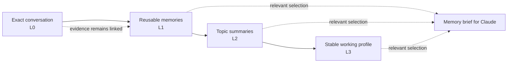

The Memseek plugin lets Claude Code remember a project between sessions. Tell Claude a
decision today, close the terminal, and return later: Claude can receive the relevant
decision automatically, apply it to the new task, and show the original conversation if
you ask where the memory came from.

This page is the whole plugin: how to run the service it needs, how to install it, the
test that proves it works, what it stores, and what to do when something is wrong.

**Two starting points.** If someone has already given you a Memseek service URL and a
workspace key, skip to [installing the plugin](#install-the-plugin-from-this-checkout). If you are trying it
out or self-hosting, start below: the service runs in Docker, and nothing but Docker is
installed for it.

## What you need

| Requirement | Why | Check it |
|---|---|---|
| Docker with Compose v2 | Runs PostgreSQL, the API, the worker, and the one-shot setup step | `docker compose version` |
| Claude Code | The plugin host | `claude --version` |
| `python3` 3.10 or newer **on the host** | Claude Code hooks are host processes, so they do not run in Docker | `python3 -V` |
| An LLM API key with credit | Embeddings and the memory ladder are real model calls | [step 1](#1-get-a-model-api-key) |
| A repository to test in | Memory is scoped per repository | any local checkout |

The test below creates real memory records, so use a workspace you are willing to delete;
[step 8](#8-stop-and-clean-up) deletes everything it created. Budget about **10 minutes**
and a few cents of model usage.

!!! warning "Do not set `LLM_FAKE=1`"
    The deterministic fake provider exists for CI. It can prove transport and exact
    message capture, but it cannot produce the L1 memories, L2 scenes, and L3 working
    profile that the cross-session test checks. Leave `LLM_FAKE` unset or `0`.

## 1. Get a model API key

The stack ships pointed at OpenAI. Create a key at
<https://platform.openai.com/api-keys>; the account must be able to call both models named
in `examples/agent_memory_catalog/conf/models.yaml`:

| Alias | Model | Used for |
|---|---|---|
| `cheap` | `gpt-5.4-2026-03-05` | high-volume passes (scene segmentation, review) |
| `strong` | `gpt-5.4-2026-03-05` | passes whose output becomes durable memory |
| embedding | `text-embedding-3-small` | every stored record's vector |

Clone the repository and write the key into `.env`, which Docker Compose reads
automatically:

```console
git clone https://github.com/memseekai/memseek && cd memseek
printf 'OPENAI_API_KEY=sk-your-real-key\n' > .env
```

`.env` is gitignored. Nothing else belongs in it for this test.

!!! note "Using a different provider or model"
    Edit `examples/agent_memory_catalog/conf/models.yaml`: change the `providers` block
    (`base_url`, `api_key_env`) and the alias `targets`, then put that provider's key
    variable in `.env` under the name you gave `api_key_env`. The provider must be
    OpenAI-compatible and must offer an embedding endpoint. Apply the change with
    `docker compose run --rm setup && docker compose restart api worker`.

## 2. Start the service with Docker

One command builds the image and starts the stack:

```console
docker compose up -d --build --wait
```

`--wait` returns only when the API is healthy and the one-shot steps have exited `0`. The
first build takes a few minutes; later runs start in seconds.

```console
docker compose ps -a --format '{{.Service}}\t{{.State}}\t{{.Status}}'
```

```text
api        running   Up 19 seconds (healthy)
migrate    exited    Exited (0) 19 seconds ago
postgres   running   Up 21 seconds (healthy)
setup      exited    Exited (0) 12 seconds ago
worker     running   Up 19 seconds
```

`migrate` and `setup` are *supposed* to be exited: they apply the schema and publish the
memory design, then have nothing left to do. If `setup` still shows as `running`, it is
mid-publish — give it a few seconds. Read what it did:

```console
docker compose logs setup --no-log-prefix
```

```text
workspace 'local' created; key written to /state/api_key
published agent_memory@0.3.0 (20 files) from examples/agent_memory_catalog
MCP interface ready — 7 tools: context, recall, standing_rules, replay_session, remember, record, answer

API      http://127.0.0.1:8000
MCP      http://127.0.0.1:8000/mcp
Key      export MEMSEEK_API_KEY=$(cat .memseek/api_key)
```

Those seven tools are the memory surface the plugin will use. If this step failed, fix it
before touching Claude Code — no hook can repair a server that has no catalog.

| Service | Role | Lifetime |
|---|---|---|
| `postgres` | PostgreSQL 16 + pgvector; every record and vector lives here | runs; data in the `memseek-data` volume |
| `migrate` | applies the schema, as its own container so a failed migration is readable | exits `0` |
| `api` | the HTTP API and the `/mcp` endpoint the plugin connects to | runs, health-checked |
| `worker` | the background process that embeds, derives L1–L3, and drains queues | runs |
| `setup` | mints the workspace, writes `.memseek/api_key`, publishes `agent_memory@0.3.0` | exits `0`; idempotent, safe to re-run |

## 3. Read the workspace key

`setup` wrote the key to a bind-mounted file instead of printing it into interleaved logs:

```console
cat .memseek/api_key
```

That string is the **Memseek workspace key** the plugin asks for. It is disclosed once, at
workspace creation: keep this file until you are done, and do not commit it (`.memseek/`
is gitignored).

## 4. Check the service answers

Liveness, including the database:

```console
curl -s http://127.0.0.1:8000/health
```

```text
{"ok":true,"db":true}
```

Then the exact contract the plugin's MCP connection depends on. This runs inside the API
container, so Docker stays the only requirement:

```console
docker compose exec \
  -e MEMSEEK_URL=http://127.0.0.1:8000 \
  -e MEMSEEK_API_KEY="$(cat .memseek/api_key)" \
  api memseek mcp --check
```

The JSON must report `package: agent_memory 0.3.0`, seven `tools`, and
`"streamable_http": "http://127.0.0.1:8000/mcp"`. A `401` means the key is wrong; an empty
tool list means the catalog was never published.

## 5. Prove the model credentials work

Do this **before** installing the plugin. It is the single check that separates "my API key
is wrong" from "the plugin is broken", and it takes about 30 seconds.

Write one message into a throwaway entity:

```console
curl -sS -X POST http://127.0.0.1:8000/records \
  -H "Authorization: Bearer $(cat .memseek/api_key)" \
  -H 'Content-Type: application/json' \
  -d '{"records":[{"collection":"messages","type":"message",
       "entity":"project:preflight",
       "text":"Every distributed-cache key in this project must start with orbit:.",
       "content":{"text":"Every distributed-cache key in this project must start with orbit:.",
                  "role":"user","session_id":"preflight","ordinal":0},
       "dedupe_key":"preflight:0"}]}'
```

```text
{"inserted":[{"index":0,"id":"4882d928-...","ready":false}],"duplicates":[]}
```

`ready: false` is expected: the record is stored, and its required embedding is still
pending. Watch the worker do the real model work:

```console
docker compose logs -f worker
```

Within about 30 seconds you should see, in this order, one line per stage:

```text
"processor":"embedding_v1","provider":"openai","status":"ok"
"derivation":"l1_extract","status":"ok","output_count":1
"derivation":"scene_synthesis","status":"ok","output_count":1
```

That is the memory ladder forming from one message: L0 evidence embedded, an L1 memory
extracted, an L2 scene written. Press `Ctrl-C` to stop following. A `"status":"error"` line
with an authentication or model-not-found message means the key or the model name in
`conf/models.yaml` is the problem — fix it here, not later.

Confirm the derived memory is retrievable:

```console
curl -sS -X POST http://127.0.0.1:8000/views/memory_recall/query \
  -H "Authorization: Bearer $(cat .memseek/api_key)" \
  -H 'Content-Type: application/json' \
  -d '{"entity":"project:preflight","task":"distributed cache key prefix"}'
```

The `hits` array should contain a claim about the `orbit:` prefix — derived, not the
sentence you sent. Now delete the throwaway entity so it cannot contaminate the plugin
test:

```console
curl -sS -X POST http://127.0.0.1:8000/erase \
  -H "Authorization: Bearer $(cat .memseek/api_key)" \
  -H 'Content-Type: application/json' \
  -d '{"entity":"project:preflight"}'
```

```text
{"erasure_record_id":"464271d5-...","deleted_count":19,"affected_entity_count":1,"index_delete_job_id":"d01c90db-..."}
```

`deleted_count` depends on how far the worker got before you erased — the message, its
derived memory, the scene, and any working-profile traits all count. Erasure is not a soft
delete and cannot be undone through the API.

The service is now proven end to end: schema, catalog, tool surface, model credentials,
derivation, retrieval, and erasure.

## Install the plugin from this checkout

The plugin is **not published to a marketplace yet**, so install it from the repository you
cloned in step 1. That directory *is* the marketplace: it carries
`.claude-plugin/marketplace.json`.

```console
claude plugin marketplace add ./
claude plugin install memseek-memory@memseek --scope local \
  --config MEMSEEK_URL=http://127.0.0.1:8000 \
  --config MEMSEEK_API_KEY="$(cat .memseek/api_key)" \
  --config MEMSEEK_CAPTURE_MODE=conversation
```

```text
✔ Successfully added marketplace: memseek (declared in user settings)
✔ Successfully installed plugin: memseek-memory@memseek (scope: local)
```

Three details matter:

- **`./`, not `.`** — a bare dot is rejected with `Invalid marketplace source format`. An
  absolute path works too.
- **`--scope local`** keeps the plugin to this project and out of any shared settings file.
  Use `--scope user` to have it in every project you open.
- **`--config`** sets the same three values the interactive flow asks for, so nothing has to
  be typed into a prompt. Omit the flags and Claude Code asks instead:

| Prompt | Answer |
|---|---|
| **Memseek service URL** | `http://127.0.0.1:8000` for the local stack, or the URL from your administrator — no `/mcp`, no trailing slash |
| **Memseek workspace key** | The output of `cat .memseek/api_key`, or the key from your administrator |
| **Conversation capture (`MEMSEEK_CAPTURE_MODE`)** | How this Claude session may add new information to Memseek; see the comparison below |

No `.env` file or shell exports are needed on the Claude Code side. The two non-sensitive
options are written to `~/.claude/settings.json` under `pluginConfigs`; the workspace key is
stored as a sensitive value and is not written there. Change any of them later through
`/plugin` → `memseek-memory@memseek`, then start a new session. If you installed from
inside an active session, start a new one before continuing.

!!! note "Editing the plugin's own source"
    Installing **copies** the plugin into
    `~/.claude/plugins/cache/memseek/memseek-memory/<version>/` at the current commit, and
    `claude plugin update memseek-memory@memseek --scope local` only re-copies when the
    version in `plugin.json` changes. To iterate on hooks or skills, run
    `claude --plugin-dir ./integrations/claude-code` instead: it loads the working tree
    directly and prompts for the same three values.

Confirm Claude Code sees every component:

```console
claude plugin details memseek-memory
```

```text
memseek-memory 0.2.0
  Skills (5)  memseek-explain, memseek-feedback, memseek-remember, memseek-search, memseek-status
  Hooks (5)  SessionStart, UserPromptSubmit, Stop, PreCompact, SessionEnd
  MCP servers (1)  memseek
```

### Choose a capture mode

Capture mode controls **new writes from Claude Code**, not reads. Claude can retrieve and
use relevant existing memories in all three modes.

| Mode | Saved automatically | Manual remember | Existing memory is recalled | Choose it when |
|---|---|---|---|---|
| `conversation` (recommended) | Exact user and assistant chat messages | Available | Yes | You want memory to build naturally while you work |
| `explicit` | Nothing | Available through `/memseek-memory:memseek-remember ...` | Yes | You want to approve every new durable fact or decision |
| `off` | Nothing | Disabled by instruction | Yes | You want to use existing memory without intentionally adding to it |

With `conversation`, exact chat messages become the source evidence in L0; the Memseek
worker can derive reusable L1–L3 memories from them later. Terminal commands, file
contents, and tool inputs and outputs are not captured automatically. Text pasted or
repeated in the chat can still be saved, so do not place secrets in chat.

Changing the mode affects future activity and does not delete existing memory. `off` tells
Claude not to use Memseek write tools, but it is not an authorization boundary. If your
organization requires enforced read-only access, its administrator must deny writes for
the workspace key or block the MCP write tools in the host.

### Confirm the installation

Start a session in that repository — the plugin loads on startup, and its `SessionStart`
hook reports what it connected to:

```console
claude
```

```text
Memseek connected for project:memseek:2f77b8026b767ade.
```

Then, inside the session:

```console
/memseek-memory:memseek-status
```

```text
Memseek is ready.
  Service: http://127.0.0.1:8000
  Project memory: project:memseek:2f77b8026b767ade
  Conversation capture: conversation
  Workspace key: configured
  Memory tools: 7/7 available
  Retry queue: 0 pending, 0 need inspection
```

`/mcp` should also show `memseek` connected. Note the **project memory** name: it is
derived from the repository, and it is what makes a later session find the same memory
instead of a blank one. To change a value later, open `/plugin`, select
`memseek-memory@memseek`, update its configuration, and start a new session.

## 6. The test: memory that survives a restart

Five steps, in Claude Code.

**1. Teach one rule.** Tell Claude, in chat:

```text
For this test project, every distributed-cache key must start with orbit:.
Treat this as a priority-90 coding rule until I revoke it.
```

**2. Watch Memseek learn it.** In your terminal:

```console
docker compose logs -f worker
```

Look for `"derivation":"l1_extract","status":"ok"` — the same line as the pre-flight, now
produced by your actual conversation. This is the proof that capture happened without you
calling any memory tool.

**3. Confirm the rule became memory.** Back in Claude Code:

```console
/memseek-memory:memseek-search distributed-cache key prefix
```

Repeat every few seconds until the `orbit:` rule is returned. Derivation is asynchronous;
if it never appears, the worker or the model credentials are at fault, not the plugin.

**4. Restart and ask cold.** Quit Claude Code, reopen it **in the same repository**, and
ask — deliberately forbidding tool use, so only automatically supplied memory can answer:

```text
Do not call a memory tool. Based only on context supplied before this request,
what prefix must distributed-cache keys use here? Cite the memory evidence.
```

A correct answer says `orbit:` and cites Memseek evidence. That single answer proves the
whole chain: conversation captured, memory derived, project identity stable across
restarts, relevant memory selected, and the brief delivered before Claude answered.

**5. Ask why it believes that.**

```console
/memseek-memory:memseek-explain
```

Claude should distinguish the derived rule from the literal message you typed in step 1 and
show record ids. Memory you cannot audit is not the feature being tested here.

If step 3 passes and step 4 fails, storage and retrieval are fine and the automatic brief
is the thing to investigate. If step 3 fails, look at the worker first.

## 7. Optional deeper checks

| Check | How | Expected |
|---|---|---|
| Exact L0 capture, in order | `curl -sS -H "Authorization: Bearer $(cat .memseek/api_key)" 'http://127.0.0.1:8000/timeline?entity=<project memory>&limit=20'` | your message and Claude's reply as separate rows, newest first |
| The plugin's own diagnosis | `python3 integrations/claude-code/scripts/memseek_doctor.py status --json` with `MEMSEEK_URL` and `MEMSEEK_API_KEY` exported | `ok: true`, seven tools, `pending_writes: 0` |
| Feedback attaches to a real render | `/memseek-memory:memseek-feedback task_success The orbit: rule was recalled and cited.` | an artifact-use id, no errors, zero queued writes |
| Fail-open during an outage | `docker compose stop api`, send a prompt, then `docker compose start api` and `python3 integrations/claude-code/scripts/memseek_doctor.py flush` | Claude keeps working; `remaining: 0` after the flush, each message stored once |

Capture modes are worth one pass each if retention matters to you: set
`MEMSEEK_CAPTURE_MODE` to `explicit` through `/plugin`, start a new session, and confirm
that ordinary chat no longer produces new records while
`/memseek-memory:memseek-remember` still does, and that recall keeps working in both.

## 8. Stop and clean up

Stop the stack but keep the memory and the key:

```console
docker compose down
```

Delete everything the test created — containers, the database volume, and the minted key:

```console
docker compose down -v && rm -rf .memseek
```

!!! warning "A fresh volume means a fresh key"
    `down -v` destroys the workspace. The next `docker compose up` mints a **new**
    workspace key, so the plugin's stored key stops working. Update it through `/plugin` →
    `memseek-memory@memseek` and start a new session.

Removing the plugin and the local marketplace entry:

```console
claude plugin uninstall memseek-memory@memseek --scope local
claude plugin marketplace remove memseek
```

Local plugin state lives in `~/.memseek/plugin/claude-code/`; delete that directory to
remove the session state and any queued writes as well.

## Troubleshooting

| Symptom | Cause | Fix |
|---|---|---|
| `Marketplace file not found at ~/.claude/plugins/marketplaces/memseekai-memseek/.claude-plugin/marketplace.json` | the plugin is not published to GitHub yet, so there is nothing to clone | install from your checkout: `claude plugin marketplace add ./` |
| `Plugin "memseek-memory" not found in marketplace "memseek"` | the marketplace entry points at a copy that has no plugin, usually the failed remote one | `claude plugin marketplace remove memseek`, then `claude plugin marketplace add ./` from the repository root |
| `Invalid marketplace source format` | `.` on its own is not accepted | use `./` or an absolute path |
| plugin source edits have no effect | install copied the plugin into `~/.claude/plugins/cache/…` at its declared version | run `claude --plugin-dir ./integrations/claude-code`, or bump the version in `plugin.json` and `claude plugin update memseek-memory@memseek --scope local` |
| `docker compose up` fails on `setup` | the API came up but publishing failed | `docker compose logs setup --no-log-prefix` names the offending definition |
| port 8000 already in use | something else owns the port | add `MEMSEEK_PORT=8100` to `.env`, `docker compose up -d --wait`, and use `http://127.0.0.1:8100` as the plugin URL |
| `.memseek/api_key` missing but the workspace exists | the key was disclosed once and the file was deleted | `docker compose down -v` and start over |
| records stay `ready: false` | the embedding call is failing | `docker compose logs worker` — usually a missing or unfunded `OPENAI_API_KEY` in `.env` |
| worker logs `"status":"error"` with a model name | the account cannot call that model | change the alias targets in `examples/agent_memory_catalog/conf/models.yaml`, then `docker compose run --rm setup && docker compose restart api worker` |
| `memseek-status` says the key is missing | Claude Code has no stored configuration | `/plugin` → `memseek-memory@memseek`, set the values, start a new session |
| `/mcp` does not list `memseek` | wrong URL, or a trailing `/mcp` in it | the URL must be the base, e.g. `http://127.0.0.1:8000` |
| hooks never run | no host `python3` on `PATH` | install Python 3.10 or newer on the host; the hooks do not run in Docker |
| search finds the rule, a new session does not | memory is fine, the automatic brief is not | check `pending_writes` and the entity reported by `memseek-status` in both sessions |

## How the memory model works

The plugin uses Memseek's **L0–L3 agent-memory model**, shipped as
`agent_memory@0.3.0`. It does not use one giant chat transcript as memory. It builds four
connected layers:

| Layer | What it means to a customer | Example |
|---|---|---|
| **L0 — Conversation** | The exact user and Claude messages; this is the source evidence | “All database timestamps must be UTC.” |
| **L1 — Memories** | Small reusable facts, decisions, rules, preferences, and events | “Database timestamps use UTC.” |
| **L2 — Scenes** | Living summaries for separate areas of work | A “Payments migration” summary containing its decisions, risks, and open questions |
| **L3 — Working profile** | Stable patterns that apply across several areas of work | “The team prefers conservative rollouts and explicit migrations.” |



The higher layers never replace L0. They are interpretations built from it, and each
important claim can retain links to the messages that support it. Claude can therefore
answer both “what should I know?” and “why does Memseek believe that?”

Memseek also keeps a separate **coding playbook** for repeatable work such as reviewing a
migration or responding to an incident. Feedback can suggest a better playbook, but a new
procedure is never made live automatically just because one result was positive.

### Example across two sessions

In session one, you tell Claude:

```text
The payments migration must finish before September 10.
Do not deploy until the new webhook contract is approved.
```

Memseek stores those exact words at L0. Its background worker can extract a deadline and a
deployment rule at L1, then update the L2 “Payments migration” scene. When you return in a
new session and ask Claude to prepare the deployment, Memseek selects that scene and rule
for the new request. Claude can warn about the missing approval and show the original
message as evidence.

## What happens when you ask Claude a question

1. **The plugin opens the project's memory notebook.** The same repository gets the same
   memory even after Claude Code restarts.
2. **Memseek prepares a short memory brief.** It selects relevant scenes, rules, memories,
   working patterns, and the current coding playbook. It does not send the full history.
3. **Claude receives the brief with your question.** The technical term “context injection”
   means only that Claude Code places this brief beside your prompt before Claude answers.
   You do not need to search manually on every turn.
4. **The conversation is saved in the background.** When automatic capture is enabled,
   the exact user message and final Claude response become new L0 evidence.
5. **The memory model learns asynchronously.** The worker turns useful evidence into L1
   memories, L2 scenes, and L3 working patterns for future sessions.

If Memseek is temporarily unavailable, Claude continues without memory. Configured writes
wait in a private local queue and retry later, so a memory outage does not become a coding
outage.

## Terms you may see

| Technical term | Plain-language meaning |
|---|---|
| **Project entity** | The stable name of the project's memory notebook |
| **Memory brief** | The small relevant selection given to Claude for one question |
| **Context injection** | Automatically placing the brief beside the question before Claude answers |
| **Artifact** | The reviewed recipe for assembling a memory brief—not a stored memory itself |
| **Artifact use** | A receipt for one brief, including which recipe and version created it |
| **MCP tools** | Explicit memory actions Claude can call: search, replay, open evidence, answer, and remember |
| **Provenance** | The evidence links from a remembered claim back to its original messages |
| **Compaction** | Claude Code shortening a long local conversation to make room for more work |
| **Worker** | The background Memseek process that organizes new conversations into durable memory |

## Customer use cases

| Customer need | What the plugin changes |
|---|---|
| Resume a project after a long gap | Claude receives the relevant decisions, current work areas, preferences, and rules |
| Stop repeating architecture decisions | Decisions become reusable while the original wording remains available for audit |
| Keep critical rules visible | High-priority rules are selected exactly and added to the memory brief |
| Ask why Claude believes something | Claude can follow the claim back to the literal conversation evidence |
| Continue through a very long session | Important project memory is re-supplied when Claude shortens its local transcript |
| Improve a repeated workflow | Feedback is connected to the exact playbook and memory brief used |
| Share knowledge across terminals or agents | They use one project notebook but retain separate conversation histories |
| Limit retention | `explicit` and `off` modes disable automatic conversation capture |

The plugin is not a secret store and does not automatically capture command output, file
contents, or edit payloads. Background memories are not immediate, retrieved text is never
treated as a trusted instruction channel, and positive feedback does not automatically
promote a new playbook.

## Skills

The plugin adds these Claude Code skills:

- `/memseek-memory:memseek-search` — relevance recall with citation rules;
- `/memseek-memory:memseek-explain` — follow provenance to L0 and replay exact wording;
- `/memseek-memory:memseek-remember` — append only user-confirmed durable evidence;
- `/memseek-memory:memseek-feedback` — attach a selected outcome to the latest context use;
- `/memseek-memory:memseek-status` — inspect health, identity, tools, and local queues.

Feedback is evidence for Memseek's learning pipeline. Neither a skill nor a hook promotes
a candidate procedure automatically.

## Stable project identity

By default, the hook hashes a credential-stripped, normalized Git `origin` and includes a
short repository name. With no remote, it hashes the absolute Git root. This makes separate
Claude sessions share project state without sending the raw remote or local path.

For multiple checkouts or multiple coding agents, commit a non-secret explicit mapping:

```json
{
  "entity": "project:payments-api",
  "skill_entity": "skill:payments-api:coding"
}
```

Save that as `.memseek-project.json`. `MEMSEEK_ENTITY` and `MEMSEEK_SKILL_ENTITY`
override the file. Reusing the entity in another integration shares the durable L1–L3
project memory; each Claude launch still has its own L0 `session_id` for exact replay.

## Capture and failure behavior

`MEMSEEK_CAPTURE_MODE` is shown during installation as **Conversation capture**. It
selects the write policy:

- `conversation` (default) records exact user and assistant text;
- `explicit` records nothing automatically but keeps recall and MCP writes available;
- `off` records nothing automatically and is appropriate for a read-only operating policy.

All three modes keep automatic recall enabled. Changing the value applies to new activity
and does not remove anything Memseek already knows. Update it through `/plugin`, then
start a new Claude Code session so every hook uses the same policy.

In `off` mode the session context tells Claude not to use a Memseek write tool. That is a
model policy, not an authorization boundary; also deny the MCP write tool in the host when
read-only behavior must be enforced.

The plugin intentionally does not capture `PostToolUse`. Raw arguments and results are
high-volume, unstable evidence and may contain secrets. Put a durable conclusion in the
conversation or use the explicit remember skill instead.

Hooks fail open. An outage skips recall and leaves writes in a permission-restricted queue
under `~/.memseek/plugin/claude-code/pending`; a later hook or the doctor `flush` command
retries them with the same dedupe key. Schema-rejected envelopes move to `failed` instead
of blocking the queue. Claude Code stores the workspace key as a sensitive plugin option,
normally in the system keychain; the plugin never copies it into its state, queues, or logs.

The local state contains the last task for `PreCompact`, and a queued envelope temporarily
contains exact conversation text. Operators should apply the same disk controls they use
for local Claude transcripts.

## Self-hosted setup for operators

Customers using a prepared Memseek workspace can skip this section, and anyone running the
local Docker stack already has it: `docker compose up` publishes `agent_memory@0.3.0`
during setup.

To select the model in an existing workspace instead, export the two values the standalone
publishing script reads:

```console
export MEMSEEK_URL=http://127.0.0.1:8000
export MEMSEEK_API_KEY='replace-with-workspace-key'
```

Preview and activate the included model:

```console
python3 integrations/claude-code/scripts/publish_agent_memory.py
python3 integrations/claude-code/scripts/publish_agent_memory.py --apply
```

The preview is read-only. The second command selects `agent_memory@0.3.0` for the
workspace.

### Technical compatibility contract

The plugin targets the contract demonstrated by `examples/agent_memory_catalog`:

| Boundary | Required contract |
|---|---|
| Automatic brief | `agent_context@1(entity, task, skill)` |
| Conversation evidence | `messages@1` with `text`, `role`, `session_id`, and `ordinal` |
| Explicit memory actions | `context`, `recall`, `standing_rules`, `replay_session`, `remember`, `record`, `answer` |
| Learning feedback | an artifact-use id accepted by `POST /artifact-uses/{id}/feedback` |

A production package can replace `agent_memory@0.3.0` without changing the plugin if these
boundaries remain compatible.

For every configuration variable, queue layout, and uninstall detail, read the integration's
[README](https://github.com/memseekai/memseek/tree/main/integrations/claude-code).
