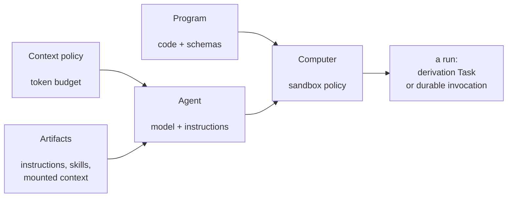
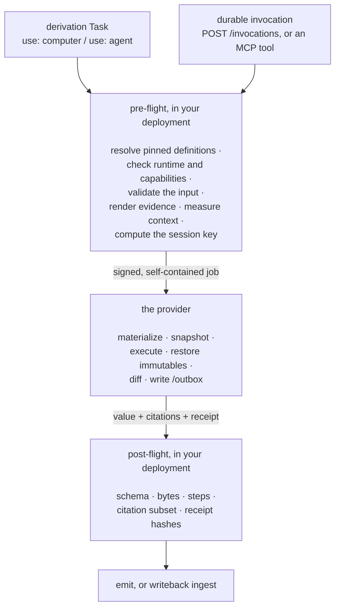

Most of a catalog describes *what memory holds*. This page describes the one
place where memory lets something **run**: a sandboxed workspace, called a
**Computer**, where either a small deterministic program or a model-driven
agent does real work over evidence Memseek hands it, and hands results back
through one narrow, declared door.

The point is not that an agent can execute code. The point is that it can do so
without ever being trusted:

- it never receives a database connection, an API key, or a record writer;
- it can only read the evidence Memseek prepared for that one run;
- it can only cite record IDs that were in that evidence;
- it can only return values through paths you declared in YAML; and
- everything it did — every command, file change, model call, and hash — is
  written to a receipt you can read afterwards.

Four small YAML families make that possible. You will not need all four for
every job.

!!! note "This page is about writing the files"
    If what you want is the list of promises the system makes — what is checked,
    what is refused, and what an agent can never do — read
    [How a Computer stays trustworthy](computer-resources-and-durable-agents.md)
    instead. It is the same system, described from the safety side.

## Do you actually need one?

| You want to… | Use | Why |
| --- | --- | --- |
| Ask a model for a bounded JSON answer over evidence | a [derivation](derivations.md) `use: llm` task | No sandbox needed. One call, one schema, one result. |
| Do exact arithmetic, set logic, or a deterministic merge in your own Python | an [installed custom task](derivations.md#installing-a-custom-task) | It runs in your deployment, with your libraries, and is trusted deployment code. |
| Run **catalog-authored, versioned code** that ships with the memory design and cannot touch your process | a **Program** in a Computer | The code is data in the catalog, hashed with the package, and runs sandboxed. |
| Let a model **work** — write files, run commands, look things up again, take several steps | an **Agent** in a Computer | It gets a durable filesystem and a bounded tool loop instead of a single completion. |
| Run something long, resumable, and interruptible that a person can talk to | an **Agent** started as a **durable invocation** | It survives restarts, pauses for input, and can be forked. |

If a single model call with a JSON schema does the job, do that instead. A
Computer costs you a runtime to deploy and a set of limits to think about.

## A run, in plain words

Before any YAML, it helps to see one run from the outside. Nothing here is
specific to a provider, and the shape is the same whether a Program or an Agent
is doing the work.

Say the job is *"read this account's recent evidence and write down the renewal
risks"*.

**1. Something asks for the work.** Either a [derivation](derivations.md) runs
on a trigger or a schedule, or your application (or an agent through
[MCP](mcp.md)) explicitly starts a **durable invocation** for one entity. You
never start a Computer directly; you start work that happens to use one.

**2. Memseek prepares the evidence — outside the sandbox.** It gathers the
records the run is allowed to see, renders them into plain text files, and
keeps a list of exactly which record IDs went into them. That list is the run's
*citation authority*: the only IDs the work is allowed to point at later.

**3. A workspace appears.** A **sandbox** is a small isolated computer with a
filesystem and nothing else — no database connection, no API keys, no access to
your application. Memseek names it from the run's identity, so every task in
one run that uses the same Computer lands in the same files, and a retry
reattaches instead of starting over. Inside, the layout is always these four
roots:

```text
/.memseek/    read-only.  instructions.md · skills/01.md · your mounted
                          context files · the Program's source
/inputs/      read-only.  the typed input for this unit of work
/workspace/   writable.   scratch: notes, scripts, working files
/outbox/      writable.   the only way a result leaves
```

**4. The work runs.** A **Program** is your own versioned code: it receives the
input, computes, returns a value. An **Agent** is a model with instructions,
tools, and a step limit: it reads the mounted files, writes notes in
`/workspace`, may run shell commands if you allowed it, may search the material
it was already given, and takes as many steps as it needs up to its limit.
Either way there is no network, no record writer, and no way to reach anything
you did not mount.

**5. One narrow door out.** The result is written into `/outbox` as a file, and
three things come back to Memseek: the **value** (a JSON object), the
**citations** (record IDs it claims to have used), and a **receipt** — the log
of every command, file change, model call, and hash from that run. Alongside
them travel the step count and, for an Agent, whether it is pausing to ask a
person a question. Nothing else crosses back.

**6. Memseek re-checks all of it.** The value must match the schema you
declared. The citations must be inside the authority from step 2 — a made-up or
merely plausible ID fails the run. Nothing outside the writable roots may have
changed, and the read-only files must be byte-for-byte what was mounted. Only
then does the value continue: through `emit` and the ordinary record checks for
a derivation, or — for a durable invocation — as writeback records that land
active or as drafts, exactly as the Computer's YAML declared.

**7. Afterwards, you can read it back.** A derivation stores the receipt with
its [run audit](evaluation-bases.md). A durable invocation additionally keeps an
ordered **journal** you can page through or stream live, the files it chose to
preserve, and its own working notes.

The single most useful thing to remember: **the sandbox is never trusted.**
Every promise it appears to make — the schema, the citations, the untouched
context, the byte counts, the hashes — is re-verified on this side afterwards,
which is why a Computer can run model-written code over your memory without
that memory being at risk. The same sequence with every individual check named
is in [What actually happens, step by step](#what-actually-happens-step-by-step)
further down this page.

## The four files you write

Each is an optional directory in your [catalog](catalog-layout.md). Nothing
breaks if you have none of them.

| Directory | Top-level key | What one entry describes |
| --- | --- | --- |
| `computers/*.yaml` | `computers:` | The **sandbox policy**: which provider, what may be mounted, which paths are writable, what capabilities exist, what may be written back, and what survives. |
| `programs/*.yaml` | `programs:` | An **immutable code bundle**: a runtime, an entrypoint, the source, and input/output JSON Schemas. No model involved. |
| `agents/*.yaml` | `agents:` | A **reasoning policy**: which model alias, which instruction and skill artifacts, which tools, which Computers it may use, and its step and byte limits. |
| `context_policies/*.yaml` | `context_policies:` | A **context budget** for an Agent: how many input tokens it may use, and what happens as that fills up. |

Several entries may live in one file, as a list. All four families use exact
integer versions and are referenced as `name@1` everywhere — there is no
floating reference to a Computer, Program, Agent, or context policy anywhere in
the system.

They compose like this:



## The workspace every run sees

The four roots from the walkthrough above are the whole filesystem, whichever
provider you use and whether a Program or an Agent is running. Which YAML
family puts what there:

| Root | Written by | Holds |
| --- | --- | --- |
| `/.memseek/` | Memseek, before the run | The Agent's rendered `instructions` and `skills`, every `context:` mount the Computer declares, a manifest of which records produced them, and the Program's source. Read-only. |
| `/inputs/` | Memseek, before the run | The typed input for this one unit of work, already checked against the Program's `input_schema`. Read-only. |
| `/workspace/` | the run | Scratch space: notes, scripts, working files. It survives between tasks and attempts of the same session, and is copied to a fork only where `retention.preserve` names it. |
| `/outbox/` | the run | The declared return channel: the result file, and — for a durable invocation — any `writeback` file. |

Two rules follow from that picture, and almost every error you will hit is one
of them:

- **`/.memseek` and `/inputs` are immutable.** They are re-read after execution;
  any change is restored *and* reported, and the run fails.
- **Nothing outside your declared writable roots may change.** The provider
  hashes the whole filesystem before and after, and diffs it.

## Which parameters to touch first

The four families below have a lot of fields, and most of them have a default
that is already the right answer. This is the short version: what you have to
decide, what you should revisit once something is real, and what to leave
alone.

**Set these, always.** There is no sensible default for them.

| Where | Field | How to decide |
| --- | --- | --- |
| Computer | `provider` | `fake` for tests and for checking that a design publishes and enforces its limits — it stands in for the executing side and runs nothing itself. `cloudflare` to actually run code or call a model. [Choosing a provider](#choosing-a-provider) has the details, and they matter. |
| Program | `input_schema` / `output_schema` | Write them tighter than feels necessary. They are the contract that stops a bad run from becoming bad memory. |
| Agent | `instructions` | A [prompt artifact](artifacts.md), and it must say "reply with the JSON envelope". Prose replies are the most common first-run failure. |
| Agent | `computers` | The exact Computers this Agent may ever run in. A run naming anything else is refused. |
| Derivation | `limits.max_computer_runs` | Defaults to `0`, which means *nothing runs*. Computer-backed work is opt-in per derivation, on purpose. |

**Revisit these once you have run it for real.** They are the ones that
actually bite.

| Where | Field | Symptom that means you should change it |
| --- | --- | --- |
| Agent | `limits.max_steps` (default 32) | *"agent returned no final text"* — it spent its last step on a tool call. The work needs more steps than you allowed. |
| Context policy | `max_input_tokens` (default 50 000) | The run fails `context_exhausted` before it starts: the mounted files plus the input already fill the budget. Trim the mounts or raise the budget. |
| Computer | `context` | The Agent keeps asking for something it was never shown, or is drowning in material it does not need. This is the one field that decides what the model actually knows. |
| Computer | `capabilities.exec` | Turn it on only when the work genuinely needs to run commands. It is what gives an Agent a shell. |
| Computer | `retention.preserve` | A fork or a later look-back finds nothing useful. `preserve` is both what outlives the workspace and exactly what a fork copies. |
| Computer | `writeback` | You want a durable run to write records rather than just answer. Nothing is written back unless it is declared here. |

**Leave these alone unless you have a specific reason.**

- `runtime.default` — `worker-javascript` is fast and needs no container. Only
  declare `fallback: container` if a Program genuinely needs a Linux shell,
  and note it also requires `fallback_requires: explicit_policy`.
- `writable` — the default `[/workspace, /outbox]` is what every provider
  supports. A third root is accepted by the catalog and then refused at
  execution by the Cloudflare runtime.
- `capabilities.network` — always refused today; there is no reviewed egress
  path yet.
- `thresholds`, `receipt_fanout`, `max_recall_pages` — sensible as they are,
  and two of them are not consumed by the runtime yet.
- `max_output_bytes`, `max_computer_output_bytes` — the defaults are megabytes.
  If you are near them, the run is trying to return a dataset rather than a
  conclusion.

One thing that is easy to miss: **the same limit is often declared in two or
three places, and the smallest wins.** An Agent's `max_steps`, the derivation's
`limits.max_agent_steps`, and the task's own `with.max_steps` are all real, and
the run is held to the lowest of the three — so raising one of them alone
changes nothing. Lowering one is not free either: [`limits:`](#limits) explains
why a smaller number can turn a working run into a failed one rather than a
cheaper one.

## `computers/*.yaml` — the sandbox policy

A Computer is a *reusable policy*, not a machine. It is never bound to an
entity or a customer. The physical workspace it describes — the **session** —
is created per run and can be resumed or forked.

### A complete example

```yaml
computers:
  - name: research_workspace
    version: 1
    active: true
    provider: cloudflare
    context:
      - {path: /.memseek/context.md, artifact: renewal_instructions@1, mode: read_only}
      - {path: /.memseek/skills/research.md, artifact: renewal_research_skill@1, mode: read_only}
    writable: [/workspace, /outbox]
    runtime:
      default: worker-javascript
      fallback: container
      fallback_requires: explicit_policy
    capabilities: {filesystem: true, exec: true, network: false}
    writeback:
      - {path: /outbox/observations.jsonl, type: observations, review: false,
         collection: task_observations@1, record_type: observation}
      - {path: /outbox/proposals, type: maintained_state, review: true,
         collection: renewal_proposals@1, record_type: pricing_commitment}
      - {path: /outbox/final-result.json, type: final_result, review: false}
    retention:
      workspace_days: 30
      preserve: [/.memseek/manifest.json, /outbox, /workspace/final-result.json]
```

A minimal one is much shorter. Every field except `name`, `version`, and
`provider` has a default:

```yaml
computers:
  - name: fast_workspace
    version: 1
    active: true
    provider: cloudflare
```

That gives you `/workspace` and `/outbox` writable, the `worker-javascript`
runtime, filesystem access without `exec` or network, no mounted context, no
writeback, and a 30-day workspace.

### Top-level fields

| Field | Required | Default | Meaning |
| --- | --- | --- | --- |
| `name` | yes | — | Lowercase name, `[a-z][a-z0-9._-]{0,63}`. |
| `version` | yes | — | Integer ≥ 1. Referenced everywhere as `name@version`. |
| `active` | no | `false` | Marks this version as the current one for the name. References are always exact, so this is bookkeeping rather than routing — but two active versions of the same name is an error. |
| `provider` | yes | — | Which runtime adapter executes it: `fake` for local development and CI, `cloudflare` for the deployed Worker. Lowercase, `[a-z][a-z0-9_]{0,31}`. |
| `context` | no | none | Read-only artifact mounts. See below. |
| `writable` | no | `[/workspace, /outbox]` | The only roots that may change during a run. |
| `runtime` | no | `{default: worker-javascript}` | Which backend runs code. |
| `capabilities` | no | `{filesystem: true, exec: false, network: false}` | What the sandbox is allowed to do. |
| `writeback` | no | none | The declared return channel(s) under `/outbox`. |
| `retention` | no | `{workspace_days: 30}` | How long the workspace is *meant* to live, and what survives a fork. |

### `context:` — mounting memory as files

Each entry renders one [artifact](artifacts.md) into the sandbox as a file
before the run starts.

```yaml
context:
  - path: /.memseek/context.md
    artifact: account_brief@4
    mode: read_only
```

| Field | Required | Rules |
| --- | --- | --- |
| `path` | yes | Absolute, no `..`, and **must be under `/.memseek/`**. Paths must be unique within the Computer. |
| `artifact` | yes | Exact `name@version`. The artifact must exist in the catalog and be listed in the same package. |
| `mode` | no | Only `read_only` exists. |

What actually happens: the artifact is rendered for the run's entity (if it
declares an `entity` parameter, it is passed automatically), the text is written
to `path`, and every record ID that went into the render becomes part of the
list of record IDs the run is allowed to cite. Nothing else is readable.

Rendered records are escaped and labeled untrusted by the artifact renderer.
Only the versioned instructions in an Agent definition are treated as
instructions; text pulled out of memory is evidence.

!!! note "Mounts are for Agents"
    `context:` is rendered when an **Agent** runs. A Program gets only its typed
    input under `/inputs`, and no mounted context — it is meant to compute, not
    to read a briefing. Declaring mounts on a Computer that only ever runs
    Programs is harmless but does nothing.

### `writable:` — what may change

```yaml
writable: [/workspace, /outbox]
```

Absolute paths, unique, no `..`, and never under `/.memseek` or `/inputs` —
those are rejected at compile time with *"/.memseek and /inputs are always
read-only"*. In practice, keep the default: the
[Cloudflare runtime](computer-cloudflare.md) additionally requires every
writable root to resolve under `/workspace` or `/outbox`, so a third root that
the catalog accepts is refused at execution with *"invalid writable root"*.
Declare a *sub*path of `/workspace` if you want a narrower write surface than
the default.

### `runtime:` — which backend runs the code

```yaml
runtime:
  default: worker-javascript
  fallback: container
  fallback_requires: explicit_policy
```

| Field | Default | Meaning |
| --- | --- | --- |
| `default` | `worker-javascript` | `worker-javascript` is a fast, isolated JS runtime. `container` is a Linux container sharing the same durable workspace. |
| `fallback` | none | An alternative backend. Must differ from `default`. |
| `fallback_requires` | none | Only `explicit_policy`. Must be declared together with `fallback`. |

Falling back is never silent: policy has to permit it, and the journal records
which backend actually ran. A Program may only run on this Computer if its own
`runtime` equals `default` or `fallback`.

### `capabilities:` — what the sandbox may do

```yaml
capabilities: {filesystem: true, exec: true, network: false}
```

| Capability | Default | Meaning |
| --- | --- | --- |
| `filesystem` | `true` | Read and write inside the writable roots. Required by every runtime. |
| `exec` | `false` | Run commands. Container Programs require it. For an Agent, this is what turns on the `shell` tool. |
| `network` | `false` | Outbound network. **Rejected at execution time** — a reviewed egress gateway does not exist yet, so a Computer that declares `network: true` fails with *"network-enabled Computers require a separately reviewed egress gateway"*. |

A Program's declared `capabilities` must be a subset of what the Computer
enables, or the catalog fails to compile.

### `writeback:` — the declared return channel

This is the whole write surface of a Computer, and it belongs to the Computer,
not to the Agent. An Agent cannot choose to write somewhere else.

```yaml
writeback:
  - path: /outbox/observations.jsonl
    type: observations
    review: false
    collection: task_observations@1
    record_type: observation

  - path: /outbox/proposals
    type: maintained_state
    review: true
    collection: renewal_proposals@1
    record_type: pricing_commitment

  - path: /outbox/final-result.json
    type: final_result
    review: false
```

| Field | Required | Rules |
| --- | --- | --- |
| `path` | yes | Absolute, unique, **must be under `/outbox/`**, and must sit inside one of the `writable` roots. May name a file or a directory. |
| `type` | yes | `observations`, `maintained_state`, or `final_result`. |
| `review` | yes | Whether records land as drafts needing approval. |
| `collection` | for the first two | Exact `name@version`. Must exist and be in the same package. |
| `record_type` | for the first two | The record type written into that collection. |

The three types behave differently, and the rules are enforced, not advisory:

| `type` | `review` | `collection`/`record_type` | What it produces |
| --- | --- | --- | --- |
| `observations` | must be `false` | required | One JSONL file, one candidate per line. Becomes **active evidence**. |
| `maintained_state` | must be `true` | required | A directory of `.json` files, one candidate each. Becomes **drafts** for human approval. |
| `final_result` | either | forbidden | The single structured result of the run. Not ingested as records. |

Each candidate object may contain only four keys — `text`, `content`,
`citations`, and an optional `key`. Everything that establishes trust is set by
Memseek and cannot be supplied: entity, collection, record type, status, and the
dedupe key. `citations` must be non-empty and must be a subset of what the run
was allowed to see.

!!! warning "Writeback only applies to durable invocations"
    In a **derivation**, `/outbox` is adapter output only. The declared result
    file becomes a Task value and still has to pass through `emit` and the
    normal [Candidate Set](evaluation-bases.md) checks. Observation and
    maintained-state files are never auto-ingested from a derivation.

### `retention:` — what survives

```yaml
retention:
  workspace_days: 30
  preserve: [/.memseek/manifest.json, /outbox, /workspace/final-result.json]
```

| Field | Default | Rules |
| --- | --- | --- |
| `workspace_days` | `30` | 1–365. The intended lifetime of the physical workspace. It is validated, carried to the provider, and recorded — but **nothing deletes a workspace on this schedule yet**, so treat it as a declaration of your policy rather than an eraser, and do not rely on it to make files go away. |
| `preserve` | none | Absolute, unique paths. |

`preserve` does two jobs: it names what is meant to be kept beyond the workspace
lifetime, and it is **exactly what a fork copies**. Forking a session gives the child the
preserved paths and nothing else — checkpoints, not scratch state. If you want a
fork to inherit an analysis, write it somewhere `preserve` names.

## `programs/*.yaml` — deterministic code

A Program is code that ships *with the memory design*: immutable, versioned,
hashed into the package, schema-bound on both sides, and never supplied inline
by a derivation. It involves no model and no prompt. Use it when the answer is a
computation rather than a judgement — parsing, extraction with fixed rules,
arithmetic, reformatting.

### A complete example

```yaml
programs:
  - name: contract_extract
    version: 3
    active: true
    runtime: worker-javascript
    entrypoint: main.js
    files:
      main.js: |
        export default async function (input) {
          const records = input.contracts || [];
          return {records: records.map((row) => ({
            text: `Extracted renewal term from: ${row.content.text}`,
            citations: [row.id],
            content: {kind: "contract_term", value: row.content.text}
          }))};
        }
    input_schema:
      type: object
      required: [contracts]
      properties:
        contracts: {type: array, maxItems: 20}
      additionalProperties: false
    output_schema:
      type: object
      required: [records]
      properties:
        records:
          type: array
          maxItems: 20
          items:
            type: object
            required: [text, citations, content]
            properties:
              text: {type: string, minLength: 1}
              citations:
                type: array
                minItems: 1
                uniqueItems: true
                items: {type: string, format: uuid}
              content:
                type: object
                required: [kind, value]
                properties:
                  kind: {const: contract_term}
                  value: {type: string}
                additionalProperties: false
            additionalProperties: false
      additionalProperties: false
    capabilities: [filesystem]
```

### Every field

| Field | Required | Default | Meaning |
| --- | --- | --- | --- |
| `name` | yes | — | Lowercase name. |
| `version` | yes | — | Integer ≥ 1. |
| `active` | no | `false` | Marks the current version for the name. |
| `runtime` | yes | — | `worker-javascript` or `container`. Must be allowed by the Computer that runs it. |
| `entrypoint` | yes | — | Relative path, no `..`. Must name one of the embedded `files`. |
| `files` | one of | — | A map of relative path → source text. Total size ≤ 1 MiB. |
| `bundle` | one of | — | `{uri, sha256}` pointing at an external bundle. **Currently refused at execution**: there is no artifact resolver to verify the hash before running it, so use `files:`. |
| `command` | container only | — | Immutable argv list. **Required** for `container`, **forbidden** otherwise. |
| `input_schema` | yes | — | A valid JSON Schema for the input. Validated before execution. |
| `output_schema` | yes | — | A valid JSON Schema. Must have `type: object`. Validated after execution. |
| `capabilities` | no | `[filesystem]` | Subset of `filesystem`, `exec`, `network`. Must be a subset of the Computer's enabled capabilities. `container` requires `exec`. |

Exactly one of `files` and `bundle` must be present.

### Writing a `worker-javascript` Program

The entrypoint exports a default async function. It receives the Task's `input`
value — already validated against `input_schema` — and whatever it returns
becomes the result, which is then validated against `output_schema` and written
to the declared output path.

```javascript
export default async function (input) {
  // deterministic work only — no network, no clock-dependent branching
  return {records: []};
}
```

!!! warning "Keep it to one file"
    Only the entrypoint's source is loaded into the JS runtime. Sibling files
    in `files:` are written to disk under `/.memseek/program/` and can be
    *read*, but `import "./lib/parser.js"` will not resolve. Write single-file
    Programs, or read siblings explicitly from the filesystem.

### Container Programs

```yaml
programs:
  - name: pdf_terms
    version: 1
    active: true
    runtime: container
    entrypoint: run.py
    command: ["python", "run.py"]
    files:
      run.py: |
        import json, pathlib
        # the input is the one input.json under /inputs/<sha256(task_id)>/
        source = next(pathlib.Path("/inputs").glob("*/input.json"))
        data = json.loads(source.read_text())
        pathlib.Path("/outbox/result.json").write_text(json.dumps({"records": []}))
    input_schema: {type: object}
    output_schema: {type: object}
    capabilities: [filesystem, exec]
```

The argv runs with `cwd: /.memseek/program`, and the result is read back by
parsing the declared output path as JSON. A non-zero exit code fails the run.
The receipt records the backend, source hash, exit code, duration, and stdout
and stderr *hashes* — never their contents.

### What Memseek checks, and when

| When | Check |
| --- | --- |
| Catalog compile | Both schemas are valid JSON Schema; `output_schema` is an object; the entrypoint exists in `files`; container rules hold; capabilities and runtime are compatible with every Computer that names this Program. |
| Before execution | The input matches `input_schema`. |
| After execution | The output matches `output_schema`; it is finite JSON; it is within the byte limit; no immutable file changed; nothing outside the writable roots changed; and no citation appeared that the run was not given. |

## `agents/*.yaml` — a bounded reasoning loop

An Agent names *how to think*: a model, versioned instructions, optional skills,
which tools it may call, which Computers it may use, and hard limits. It does
not name an entity, a customer, or a physical workspace — those come from the
run.

```yaml
agents:
  - name: renewal_analyst
    version: 1
    active: true
    model: renewal_reasoner
    instructions: renewal_instructions@1
    skills: [renewal_research_skill@1]
    tools: [computer, recall]
    computers: [research_workspace@1]
    context_policy: evidence_spine@1
    limits: {max_steps: 24, max_wall_s: 300, max_output_bytes: 1048576}
```

### Every field

| Field | Required | Default | Meaning |
| --- | --- | --- | --- |
| `name` | yes | — | Lowercase name. |
| `version` | yes | — | Integer ≥ 1. |
| `active` | no | `false` | Marks the current version for the name. |
| `model` | yes | — | A [model alias](models.md) from `conf/models.yaml`, by name. Must exist. |
| `instructions` | yes | — | Exact reference to a [prompt artifact](artifacts.md). Rendered to `/.memseek/instructions.md`. |
| `skills` | no | none | Exact references to artifacts of `kind: skill`. Rendered to `/.memseek/skills/01.md`, `02.md`, … in order. |
| `tools` | no | `[computer, recall]` | Which tool families the loop may use. `computer` is the filesystem and shell tools — the shell appears only if the Computer allows `exec`. `recall` is granted only if listed here. Values must be unique. |
| `computers` | yes | — | Exact references to every Computer this Agent is allowed to run in. At least one. A run naming a Computer that is not on this list is refused. |
| `context_policy` | yes | — | Exact reference to a context policy. |
| `limits` | no | see below | Hard bounds on the loop. |

### `limits:`

| Field | Default | Range | Enforced by |
| --- | --- | --- | --- |
| `max_steps` | `32` | 1–128 | The loop terminator, and re-checked by Memseek against the returned step count. |
| `max_wall_s` | `300` | 1–3600 | Transported to the provider; the reference Cloudflare runtime bounds the loop by steps rather than by wall clock, so treat this as a declared intent today. |
| `max_output_bytes` | `10485760` | 1–67108864 | Memseek, against the encoded result. |

In a derivation, the *lowest* of the Agent's `max_steps`, the derivation's
`limits.max_agent_steps`, and the task's own `with.max_steps` wins. The same
applies to bytes: the Agent's `max_output_bytes` and the derivation's
`limits.max_computer_output_bytes`, whichever is smaller.

!!! warning "Lowering a step limit does not make the model stop earlier"
    The number that actually terminates the loop inside the sandbox is the
    **Agent definition's** `max_steps` — that is the figure that travels with
    the job. A lower limit from the derivation or the task is enforced when the
    answer comes back: a loop that took more steps than that fails with
    `budget`, *after* those model calls have been made and billed. So to make a
    run cheaper, lower the Agent's own limit in a new Agent version; treat the
    derivation and task limits as a ceiling you do not expect to reach.

### What the Agent actually gets

- **A system prompt built by the runtime**, from your versioned `instructions`
  and `skills` artifacts. The catalog supplies the *content*; the frame around
  it is fixed by the runtime and cannot be replaced from YAML.
- **The Computer's `context:` mounts**, as read-only files.
- **The task input**, as the user message, JSON-encoded. In a derivation that
  is the task's `input` value. In a durable invocation it is
  `{kind, prompt, turns}` — the declared intent, the starting prompt, and every
  reply a person has sent since, in order.
- **Tools**: a bounded `read` (32 KiB, 800 lines per call), plus `ls`, `find`,
  `grep`, `write`, `edit`, and `delete` over the same workspace; `exec` on the
  backend implied by the runtime, but *only* when the Computer has
  `capabilities.exec: true`; and `recall`, but *only* when the Agent lists
  `recall` in `tools`. There is no network tool and no record writer in that
  set, on any Computer.
- **Model parameters** filtered through a narrow allowlist — `temperature`,
  `top_p`, `frequency_penalty`, `presence_penalty`, `seed`,
  `max_output_tokens`, and up to eight `stop` strings. Anything else is dropped.
  Catalog data cannot reach through this to change the model, the tools, the
  system prompt, or the step terminator.

### The reply envelope

An Agent's final message must be JSON in exactly this shape (an enclosing
` ```json ` fence is tolerated):

```json
{"value": {"records": []}, "citation_ids": ["…uuid…"], "awaiting_input": false}
```

`value` is the result — validated against the task's `output_schema` in a
derivation. `citation_ids` must be a subset of the IDs the run was given;
citing anything else fails the run with *"agent widened citation authority"*.
`awaiting_input: true` is how an Agent pauses a durable invocation to ask a
person something; a Program may never set it.

Returning prose instead of this envelope is the most common first-run failure.
Say so explicitly in the instructions artifact.

### `recall`, and why it exists

`recall` searches only `/.memseek` and `/workspace` — that is, only material
the run is *already* allowed to see. It exists so a long run can find a detail
that has fallen out of the model's live context, without ever widening what that
run is allowed to know. Every hit is also written to
`/workspace/recalled/<sha256(query)>.json`, so the agent can re-open the exact
text it was shown — and so can you, afterwards, from the run's preserved files.

One call returns at most `max_recall_hits` hits and at most `max_exposed_bytes`
bytes; whole matches are dropped from the tail until the payload fits, and the
result says it was `truncated`. The Cloudflare runtime clamps those two numbers
to 1–50 and 1 KiB–256 KiB, falling back to 20 hits and 64 KiB if a policy value
lands outside the clamp.

## `context_policies/*.yaml` — the token budget

A context policy is the rulebook for how an Agent's working context is managed
as it fills up.

```yaml
context_policies:
  - name: evidence_spine
    version: 1
    active: true
    max_input_tokens: 50000
    reserve_output_tokens: 4000
    thresholds: {pointerize: 0.70, compact: 0.82, pause: 0.92}
    max_recall_pages: 5
    max_recall_hits: 50
    max_exposed_bytes: 262144
    receipt_fanout: 8
```

| Field | Default | Range | Meaning |
| --- | --- | --- | --- |
| `max_input_tokens` | `50000` | ≥ 4096 | The input budget the run is measured against. |
| `reserve_output_tokens` | `4000` | ≥ 256, and below `max_input_tokens` | Held back for the reply. |
| `thresholds.pointerize` | `0.70` | 0–1 | At this fraction of the budget, big tool results the agent has finished with are replaced by a saved pointer instead of being carried inline. |
| `thresholds.compact` | `0.82` | 0–1 | Completed spans become episode receipts and the working brief is refreshed. |
| `thresholds.pause` | `0.92` | 0–1 | The run **pauses** rather than discarding protected context. |
| `max_recall_hits` | `50` | 1–200 | Ceiling on hits one `recall` call returns. The Cloudflare runtime clamps this to 1–50. |
| `max_exposed_bytes` | `262144` | 1–4194304 | Ceiling on bytes one `recall` call may expose. The Cloudflare runtime clamps this to 1 KiB–256 KiB. |
| `max_recall_pages` | `5` | 1–20 | Declared page bound for recall. Not yet consumed by the runtime. |
| `receipt_fanout` | `8` | 2–32 | Declared fan-out for the episode-receipt range index. Not yet consumed by the runtime. |

The three thresholds must be strictly increasing. Before an Agent runs, Memseek
measures the mounted context plus the input against this policy; if that alone
is already at the `pause` threshold, the run never starts — it fails with
`context_exhausted` rather than silently dropping evidence. That is deliberate:
losing protected context quietly is worse than failing loudly.

The thresholds are fractions of the *usable* budget, which is
`max_input_tokens` minus `reserve_output_tokens` — with the values above, 46 000
tokens, so `pause` trips at about 42 300. Raising the reserve therefore tightens
every threshold.

That pre-flight measurement is deliberately cheap and provider-independent: it
sums the UTF-8 bytes of every mounted file plus the canonical JSON of the input
and divides by four. No tokenizer is loaded, and no model is called to find out
whether the run can start. So treat `max_input_tokens` as a budget with a
little slack in it rather than an exact token count, and leave headroom for the
model's own reply on top of `reserve_output_tokens`. The measured figure, the
ratio, and the resulting action are all written to the run's receipt as
`context_pressure`, so you can see how close a run came.

The active objective, pending tool calls, unread tool results, and unmirrored
journal events are never evicted at any pressure level.

## Running one from a derivation

This is the common case: a [derivation](derivations.md) gathers bounded
evidence, hands it to a Program or an Agent, and emits the result as cited
records. Two task types do this.

### `use: computer` — run a Program

```yaml
tasks:
  - id: extracted_terms
    use: computer
    input: {contracts: "{{new_contracts.records}}"}
    with:
      computer: fast_workspace@1
      program: contract_extract@3
      output: /outbox/result.json
```

| `with` field | Required | Default | Meaning |
| --- | --- | --- | --- |
| `computer` | yes | — | Exact `name@version`. |
| `program` | yes | — | Exact `name@version`. Its runtime and capabilities must be allowed by the Computer. |
| `output` | no | `/outbox/result.json` | Where the Program writes its result. Must be under `/outbox`. |

`input` is the typed value the Program receives, and it is checked against the
Program's `input_schema` before anything runs.

### `use: agent` — run an Agent

```yaml
tasks:
  - id: assessment
    use: agent
    input:
      objective: Identify renewal risks, including promises contradicted by incidents.
      evidence: "{{renewal_basis.records}}"
    with:
      agent: renewal_analyst@1
      computer: research_workspace@1
      context_policy: evidence_spine@1
      output: /outbox/final-result.json
      max_steps: 24
      output_schema:
        type: object
        required: [records]
        properties:
          records:
            type: array
            maxItems: 10
            items:
              type: object
              required: [text, citations, content]
              properties:
                text: {type: string, minLength: 1}
                citations:
                  type: array
                  minItems: 1
                  uniqueItems: true
                  items: {type: string, format: uuid}
                content: {type: object}
              additionalProperties: false
        additionalProperties: false
```

| `with` field | Required | Default | Meaning |
| --- | --- | --- | --- |
| `agent` | yes | — | Exact `name@version`. |
| `computer` | yes | — | Exact `name@version`. Must be listed in the Agent's own `computers:`. |
| `context_policy` | yes | — | Exact `name@version`. |
| `output` | no | `/outbox/result.json` | Where the final result is written. Must be under `/outbox`. |
| `output_schema` | yes | — | JSON Schema with `type: object`. The Agent's `value` is checked against it. |
| `max_steps` | no | the run limit | 1–128. Lowered further by the Agent's own limit and the derivation's. |

### The limits that gate all of this

Computer-backed work is **off by default**. Every derivation that uses it has
to say so:

```yaml
limits:
  max_computer_runs: 1            # default 0 — nothing runs without this
  max_agent_steps: 24
  max_computer_output_bytes: 1048576
```

| Limit | Default | Range | What it bounds |
| --- | --- | --- | --- |
| `max_computer_runs` | `0` | 0–20 | How many `computer`/`agent` tasks may run. **Zero by default**, so a Computer-backed derivation must opt in. |
| `max_agent_steps` | `32` | 1–128 | Steps for any Agent task in the run. |
| `max_computer_output_bytes` | `10485760` | 1–67108864 | Size of a returned result. |
| `max_preserved_bytes` | `52428800` | 0–536870912 | Declared bound on preserved output. Accepted by the schema; not yet enforced by the runner. |

The ordinary [run-wide limits](derivations.md#run-wide-limits) still apply —
`max_visible_records` in particular counts the records that go into an Agent's
mounted context.

### What the task may cite, and what it may write

A **Program** may cite only the records its `input` came from. An **Agent** may
cite those, plus the records that went into its instructions, its skills, and the
Computer's `context:` mounts. Anything else fails the run. What comes back is *just a value* — it is not a
record. It still goes through `emit`, the destination collection's schema, the
staleness re-check, and review, exactly like the output of an `llm` task.
Nothing about a Computer shortens that path.

### One workspace per Computer, per run

Every task in a run that names the same Computer shares one filesystem, so a
Program can leave a file for an Agent in a later task. Tasks naming *different*
Computers are fully isolated from each other. If a run is retried after a
transport failure, it reattaches to the same workspace and returns the cached
result for work it already finished rather than paying for it twice.

## Running one as a durable agent

The other way to run a Computer is a **durable invocation**: a long-lived run
tied to an entity, which survives process restarts, can pause to ask a person
something, streams its events, and can be resumed or forked. This is what you
want for "prepare the renewal strategy for this account" rather than "extract
terms from these three contracts".

### Give an agent a button in YAML

An [MCP interface](mcp.md) can expose a Computer as a tool, so a coding agent
or a chat client can start one:

```yaml
name: renewal_computer
version: 1
title: Durable renewal Computer
instructions: Treat rendered account material as evidence and cite original record IDs.
tools:
  - name: prepare_renewal
    kind: invocation
    computer: research_workspace@1
    agent: renewal_analyst@1
    context_policy: evidence_spine@1
    invocation_task: answer
    description: Start a durable, resumable renewal analysis for one account.

  - name: extract_contract
    kind: invocation
    computer: fast_workspace@1
    program: contract_extract@3
    invocation_task: compute
    description: Run the deterministic contract extractor in a durable workspace.
```

| Field | Rules |
| --- | --- |
| `kind` | `invocation`. |
| `computer` | Required, exact reference, and must be listed in the package. |
| `agent` **or** `program` | Exactly one of the two. Also must be in the package. |
| `context_policy` | Required with `agent`, forbidden with `program`. |
| `invocation_task` | `answer` or `task` for an Agent; `compute` for a Program. |

The caller supplies only `entity` and either `prompt` (for `answer`/`task`) or
`input` (for `compute`), plus an optional `idempotency_key`. It cannot choose
the Computer, the Agent, the model, or the policy — those are fixed by the
declaration.

### Start one over HTTP

```http
POST /invocations
```

```json
{
  "entity": "account:acme",
  "computer": "research_workspace@1",
  "executor": {
    "kind": "agent",
    "agent": "renewal_analyst@1",
    "context_policy": "evidence_spine@1"
  },
  "task": {
    "kind": "answer",
    "prompt": "Prepare the renewal strategy and find unfulfilled promises."
  },
  "session": {"mode": "new"},
  "idempotency_key": "acme-renewal-2026"
}
```

| Field | Required | Notes |
| --- | --- | --- |
| `entity` | yes | 1–255 characters. `*` is not an entity. |
| `computer` | yes | Exact reference. |
| `executor` | yes | `{kind: agent, agent, context_policy}` or `{kind: program, program}`. An Agent must list this Computer in its own `computers:`. |
| `task.kind` | yes | `answer` or `task` for an Agent (both need `prompt`, up to 32 KiB); `compute` for a Program (needs `input`). The kind is passed to the run as the stated intent. |
| `session.mode` | no | `new` (default), `resume`, or `fork`. `resume` and `fork` require `session_id`; `new` forbids it. |
| `idempotency_key` | no | Up to 128 characters. Replaying the same key returns the original invocation instead of starting a second one. |

Or the same thing from the [Python SDK](sdk.md):

```python
handle = await client.invocations.start(
    entity="account:acme",
    computer="research_workspace@1",
    executor={"kind": "agent", "agent": "renewal_analyst@1",
              "context_policy": "evidence_spine@1"},
    task={"kind": "answer", "prompt": "Prepare the renewal strategy."},
    idempotency_key="acme-renewal-2026",
)
```

### How a run moves

```text
queued ──→ running ──→ succeeded
  ↑           ├──────→ awaiting_input ── a person replies ──┘
  │           ├──────→ context_exhausted
  │           ├──────→ failed
  └─ interrupted and retried

queued | running | awaiting_input ── cancel ──→ cancelled
```

`succeeded`, `failed`, `cancelled`, and `context_exhausted` are final and never
change. A transport interruption puts a running invocation back in `queued` and
records why; the retry reuses the same workspace and the same work identity, so
finished work is not repeated.

`awaiting_input` is how an Agent asks a question. Reply with a turn and it
queues again with the conversation intact:

```http
POST /invocations/{id}/turns      {"prompt": "Yes, offer the 12% discount."}
```

### The rest of the surface

| Call | Parameters | What it gives you |
| --- | --- | --- |
| `GET /invocations/{id}` | — | Status, pinned definitions, session, result. |
| `GET /invocations/{id}/events` | `after` (default `0`), `limit` (1–500, default 100) | The ordered journal — `queued`, `started`, the provider's `command`, `file_change`, `model_request`, `model_step`, `tool_call` and `tool_result` entries, `user_turn`, `awaiting_input`, `execution_interrupted`, `context_exhausted`, `writeback_ingested`, `completed`, `failed`, `cancelled`. `after` is a simple counter, so you can always ask for just what you have not seen; the reply repeats the highest ordinal as `cursor`. |
| `GET /invocations/{id}/events/stream` | `after` (default `0`) | The same events over SSE, closing itself once the run is terminal. Replayable, not a separate feed. |
| `POST /invocations/{id}/turns` | `prompt` (1–32 KiB) | Answer an `awaiting_input` run. `409 state` from any other status. |
| `POST /invocations/{id}/cancel` | — | Stop a `queued`, `running`, or `awaiting_input` run. A no-op on a terminal one. |
| `POST /invocations/{id}/fork` | the same body as `POST /invocations`, without `session` | Start a child run from this one's preserved files. |
| `GET /invocations/{id}/artifacts` | — | The files the run preserved: path, hash, size, and whether it is preserved. |
| `GET /invocations/{id}/artifacts/{artifact_id}` | — | One descriptor, with the final result's `content` inlined. Never a storage address. |
| `GET /invocations/{id}/memory` | `kind` (`working_brief` or `episode_receipt`), `limit` (1–200, default 50) | The run's working brief and episode receipts, newest first. |
| `GET /invocations/{id}/recall` | `q` (1–512 characters), `limit` (1–50, default 20) | Search this one run's journal and notes. It cannot reach another invocation, another entity, or the workspace. |

Every one of these has an SDK equivalent under `client.invocations`, and the
request and response bodies are spelled out in
[Durable agent runs](api-surface.md#durable-agent-runs).

!!! note "Briefs and receipts are notes, not evidence"
    A working brief and an episode receipt exist so a long run can remember
    what it was doing. They are not sources. A final answer still cites
    original records or preserved source files.

### Resume, or fork

**Resume** continues in the same workspace. It only works if every pinned
version is byte-for-byte the same as when the session started; if a definition
changed, the API returns `409` and tells you to fork. That is on purpose — a run
whose instructions changed halfway through is not the run you started.

**Fork** creates a new workspace from the parent's `retention.preserve` paths
and may pin new versions. Use it to hand work to a different Agent, or to try a
second approach from the same checkpoint. The entity stays the same throughout;
several sessions can work on one entity at once.

### Writing back through `/outbox`

Durable invocations are the only place the writeback declarations on a Computer
come alive. When the run finishes:

- each file under `/outbox` is matched to exactly one `writeback` declaration —
  an undeclared path fails the ingest;
- the reported hash and byte count are re-verified;
- every candidate must carry citations the run was actually shown;
- `observations` land as **active** records, `maintained_state` as **drafts**;
- the entity, collection, record type, status, and dedupe key are set by
  Memseek, so a re-run cannot create duplicates or forge provenance.

The records, the result, the preserved files, the brief, and the completion
event all commit together, or none of them do.

## What actually happens, step by step

Both entry points — a derivation task and a durable invocation — narrow to the
same signed boundary, and everything on the far side of it is re-checked when
the answer comes back.



### A derivation task, end to end

For `use: computer` (a Program):

1. **Reserve the run.** The task counts against `limits.max_computer_runs`.
   Zero — the default — fails here with *"run exceeds max_computer_runs"*,
   before any work.
2. **Resolve the pinned definitions.** `computer@v` and `program@v` come from
   the catalog the run started with. An unknown reference fails as `reference`.
3. **Check compatibility.** The Program's `runtime` must be the Computer's
   `default` or `fallback`, and its `capabilities` must be a subset of the
   Computer's. Either failure is `capability`.
4. **Validate the input** against the Program's `input_schema`. This happens
   before a sandbox exists.
5. **Compute the session key** — `sha256(workspace, run key, computer ref)`,
   where the run key is the derivation's job id, or, for a run outside a job, a
   hash of the definition name, the entity, and the run's watermark and highest
   sequence. For a durable invocation it is the session's own id. That is what makes every
   task in one run that names the same Computer land in the same filesystem,
   and what lets a retried run reattach to the work it already finished.
6. **Send the job** to the Computer's provider — for `cloudflare`, signed over
   its exact canonical bytes over HTTP; for `fake`, handed to an in-process
   executor. Either way it is the same self-contained payload: the mode, the
   resolved definitions, the input, the record IDs behind that input, the
   citation authority, and the output path. No connection, key, or writer goes
   with it.
7. **The provider runs it** — fork if asked, replay from cache if this exact
   unit of work already finished, materialize, hash, execute, restore
   immutables, diff, write the result, collect `/outbox`, cache the response.
   For the deployed runtime, in order:
   [the Cloudflare execution sequence](computer-cloudflare.md#the-execution-sequence).
8. **Re-check the answer, trusting none of it.** A Program that returned
   `awaiting_input` fails (*"Programs cannot await user input"*). The value is
   validated against `output_schema`, re-encoded as canonical JSON (a non-finite
   number fails as `validation`), measured against
   `limits.max_computer_output_bytes`, and its citations must be a subset of
   what the run granted.
9. **Annotate the receipt** with every pinned reference and its definition
   hash, and append it to the run's Computer trace.
10. **Continue as an ordinary Task value.** `emit`, the destination
    collection's schema, the staleness re-check, review, and the normal
    [Candidate Set](evaluation-bases.md) rules. A Computer shortens none of
    that.

`use: agent` adds five things around the same spine:

- **Evidence is rendered first.** The Agent's `instructions`, each `skills`
  entry, and every `context:` mount on the Computer are rendered to text, in
  that order, at `/.memseek/instructions.md`, `/.memseek/skills/NN.md`, and
  their declared paths. Records newly made visible by those renders count
  against the run's `max_visible_records`.
- **Citation authority is the union** of the records behind the task input and
  the records behind those renders. Nothing else. The rendered text itself is
  escaped and labeled untrusted; only the versioned instructions are treated as
  instructions.
- **The step limit is the lowest of three** — the task's `with.max_steps`, the
  derivation's `limits.max_agent_steps`, and the Agent's own
  `limits.max_steps`. Bytes take the lower of the derivation's
  `max_computer_output_bytes` and the Agent's `max_output_bytes`.
- **Context is measured before the run starts.** If the mounts plus the input
  already reach the policy's `pause` threshold, nothing runs: the task fails
  with `context_exhausted`.
- **The model alias is resolved and sent** as its targets plus its allowlisted
  parameters. The Agent names an alias; the run sends the resolution, so the
  sandbox never chooses a model.

Afterwards the returned `value` is validated against the task's own
`output_schema`, the step count is re-checked against the computed limit, and
the citation set must sit inside the authority above.

### A durable invocation, end to end

1. **Start it.** `POST /invocations`, the SDK, or an MCP `invocation` tool. An
   `idempotency_key` that has been seen before returns the original invocation
   instead of starting a second one.
2. **Pin the definitions.** The Computer, the executor, and — for an Agent —
   the context policy are recorded on the session row with their definition
   hashes. `mode: new` creates a session; `resume` reuses one, and only if every
   pinned hash still matches byte-for-byte, otherwise `409`
   `session_version_conflict`; `fork` creates a child from the parent's
   preserved paths.
3. **Queue it.** A job lands on the worker's `invocation` lane and the run is
   `queued`. Nothing runs in the API request.
4. **A worker claims it** under a lease (`JOB_LEASE_S`, 300 s by default,
   heartbeated while the run works), flips the status to `running`, and appends
   a `started` event.
5. **Evidence is rendered now, not at start time.** Every attempt re-renders
   the instructions, skills, and mounts from *current* records through the
   *pinned* artifact versions. The union of contributing record IDs is both the
   source set and the entire citation authority for the attempt.
6. **Turns are replayed.** The input is `{kind, prompt, turns}`, carrying every
   reply a person has sent so far, in order.
7. **The job goes out** with `mode: invocation` and an output path of
   `/outbox/final-result.json`. Unlike a derivation task, a durable *Agent* is
   held to no per-run output schema beyond "the value must be a JSON object" —
   the shape of a durable answer is yours to describe in the instructions. A
   durable *Program* is still validated against its own `output_schema`.
8. **The receipt is bounded on arrival.** At most 512 journal entries —
   commands, file diffs, and model and tool events together — each at most
   64 KiB; a receipt (without events and outbox) at most 1 MiB; at most
   100 outbox files, each at most 1 MiB, and each one's reported hash and byte
   count is recomputed and must match.
9. **If the Agent asked a question** — `awaiting_input: true` — the status
   becomes `awaiting_input`, the partial result is stored, and the journal gets
   the model and tool events plus an `awaiting_input` event. Writeback in that
   same answer is refused: a run that is still asking has not finished. A turn
   queues it again with the conversation intact.
10. **Otherwise it commits, once.** In a single transaction: writeback
    candidates are ingested — `observations` active, `maintained_state` as
    drafts, with entity, collection, record type, status, and dedupe key set by
    Memseek and citations checked against what the run was shown — the status
    becomes `succeeded`, the provider's events are appended as journal events, a
    `writeback_ingested` and a `completed` event are written, the final result
    is registered as a preserved artifact, and the run's completion memory is
    persisted. All of it, or none of it.
11. **If it broke.** A `transport` or `provider` failure returns the run to
    `queued` with the reason recorded, and the retry reattaches to the same
    workspace and the same work identity — so finished work is replayed from
    cache rather than paid for twice. That repeats until `JOB_MAX_ATTEMPTS`
    (3 by default), after which the run `failed`. A `context_exhausted` run is
    terminal immediately; so is any definition, schema, or provenance failure.

!!! note "A durable Program can only return a result"
    A durable invocation of a Program is given no mounted context and no
    citation authority — there is no evidence for it to cite, because its input
    is the caller's. Writeback candidates must carry citations the run was
    shown, so `observations` and `maintained_state` files from a Program
    invocation are always refused. Programs return a final result; Agents write
    back records.

### Who checks what, and when

The same parameter is often checked twice on purpose, once where it is cheap
and once where it cannot be evaded.

| Stage | What it enforces |
| --- | --- |
| **Catalog publish** | Reference exactness and existence; path rules for `context`, `writable`, `writeback`, and `preserve`; writeback type/review/collection agreement; Program entrypoint, size, container argv, and schema validity; Agent skills being skills, model alias existing, Computers being listed; strictly increasing context thresholds; package closure over all four families. |
| **Pre-flight** (before a sandbox exists) | `max_computer_runs`; runtime and capability compatibility; the Program's `input_schema`; the Agent's allowed Computers; `max_visible_records` for rendered context; the context-policy `pause` check; the step and byte limits reduced to their lowest declared value. |
| **The provider** (inside the sandbox) | Path shape and traversal; `capabilities.network` refusal; writable-root shape; immutability of `/.memseek` and `/inputs`; the write-scope hash diff; the step terminator; the model-parameter allowlist; the citation subset; the outbox declaration; every file, fork, and snapshot count limit. |
| **Post-flight** (on the answer) | `output_schema`; finite canonical JSON; the byte cap; the step count; the citation subset again; receipt, journal, and outbox bounds; every outbox hash and byte count recomputed. |
| **Emit / ingest** | Collection schema and record type; the staleness re-check; review status; dedupe key; Candidate Set rules. Identity fields on written records are always set by Memseek, never by the sandbox. |

### The error codes

Both entry points report a machine-readable code alongside the message. In a
derivation the code arrives as the run's failure kind; over HTTP it is the
`code` in the error body.

| Code | Meaning |
| --- | --- |
| `reference` | A Computer, Program, Agent, or context policy reference does not resolve. |
| `capability` | A runtime or capability mismatch, or an Agent naming a Computer it is not allowed to use. |
| `computer_capability` | The same refusal at the durable-invocation boundary: `POST /invocations` named a Computer the Agent does not list. |
| `validation` | A schema failure on the input or the output, a non-finite number, or an envelope that does not parse. |
| `budget` | Over a declared limit: runs, output bytes, steps, or response size. |
| `provenance` | A citation outside the run's authority. |
| `context_exhausted` | Protected context already fills the policy's `pause` threshold. Terminal for a durable run. |
| `transport` | The provider could not be reached, timed out, or answered with a non-`200` — in which case the runtime's own error message is quoted in the detail, so you rarely need its logs. A durable invocation is requeued rather than failed. |
| `provider` | No such provider, or it is not configured. Requeued the same way. |
| `provider_receipt` | The receipt, its journal, or its outbox broke a declared bound, or a reported hash did not match. |
| `writeback` | An undeclared outbox path, an invalid candidate, missing citations, or writeback alongside `awaiting_input`. |
| `materialization` | Two context mounts claimed the same path. |
| `session_not_found` / `session_inactive` / `session_version_conflict` | Resume or fork named a missing session, an inactive one, or one whose pinned definitions have changed — fork instead. |
| `state` | The invocation cannot run, be answered, or be cancelled from the status it is in. |

## Shipping it in a package

A [package](packages.md) has to list everything it uses, and that includes all
four of these families:

```yaml
name: computer_renewal_demo
version: 1.0.0
collections: [renewal_evidence@1, contract_terms@1, renewal_risks@1,
              task_observations@1, renewal_proposals@1]
processors: [embedding_v1, importance, contract_extract, renewal_assessment]
artifacts: [renewal_instructions@1, renewal_research_skill@1]
computers: [fast_workspace@1, research_workspace@1]
programs: [contract_extract@3]
agents: [renewal_analyst@1]
context_policies: [evidence_spine@1]
mcp: renewal_computer@1
search_profiles: [pg_default]
```

The publish is rejected if anything is missing, and the message names what:

- a Computer's `context:` artifact, or a writeback `collection`, not listed;
- an Agent's instructions artifact, a skill, an allowed Computer, or its
  context policy, not listed;
- a Computer or Program named by a `use: computer` task, not listed;
- an Agent, Computer, or context policy named by a `use: agent` task, not
  listed;
- an MCP `invocation` tool pointing at anything the package does not carry.

Program source is part of the package hash, so "the same package" always means
the same code.

## Choosing a provider

`provider:` picks who is on the far side of that signed boundary. There are two,
and they are for genuinely different jobs — this is the one place where reading
the difference carefully will save you an afternoon.

### `fake` — for tests, and for validating a design

`fake` is a **stand-in for a provider**, not a local sandbox. It runs in your own
process, enforces the identical contract — the same schemas, limits, citation
rules, and receipt shape — and needs no Docker, no account, and no network.

What it does not do is execute anything: it does not run your Program's
JavaScript and it never calls a model. A test registers a small Python function
per reference and `fake` calls that instead:

```python
from memseek.computers import FAKE_COMPUTER_PROVIDER

FAKE_COMPUTER_PROVIDER.register_program("contract_extract@3", extract)
FAKE_COMPUTER_PROVIDER.register_agent("renewal_analyst@1", assess)
```

Without a registration, a run fails with *"no fake executor registered for
contract_extract@3"*. So `fake` is the right choice for exactly two things:
your automated tests, and checking that a catalog with Computers in it
publishes, wires up, and enforces its limits. It is what this project's own
test suite uses.

To watch real work happen without deploying anything, run the bundled demo
(`make computer-demo`, below): it publishes the fixture with
`provider: cloudflare` and serves the same signed endpoint from the example
script itself, so the Program's code and the boundary are both real while the
"cloud" is a process on your laptop.

### `cloudflare` — the deployed runtime

Switching a Computer to `provider: cloudflare` adds one process and one shared
secret. Nothing about the YAML changes but the `provider:` line.

The API and worker processes read four settings. They have **no** `MEMSEEK_`
prefix — a prefixed name binds nothing and the adapter fails with
*"Cloudflare Computer runtime URL/token is not configured"*:

| Setting | Default | Meaning |
| --- | --- | --- |
| `COMPUTER_RUNTIME_URL` | *empty* | Base URL of the deployed Worker; the adapter posts to `<url>/v1/execute`. |
| `COMPUTER_RUNTIME_TOKEN` | *empty* | Shared secret; must match the Worker's `MEMSEEK_RUNTIME_SECRET`. |
| `COMPUTER_REQUEST_TIMEOUT_S` | `300` | Per-request timeout. |
| `COMPUTER_RESPONSE_MAX_BYTES` | `16777216` | Response size cap. |

```sh
cd cloudflare/computer-runtime
npm install
npm run check
SECRET=$(openssl rand -hex 32)
echo -n "$SECRET" | npx wrangler secret put MEMSEEK_RUNTIME_SECRET
npm run deploy
curl -s https://<worker-host>/health          # {"ok":true,"provider":"cloudflare"}
```

Five things to know before you point a real catalog at it:

- **Workers AI models only.** An Agent's model alias must resolve to a
  `workers_ai:@cf/…` target. Anything else is refused, and Agent runs are real,
  billed model calls.
- **Inline Program source only.** `bundle:` is refused until there is a
  resolver that can verify its hash first.
- **No network.** `capabilities.network: true` is refused at the boundary, and
  both backends run with egress disabled.
- **`/workspace` and `/outbox` only.** Every `writable:` root must resolve under
  one of those two, even though the catalog itself allows others.
- **Docker to deploy.** The Worker declares a container fallback, so
  `wrangler deploy` builds its image. Running `worker-javascript` work
  afterwards starts no container.

Requests are signed over their exact canonical bytes and timestamped, and the
Worker allows ±300 s of clock skew — so a proxy that re-serializes JSON bodies
will break authentication.

Everything else about that runtime — what is deployed and with which bindings,
the wire protocol, the execution order, the tools an Agent actually gets, every
limit, and its failure table — is on its own page:
[The Cloudflare Computer runtime](computer-cloudflare.md).

## When something is rejected

### At publish time

| Message | What to fix |
| --- | --- |
| `must be an exact name@version reference` | Something is referenced by bare name. Every reference in these four families is exact. |
| `context paths must live below /.memseek` | A `context:` mount points elsewhere. |
| `/.memseek and /inputs are always read-only` | They appear in `writable:`. |
| `writeback paths must live below /outbox` | A `writeback.path` is elsewhere. |
| `writeback path … is outside writable roots` | The path is under `/outbox` but `/outbox` is not writable. |
| `maintained_state writeback requires review` / `observations writeback cannot require review` | The `review` flag contradicts the type. |
| `final_result writeback forbids collection and record_type` | Remove them; a final result is not ingested. |
| `program requires exactly one of files or bundle` | Pick one. |
| `program entrypoint must name an embedded file` | The entrypoint is not a key in `files`. |
| `embedded program bundle exceeds 1 MiB` | Shrink the source. |
| `container programs require an immutable command argv` / `command is only valid for container programs` | `command` and `runtime` disagree. |
| `computer … does not allow runtime …` | The Program's runtime is neither the Computer's `default` nor its `fallback`. |
| `computer … lacks ['exec']` | The Program wants a capability the Computer does not enable. |
| `agent … does not allow …` | The task names a Computer missing from the Agent's `computers:`. |
| `agent skill … is not a skill artifact` | A `skills:` entry points at an artifact whose `kind` is not `skill`. |
| `agent references unknown model alias` | The `model:` name is not in `conf/models.yaml`. |
| `context thresholds must be strictly increasing` | `pointerize < compact < pause`. |
| `Computer-backed Tasks exceed limits.max_computer_runs` | Raise `max_computer_runs`; it defaults to `0`. |
| `package omits …` | Add the named resource to the package manifest. |

### At run time

| Message | What happened |
| --- | --- |
| `agent final output does not match the MemSeek envelope` | The model returned prose or a bare object instead of `{"value": …, "citation_ids": […]}`. |
| `agent widened citation authority` | It cited an ID that was not in its evidence. |
| `immutable files changed: …` | Something wrote under `/.memseek` or `/inputs`. |
| `files changed outside writable roots: …` | A write landed outside `writable:`. |
| `unknown outbox files: …` | An undeclared path under `/outbox` — or a derivation writing more than its one declared result. |
| `Programs cannot await user input` | A Program tried to pause. Only Agents can. |
| `Computer output exceeds declared byte limit` | Over `max_computer_output_bytes` or the Agent's `max_output_bytes`. |
| `Agent exceeded declared step limit` | Over the lowest of the three step limits. |
| `protected Agent context cannot fit the declared context policy` | The mounted context plus input already hits the `pause` threshold. Trim the mounts or raise `max_input_tokens`. |
| `network-enabled Computers require a separately reviewed egress gateway` | `capabilities.network: true`. |
| `Cloudflare runtime accepts only workers-ai model targets` | The model alias is not a Workers AI model. |
| `external Program bundles require an installed artifact resolver` | The Program uses `bundle:` instead of `files:`. |
| `Cloudflare Computer runtime URL/token is not configured` | Missing env vars — check for a stray `MEMSEEK_` prefix. |
| `agent returned no final text; expected the MemSeek envelope` | The model spent its last step on a tool call and never wrote a reply. Usually the step limit is too low for the work asked of it. |
| `invalid writable root` | A `writable:` root outside `/workspace` and `/outbox`, on the Cloudflare runtime. |
| `invalid model parameter: <name>` | A model-alias parameter outside the allowlisted range. |
| `writeback widened citation authority` | A writeback candidate cited a record the run was never shown — including any candidate from a durable Program, which has no citation authority at all. |
| `awaiting-input result cannot write back` | An Agent set `awaiting_input` *and* left files in a declared writeback path. Finish, then write. |
| `fork parent mismatch` | A retried fork named a different parent than the one already recorded in the child workspace. |

## A complete working example

`examples/computer_renewal_catalog/` is the smallest catalog that uses all of
this: a deterministic extractor Program triggered by new contract evidence, a
nightly Agent derivation that turns evidence into cited risks, and an MCP tool
that starts a durable renewal analysis for one account. It also contains the
buried detail that makes the demo worth watching — an old meeting promising a
12% discount if uptime drops below 99.95%, and a later incident reporting
99.91%.

```sh
make computer-demo
```

That brings the stack up with a stand-in runtime, runs the write-triggered
Program, the nightly Agent derivation, and a durable invocation that pauses for
a human — no API keys required. Point `COMPUTER_RUNTIME_URL` at a deployed
Worker instead and the same catalog runs against the real thing.

[Run an agent inside a Computer](computer-renewal-example.md) walks through that
demo file by file, with the output of a real run at each step.

## Next

- The rules and guarantees behind all of this, in one place:
  [How a Computer stays trustworthy](computer-resources-and-durable-agents.md)
- The deployed provider in detail:
  [The Cloudflare Computer runtime](computer-cloudflare.md)
- What a derivation does with the result:
  [Derivations](derivations.md) and [Runtime receipts and Candidate Sets](evaluation-bases.md)
- What gets mounted as context: [Artifacts](artifacts.md)
- Exposing it to an agent: [MCP](mcp.md)
- Shipping it: [Packages](packages.md)
