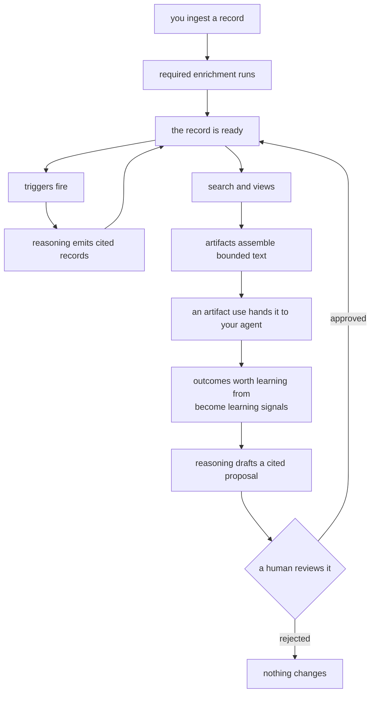

Memseek stores memory as **records**, organized along three questions:

- **Where does it belong?** → the *collection* (what kind of information)
- **Who is it about?** → the *entity* (whose memory)
- **Is it something that happened, or a current fact?** → no *key* (an event)
  or a *key* (a named, updatable fact)

Get these three right and everything else — enrichment, reasoning, search,
prompts — follows naturally. This page explains each concept in plain words,
then shows how real applications map onto them.

## The vocabulary

### Record — one remembered thing

A record is a single memory: "customer emailed asking about pricing", "the
agent decided to prioritize task X", "Maria's current role is CTO". Every
record has:

- `text` — the memory as a readable sentence,
- optional structured `content` — a JSON object checked against the
  collection's schema,
- a **collection**, an **entity**, and a **type**,
- optionally a **key**,
- timestamps: `occurred_at` (when it happened) and `created_at` (when it was
  stored).

Records are **never edited**. Corrections and updates are written as *new*
records that supersede or withdraw the old ones. That is what makes this memory
auditable — you can always see what was believed, when, and why.

### Collection — what kind of information

A collection groups records that follow the same rules, like a drawer in a
filing cabinet or a table in a database. Everything in one collection shares a
schema, an enrichment policy, and a search setup.

Create a collection per *kind* of information — not per user, and not per app
screen:

- `customer_events` — everything that happens with customers
- `customer_profiles` — what we currently know about each customer
- `calendar_events` — appointments
- `reflections` — conclusions an agent has drawn

If two records would be validated, enriched, and searched the same way, they
belong in the same collection. See [Collections](collections.md) for the YAML.

### Entity — whose memory it is

Every record belongs to exactly one entity: the *subject* the memory is about.
An entity is just a string id you choose — `user-42`, `acme-corp`, `agent-7`,
`project-apollo`. Memseek does not define what entities are; you do, and that
choice shapes everything downstream:

- **Searches are usually scoped per entity** — "find records about *this*
  customer."
- **Reasoning runs per entity** — each customer gets their own profile update;
  each agent gets its own reflections.
- **"Enough has happened" is counted per entity** — "enough important events
  *for this customer*."

How to choose: the entity should be the thing you will ask questions about
later.

| You are building… | Good entity | Because you will ask… |
| --- | --- | --- |
| A support or CRM memory | the customer or account | "what do we know about ACME?" |
| A personal assistant | the end user | "what does this user prefer?" |
| A simulated or autonomous agent | the agent itself | "what has agent-7 observed and learned?" |
| A team knowledge base | the project or team | "what happened on project Apollo?" |

The same real-world fact can live under different entities in different
products. "Maria, a contact at ACME, was promoted" might be recorded under
entity `acme-corp` in a CRM, but under entity `maria` in an assistant that
serves Maria directly. Pick the subject whose memory should accumulate.

### Type — what kind of record, within a collection

`type` is a short label distinguishing flavors of records inside one
collection: `event`, `note`, `observation`, `reflection`, `plan`, `fact`.

You are not required to declare types anywhere — you choose them when you
write a record. But searches all over your design can filter on them
(`types: [event]`), so keep to a small, consistent set. When automated
reasoning writes records, its configuration fixes the type it writes.

Use different **types** when records share the same rules but differ in flavor.
Use different **collections** when the rules themselves differ — a different
schema, different enrichment, or a different search setup.

### Key — the name of an updatable fact

A key turns a record from "something that happened" into "the current answer to
a named question". In a keyed collection, each entity-and-key pair holds one
*current* value:

- entity `acme-corp`, key `needs` → "Evaluating SSO options for Q4"
- entity `acme-corp`, key `risks` → "Contract renewal contested by CFO"
- entity `agent-7`, key `skill.plan_meetings` → "Steps that worked so far…"

Writing a new record with the same entity and key **supersedes** the old value.
The old record stays in history, but ordinary reads and searches see only the
latest. Think of a key as a labeled slot on a per-entity whiteboard.

When do you need keys? Whenever a consumer should get *one* answer per question
rather than every answer ever recorded: profiles, preferences, skills, plans,
settings, saved prompt snapshots. When the history itself is the payload —
messages, observations — you don't want a key. You want events.

A keyed value can also be **retracted**: withdrawn without a replacement. Again
this is done by writing a successor record, never by deleting anything.

### Status — live, or awaiting review

A record is either `active` (live: visible to normal search, usable as
evidence) or `draft` (a proposal waiting for review).

Most records are active from the moment they are written. But you can require
that a piece of automated reasoning have its output reviewed. When you do, its
records stay as drafts until someone approves them — at which point approval
writes new active records rather than flipping the drafts in place. See
[reviewed artifacts](artifacts.md#live-vs-reviewed) for the full pattern.

### Annotations and scores — what machines add on top

After a record is stored, **processors** enrich it without touching the record
itself. Every processor attaches an annotation under its own name; two kinds
also write into dedicated storage:

- an **embedding** processor writes the vector that makes a record findable by
  meaning;
- a **score** processor's number is also copied somewhere cheap to read
  (`scores.importance: 8`) so that ranking and triggers can use it without
  loading the whole annotation;
- a **json** processor attaches structured data
  (`annotations.sentiment: {label: negative, confidence: 0.9}`), and can also
  promote numbers inside it into those cheap-to-read scores.

A collection declares which enrichment is **required** and which is optional. A
record is not **ready** — not searchable, not able to set off reasoning — until
every required processor has finished. That barrier is all-or-nothing, so
nothing ever acts on a half-enriched record. See
[Models & processors](processors.md).

### Provenance — where a conclusion came from

Records written by automated reasoning **cite** the records they were derived
from. That gives every record a `depth`: evidence you ingested is depth 0, a
profile fact concluded from it is deeper.

Because citations are checked and stored, you can trace any conclusion back to
its evidence. And if evidence ever has to be erased, everything that depended on
it can be found and removed too.

### Artifact use — connecting a prompt to its outcome

Provenance answers "which records produced this text?" An **artifact use**
answers the question that comes next: "which text went into the run that
produced *this* outcome?"

Binding a use renders a prompt and registers a small handle alongside it: an
id, a fingerprint of the content, and which maintained value feedback should
improve. Your application stores that id next to its own result — the assistant
message, the completed task, the reviewed output — and hands it back later with
what actually happened.

A use is deliberately *not* a log of the invocation. It never holds the prompt
text, the model response, tool calls, token counts, or timings; those belong in
your observability tooling. Memseek keeps only what could change future
knowledge. See [Artifact uses & feedback](artifact-uses.md).

### Learning signal — an outcome worth remembering

Most agent runs should leave no trace here. The few that teach you something —
a thumbs-down, a human correction, a failed task, a low evaluator score —
become ordinary records in a collection of learning signals, cited and typed
like any other evidence.

That is what lets the improvement loop work with no special machinery: a signal
is just a record, so ordinary reasoning reads it, drafts a cited proposal, and
the ordinary review-and-approve path decides whether it ships. Nothing deploys
itself.

### Watermark — the bookmark that keeps reasoning incremental

Each piece of automated reasoning keeps a per-entity bookmark of how far it has
read. A run consumes records past the bookmark, and moving the bookmark forward
on success means the next run sees only what is new. "Enough has happened"
counting works from the same bookmark, so a retry never double-counts.

You rarely configure this. Knowing it exists simply explains why reasoning
processes "everything new since last time" rather than everything, every time.

## Versioning: which "latest" is which

Several things version independently here, and the words *active*, *current*,
and *latest* each belong to a different one. This section untangles them once;
the reference pages link back here.

### Two layers that version separately

**Definitions version** — these are your contracts. A collection, view, or
artifact has an integer `version`, so `customer_events@1` and
`customer_events@2` are two contracts sharing one name. Every record is bound
to the contract it was written under, so you publish a new version when you
change that contract in a way that would make an existing record mean something
different. Purely additive changes can often publish in place — see
[Changing definitions](changing-definitions.md).

Packages version too, but with familiar three-part versions
(`customer_memory@1.2.0`), because a package is a *release*, not a contract.

**Records supersede** — this is your data. In a keyed collection, writing a new
value for the same entity and key creates a *successor*. Nothing is edited or
deleted; the newest active record for a slot simply wins. That chain of
successors is what "versioning" means at the record level, and it has nothing
to do with definition versions.

The two layers meet in exactly one place: every record permanently stores which
collection, which version, and which exact contract it was written under. That
stamp is the whole reason definition versions exist — old records keep being
read through their original contract even after you ship a new one.

### The vocabulary, disambiguated

| Word | Belongs to | Means |
| --- | --- | --- |
| `version: 2` / `name@2` | definitions | Which revision of a collection, view, or artifact contract. |
| `active: true` on a definition | definitions | Which version answers when a reference leaves the version out — `customer_events` alone resolves to the active one. Exactly one per name. |
| `version: 1.2.0` | packages | A release of the whole design. |
| `status: active` on a record | records | The record is live, as opposed to a draft awaiting review. **Unrelated** to the definition flag, despite the shared word. |
| "current value" / `versions: current` in a search | records | For each keyed slot, only the newest active successor. `versions: all` also returns superseded history. |
| A `current` source in a derivation | records | The latest keyed state, selected and re-checked for one run. |
| A derivation's cursor | progress | How far incremental reasoning has consumed. Private runtime progress, not a version of anything. |

### One slot, followed through its life

Abstract rules are easy to misread, so here is a single keyed slot — entity
`acme-corp`, key `needs`, in `customer_profiles@1` — followed through five
writes. Nothing is ever edited or deleted, so each row is a **new record**, and
"current" is recomputed after each one:

| # | What was written | Status | Current value of `needs` afterwards |
| --- | --- | --- | --- |
| 1 | set "Evaluating SSO options" | active | "Evaluating SSO options" |
| 2 | set "Committed to SSO rollout in Q4" | active | "Committed to SSO rollout in Q4" — record 1 is history now, still readable with `versions: all` |
| 3 | set "Also exploring SCIM" | **draft** | *still* "Committed to SSO rollout in Q4" — a draft proposes, it does not replace |
| 4 | record 3 is **approved** | active | "Also exploring SCIM" — approval wrote it as the newest active successor |
| 5 | retract | active | *(empty)* — the slot has no current value; records 1–4 remain as history |

The rule this demonstrates: **for each entity and key, the current value is the
newest successor whose status is active.** A set replaces, a retract empties, a
draft waits.

Reads then pick the layer they want:

- A document read, or a search with `versions: current`, sees only current
  values — after step 5 they show no `needs` at all. This is what feeds prompts
  and decisions.
- A search with `versions: all` sees the whole five-record chain. This is what
  feeds audits and "how did this belief change?" questions.
- Automated reasoning reading current state sees current values, re-checked
  just before it commits, so it cannot write conclusions based on a value that
  changed underneath it.

Note what did **not** change anywhere in that table: `customer_profiles` is
still at definition version 1. Data changing is never a reason to bump a
definition version.

### And separately: when definitions version

Definition versions move only when the *contract* changes meaning:

- You rename a field in the `customer_events` schema, so old stored records
  would be misread through the new schema → publish `customer_events@2` and
  mark it active. Records written under `@1` keep their `@1` stamp forever and
  are still read through it.
- You reword a scorer's prompt without changing what the number means → no new
  version anywhere. Same name, same contract.
- You release your design with these edits → bump the **package** version
  (`customer_memory@1.3.0`), because that is a release label, not a contract.

### Rules of thumb

- Referring to a definition **without** a version (`customer_events`) means
  "whatever is active." That is fine inside a design you control end to end.
  References inside a package, and a view's or artifact's dependencies, are
  always **exact** (`customer_events@1`), so an installed package can never
  change meaning behind your back.
- Bump a **collection version** when old records would be reinterpreted (see
  the [versioning checklist](collections.md#when-to-create-a-new-version)).
  Bump the **package version** whenever you publish any change at all.
- You never bump anything just to *update data* — data updates are new records.
  If you find yourself wanting `profile_v2` as a key or a collection name, you
  probably want a successor record or a new definition version instead.

## What can you model? Three worked shapes

### A support desk that remembers customers

> "Remember every interaction. Keep a current profile per customer. Before I
> reply, brief me."

| The idea in words | Becomes |
| --- | --- |
| "every interaction, never edited" | `customer_events` as an event collection; entity = the customer; types `email`, `call`, `note` |
| "a current profile per customer" | `customer_profiles` as a keyed collection; keys `needs`, `commitments`, `risks` |
| "profiles update themselves when enough happens" | reasoning that runs once enough important events have accumulated |
| "brief me before I reply" | a `customer_brief` artifact: the profile, plus a block of relevant events |

### An assistant that learns its user

> "Learn preferences from conversation. Never forget corrections. Answer 'what
> does this user like?' instantly."

| The idea in words | Becomes |
| --- | --- |
| "raw conversation, as it happened" | `transcripts` as an event collection; entity = the user |
| "learned preferences, one current answer each" | `profiles` as a keyed collection; keys like `diet`, `tone`, `working_hours` |
| "corrections replace old beliefs but keep history" | successor records — a correction is a new write on the same key |
| "instant answers" | a document read, or a search over `profiles` with `versions: current` |

### An autonomous agent that reflects

> "The agent observes, periodically reflects on what its observations mean,
> maintains plans, and improves its skills from outcomes."

| The idea in words | Becomes |
| --- | --- |
| "observes" | `main` as an event collection, type `observation`; entity = the agent |
| "periodically reflects" | reasoning that reads new observations and writes unkeyed reflections, set off once enough important ones accumulate |
| "maintains plans" | `plans` as a keyed collection; reasoning writes keys like `today`, `next_steps` |
| "improves skills from outcomes" | outcome events feed reasoning that proposes a complete new skill, held for review and approved through an artifact |
| "learns from what actually went wrong in production" | bind an [artifact use](artifact-uses.md) per run, submit feedback on the few runs that teach something, and let that same reviewed reasoning consume the resulting learning signals |
| "recalls what matters right now" | a view that blends observations, plans, and reflections with different weights |

The [Generative Agents example](generative-agents-example.md) runs this third
shape end to end.

## The memory flow, end to end

The last three lines are the only cycle in that diagram, and it deliberately
passes through a human or an external evaluator. Evidence flows in
automatically; behavior changes only when someone approves.

Two properties hold everywhere:

- **The database is the source of truth.** An external search index only ever
  nominates candidates — every result is re-checked against the real records
  and your query's rules before you see it. Indexes are disposable and can be
  rebuilt at any time.
- **Everything is versioned and fingerprinted.** Collections, definitions,
  packages, and your whole design carry fingerprints into the record of every
  run and every rendered prompt. No stored record is ever silently
  reinterpreted, and every output traces back to exactly what produced it.

## Where to go next

- Define what you store: [Collections](collections.md)
- Enrich records as they arrive: [Models & processors](processors.md)
- Turn evidence into profiles and reflections: [Derivations](derivations.md)
- Ask questions: [Views & search](views-search.md)
- Assemble prompts and briefings: [Artifacts](artifacts.md)
- Learn from what the agent actually did: [Artifact uses & feedback](artifact-uses.md)
- Ship it: [Packages](packages.md)
