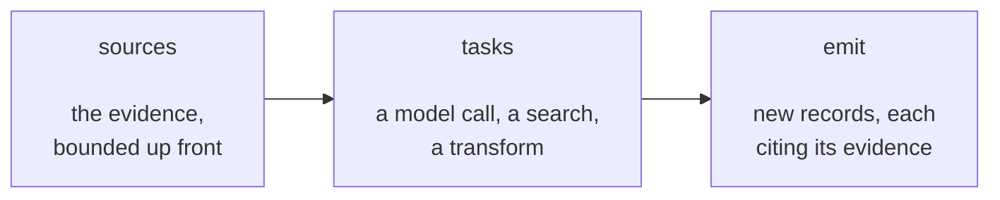

A **derivation** is how memory draws conclusions for you. It reads records you
already have — recent events, the current profile — thinks about them, and
writes new records that cite the evidence behind them. Turning a month of
customer emails into "needs: evaluating SSO options" is a derivation.

Three things happen, in order:



You write those three things. That is the whole job:

- **sources** name the evidence, and cap how much of it there is.
- **tasks** do the work, in order, each one seeing what came before.
- **Emit** says where the results go.

Everything else is handled for you, and is worth knowing about only because it
explains why you don't have to think about it: remembering how far you got last
time, not double-counting on a retry, refusing to write a conclusion if the
underlying value changed mid-run, holding output for review, and committing
everything or nothing. [Runtime receipts and Candidate Sets](evaluation-bases.md)
documents those guarantees if you ever need to reason about them.

Files live under `derivations/`.

!!! note "Two naming quirks"
    Packages list derivations under a field called `processors`, and the manual
    route to run one is `/processors/{name}/run`. Both are historical: a
    derivation is *not* an [enrichment processor](processors.md). See
    [Derivation](glossary.md#derivation-also-called-a-pipeline).

The authoring format on this page begins at `agentic_memory_core@2.2.0`. It is a
deliberate break: the retired `input`/`state`/`steps`/`output` syntax is
rejected outright rather than quietly translated, so an old file fails loudly
instead of behaving differently than it reads.

## A complete example

This derivation incrementally maintains five profile slots:

```yaml
name: profile
trigger:
  accumulator: {metric: importance, threshold: 100}
  cooldown_s: 60

sources:
  new_events:
    kind: changes
    collections: [main]
    types: [event, chat, observation]
    statuses: [active]
    keyed: false
    max_records: 200
    max_tokens: 24000
    allow_empty: false

  current_profile:
    kind: current
    collections: [profiles]
    types: [fact]
    statuses: [active]
    keys: [role, preferences, commitments, open_threads, timeline]
    max_records: 100
    max_tokens: 12000

model: strong
limits:
  max_tasks: 1
  max_llm_calls: 2
  max_retrieved_records: 0
  max_visible_records: 255
  max_total_tokens: 50000
  max_wall_s: 120

tasks:
  - id: result
    use: llm
    with:
      output_schema:
        type: object
        required: [records]
        properties:
          records:
            type: array
            items:
              type: object
              required: [citations]
              properties:
                key: {type: string}
                text: {type: string}
                content: {type: object}
                citations:
                  type: array
                  items: {type: string, format: uuid}
                retract: {type: boolean}
              additionalProperties: false
        additionalProperties: false
      prompt: |
        Maintain the current profile of {{entity}}.

        CURRENT PROFILE:
        {{current_profile.rendered}}

        NEW EVIDENCE:
        {{new_events.rendered}}

        Return only changed slots. Every record must cite visible evidence.
        Return JSON:
        {"records":[
          {"key":"role","text":"...","citations":["uuid"]},
          {"key":"open_threads","retract":true,"citations":["uuid"]}
        ]}

emit:
  from: "{{result.records}}"
  collection: profiles
  type: fact
  keys: [role, preferences, commitments, open_threads, timeline]
```

This says only what the author needs to decide:

1. `new_events` drives the derivation with records not processed by its prior
   successful run.
2. `current_profile` supplies the guarded current slots the computation needs.
3. The registered `llm` task produces a JSON value named `result`.
4. `emit.from` selects `result.records` as the proposed canonical records.
5. Declaring `keys` makes this a partial keyed emission: omitted slots remain
   unchanged.

## Top-level fields

| Field | Meaning |
| --- | --- |
| `name` | The derivation's permanent name, used by triggers, runs, and packages. |
| `trigger` | Optional. When this should run. See [Triggers](triggers.md). |
| `sources` | The evidence, under names you choose. Exactly one must be a *driving* source. |
| `model` | The model alias used by any model step that doesn't name its own. |
| `limits` | Ceilings on the whole run — tokens, model calls, wall-clock. |
| `tasks` | The work to do, in order. |
| `emit` | Where the results are written, and which task result to write. |

Unknown fields are errors. Source names and task ids share one namespace, and
neither may be called `entity` or `run` — those names are already taken. Nothing
may dangle: every source must be used by some task, and every task result must
be used by a later task or by `emit`.

## Sources: naming the evidence

Sources select and *bound* the evidence before any work starts. This ordering is
the point — a derivation can never discover halfway through that it needs to
read more, so its cost is knowable before it runs.

Every derivation has exactly one **driving source**, which decides the basic
question "what is this run about?":

| Driving source | Answers | Use it when |
| --- | --- | --- |
| `changes` | "what's new since last time?" | The normal case. Incremental, cheap, runs often. |
| `snapshot` | "everything within these bounds, right now" | The conclusion must be rebuilt from the whole picture, not patched. |
| `stale_citations` | "what did I conclude from evidence that has since changed?" | Repairing conclusions whose ground moved underneath them. |

Alongside it you may add any number of supporting sources, which supply context
rather than driving the run:

| Supporting source | Gives you |
| --- | --- |
| `current` | A bounded set of current keyed values — typically the profile you are about to update. |
| `record` | One current keyed value. |
| `view` | The results of a saved [view](views-search.md). |

### What a record source exposes

Every record source — `changes`, `snapshot`, `stale_citations`, `current`, and
`record` — exposes two forms:

| Reference | Value |
| --- | --- |
| `{{name.records}}` | A typed list of record objects. Use in exact references and custom task `input`. |
| `{{name.rendered}}` | Escaped one-line rows with record UUIDs and canonical render fields, joined by newlines and nothing more. Use in prompts, wrapped in an element you write. |

Each object in `.records` contains canonical identity and public data such as
`id`, `seq`, `collection`, `collection_version`, `entity`, `key`, `type`,
`status`, `content`, `scores`, and `occurred_at`.

A `view` source also provides `.records` and `.rendered`, using the bounded
hits returned by the named view.

#### Marking rows as untrusted data is yours to write

Row text is always escaped: `&`, `<`, and `>` become the literal text `\u0026`,
`\u003c`, and `\u003e`, so record content cannot close or forge an element.
That escaping is unconditional and not configurable. The escape form is a JSON
unicode escape, so an escaped value interpolated inside a JSON literal still
parses back to the original characters.

What the engine will not do is add prose or markup to your prompt. A
`.rendered` reference substitutes rows and nothing else, so the element that
tells the model those rows are data goes in the prompt you wrote, next to the
instructions it qualifies:

```yaml
prompt: |
  Detect direct contradictions between the changed keyed facts and the current
  keyed facts about {{entity}}.

  CHANGED KEYS:
  <records untrusted="true">
  {{changed_keys.rendered}}
  </records>

  CURRENT KEYS:
  <records untrusted="true">
  {{current_keys.rendered}}
  </records>
```

The same holds for an untrusted scalar — a prior task's output, for instance —
which is escaped and substituted, so wrap it yourself where the framing matters:

```yaml
  REVIEW PATCH PROPOSAL:
  <data untrusted="true">{{proposal}}</data>
```

Choose the tag and the wording you want; the trusted system message every
derivation call carries names the `untrusted="true"` attribute rather than one
fixed element, and it independently tells the model that retrieved record rows
are data. Leaving rows unwrapped changes your prompt's wording, not that
boundary.

### `changes`: consume new records incrementally

```yaml
sources:
  new_events:
    kind: changes
    collections: [crm_events]
    collection_versions: {crm_events: [1]}
    types: [crm_event]
    statuses: [active]
    keyed: false
    max_records: 100
    max_tokens: 12000
    allow_empty: false
```

`changes` reads matching records after this entity and derivation's successful
cursor, in canonical sequence order. It consumes only a ready prefix. If more
matching rows remain, commit queues a successor run.

`max_records` is the per-run batch bound. `max_tokens` is the rendered source
bound. A token-limited changes run may consume the maximal fitting prefix; it
never skips a matching row to reach later evidence.

With `allow_empty: false`, an empty batch becomes a cheap audited no-op. With
`allow_empty: true`, tasks may run even when no driving rows match.

The cursor also stores a private hash of the fields that decide source
membership: kind, collections and versions, types, statuses, and keyed shape.
Changing a prompt, task, emission, limit, `max_records`, `max_tokens`, or
`allow_empty` can continue at the same cursor because each run stores its exact
configuration and task implementation hashes. Changing which records belong to
the `changes` source is rejected: use a new derivation identity or an explicit
`snapshot` derivation. There is no authored cursor-policy switch.

### `snapshot`: reconstruct from a complete bounded scope

```yaml
sources:
  crm_corpus:
    kind: snapshot
    collections: [crm_events]
    types: [crm_event]
    statuses: [active]
    keyed: false
    max_records: 200
    max_tokens: 24000
    allow_empty: true
```

Where `changes` reads only what is *new* since last time and advances a cursor,
`snapshot` reads the *whole* matching set every run, from scratch. Use it when
the output is a fresh rebuild of some state — "reconstruct this profile from all
of its events" — rather than an incremental update. There is no cursor; each run
starts over.

**How "complete" is pinned.** Records keep arriving while a run is computing, so
"all matching records" needs a cutoff, or two runs could disagree about what
"all" meant. At run start Memseek reads the highest sequence number (`seq`) among
matching rows and freezes it as `{{run.checkpoint}}`. The source is then exactly
every matching record with `seq` at or below that checkpoint — no more, no less.
Anything that arrives afterward has a higher `seq` and belongs to the *next*
run, not this one. That is all "captured at one canonical sequence checkpoint"
means: one fixed cutoff line, so the corpus the run derives from is stable and
reproducible.

"Matching" is defined by the source's own fields — collection, version, type,
status, keyed shape, and entity — the same filters every source declares. The
snapshot is complete *with respect to that scope*, not the whole database.

Completeness is strict:

- exceeding `max_records` fails the run;
- not fitting `max_tokens` or `max_visible_records` fails the run; and
- an unready matching row makes the run wait rather than silently excluding it.

Narrow the source, raise a safe bound, or introduce a compacted upstream
collection when the complete history no longer fits one run.

#### `window`: narrow what "complete" means

Sometimes the whole matching history is more than the run needs, and failing the
run is the wrong answer. A `window` declares a *smaller* corpus so completeness
still holds — over that window rather than over all history. It is valid only on
a `snapshot` source, and takes either a tail count or an `occurred_at` range,
never both:

```yaml
sources:
  recent_corpus:
    kind: snapshot
    collections: [crm_events]
    statuses: [active]
    keyed: false
    max_records: 200
    max_tokens: 24000
    window: {recent: 200}          # the 200 newest matching records
```

```yaml
    window:                        # or an explicit occurred_at range
      since: "2026-01-01T00:00:00Z"
      until: "2026-04-01T00:00:00Z"
```

`recent` accepts 1 through 500; `since` must be earlier than `until`, and both
bounds are timezone-aware. The window's lower bound is recorded in the run
receipt as `from_seq`, so a windowed run stays reproducible and honest about what
it excluded — it is a declared narrower scope, not a silent truncation.

### `stale_citations`: repair records whose evidence moved

```yaml
sources:
  stale_syntheses:
    kind: stale_citations
    collections: [syntheses]
    types: [synthesis]
    statuses: [active]
    keyed: true                    # required: this driver reads keyed records
    max_records: 1
    max_tokens: 12000
    allow_empty: false
```

Derived records cite the evidence they were built from, and that evidence can be
superseded later. A profile fact citing "Maria is the platform lead" does not
become wrong by itself when a newer version of that belief lands — but it is now
built on a stale parent. `stale_citations` is the driver that finds exactly those
records: current, ready, non-tombstone keyed rows in its scope whose cited keyed
parents have a newer ready version (including a tombstone).

This is a *repair* driver, so it behaves differently from the other two:

- It has no cursor. Membership is recomputed each run, and the same record
  reappears until its citations are current again — the run's own output is what
  removes it from the set.
- It is guarded like a `current` source: if the stale set changes while tasks are
  running, the commit is rejected as stale rather than writing a repair based on
  a set that no longer holds.
- `keyed: true` is mandatory; the driver reads keyed slots.
- Pair it with `cron: {entities: any}`. The scan uses this driver as its own
  entity selector, so an hourly repair enqueues work only for entities that
  actually have stale citations rather than one noop run per entity.

Keep `max_records` small — one or two records per run — so a large backlog drains
as many cheap bounded runs instead of one oversized one.
`examples/gbrain_catalog/derivations/repair_synthesis.yaml` is the shipped worked
example.

### `current`: read guarded keyed state

```yaml
sources:
  current_profile:
    kind: current
    collections: [user_profiles]
    types: [profile]
    statuses: [active]
    keys: [role, commitments, preferences, open_threads, goals]
    max_records: 20
    max_tokens: 6000
```

`current` selects the latest matching keyed row per collection, key, and
status. It never falls back behind a newer pending row: if the latest match is
not ready, the derivation waits. `keys` is optional; declare it when the key
universe is known. The complete selected set must fit both bounds.

This is a guarded read. Before commit, Memseek reloads the source and rejects
the run as stale if its record identities changed while tasks were running.

### `record`: read one guarded current slot

```yaml
sources:
  account_playbook:
    kind: record
    collection: playbooks
    key: playbook
    type: playbook
    status: active
    max_tokens: 1500
```

`record` is the compact form for one keyed slot. `collection_version` may pin
an exact version; otherwise catalog compilation resolves the active version.
The selected latest ready row, or its absence, is guarded through commit. A
newer pending match makes the derivation wait instead of exposing stale state.

### `view`: run a named bounded query

```yaml
sources:
  commitment_history:
    kind: view
    view: crm_history
    params:
      entity: "{{entity}}"
      query: commitments and next steps
    max_tokens: 3000
```

The named view and its parameters are validated with the whole catalog. At run
time its bounded canonical hits become task-visible values and provenance
parents. A view is a query result, not a current-state precondition; use
`current` or `record` when a concurrent keyed change must invalidate the run.

## Core template values

| Reference | Meaning |
| --- | --- |
| `{{entity}}` | Entity whose derivation job is executing. |
| `{{run.now}}` | UTC start time in ISO 8601 form. |
| `{{run.checkpoint}}` | Driving source sequence checkpoint for this run. |
| `{{run.source_ids}}` | UUIDs selected by the driving source. |

`{{entity}}` is a scalar. Bare `{{run}}` is invalid; run references always
identify an explicit value.

## Tasks: doing the work

Tasks run in the order you list them. Each one names its result so later tasks —
and `emit` — can refer to it.

Every task has the same four parts: an `id` naming its result, a `use` naming
which kind of task it is, optional per-run `input`, and that task type's own
settings under `with`.

```yaml
tasks:
  - id: questions
    use: llm
    with:
      model: cheap
      output_schema:
        type: object
        required: [questions]
        properties:
          questions:
            type: array
            items: {type: string}
        additionalProperties: false
      max_output_tokens: 600
      prompt: |
        Read {{recent_memories.rendered}} and return
        {"questions":["...","...","..."]}.

  - id: evidence
    use: search
    with:
      foreach: "{{questions.questions}}"
      max_tokens: 12000
      spec:
        q: "{{item}}"
        sources:
          - name: memories
            mode: hybrid
            scope:
              entities: ["{{entity}}"]
              collections: [main]
            k: 12
        k: 12
        render: true

  - id: result
    use: llm
    with:
      output_schema:
        type: object
        required: [records]
        properties:
          records:
            type: array
            items:
              type: object
              required: [citations]
              properties:
                key: {type: string}
                text: {type: string}
                content: {type: object}
                citations:
                  type: array
                  items: {type: string, format: uuid}
                retract: {type: boolean}
              additionalProperties: false
        additionalProperties: false
      prompt: |
        Use this evidence:
        {{evidence}}
        Return {"records":[...]}.
```

Tasks run in declaration order. A task result is a typed JSON-compatible value,
so an exact reference such as `{{questions.questions}}` preserves its list
shape while an embedded reference renders it safely as text.

`input` and `with` serve different purposes:

- `input` carries per-run data from a source or earlier task and is validated
  against the registered task's input type; and
- `with` configures the task itself and is validated when your definitions load,
  so a misconfigured task fails at deploy time rather than mid-run.

The built-in tasks require `input` to be omitted and reference named values in
their configured prompt, search specification, or template. Installed
deterministic tasks should prefer an exact typed `input` reference.

There is no special final task and no requirement that it be an LLM. Any
registered task may produce the value referenced by `emit.from`.

### Built-in `llm`

The `llm` task performs a bounded JSON completion. Its `with` fields are:

- `prompt` — required template;
- `model` — optional model alias overriding the derivation default;
- `params` — static provider-neutral validated generation parameters; templates
  are rejected here;
- `output_schema` — the complete object-root JSON Schema for the typed result;
  it is static and explicit in YAML, while `prompt` carries references;
- `max_output_tokens` — optional task-level output cap.

One correction attempt is allowed for malformed JSON or a schema-invalid
result and counts
against `max_llm_calls`. Record ids literally present in the rendered prompt
become the task result's citation authority.

The exact authored schema is also passed through the provider seam. A provider adapter
that declares native JSON Schema capability uses schema-constrained output as
the primary request mode. OpenAI-compatible endpoints do this by default;
operators must explicitly configure `json_object` or `none` for a compatible
endpoint that lacks the capability. Selection happens before the request and a
provider rejection never causes a silent downgrade. Every response is still
validated locally, including native structured output.

The YAML schema is the explicit task-result contract; it cannot weaken the
Emission guarantees. After schema validation, the runtime still enforces the
non-configurable record-draft vocabulary, citation authority, declared keys,
destination collection schema, bounds, and retraction rules.

### Built-in `search`

The `search` task accepts exactly one of:

- `q` for one query; or
- `foreach` for an exact list reference, capped at five items.

`spec` is an ordinary validated SearchSpec and `max_tokens` bounds rendered
hits. Selected canonical hit IDs become provenance and citation authority.

### Built-in `template`

```yaml
- id: result
  use: template
  with:
    template: |
      {"records":[]}
```

`template` renders one string with tracked provenance. It is useful for simple
deterministic composition or as a small stand-in in tests. The emitted value
must still resolve to a JSON record list, so custom code is normally more
useful for deterministic structured output.

## Installing a custom task

The built-in `llm`, `search`, and `template` tasks cover reasoning, retrieval,
and simple composition. When a derivation needs *exact* logic instead — set
arithmetic, money math, a deterministic merge, a call to a trusted internal
service — install a custom task. A custom task is ordinary deployment Python
that you register in the process before any catalog compiles. Workspace YAML can
*select* it, but it can never upload or alter the code: the same trust boundary
that keeps YAML authors from touching the database keeps them from installing
Python.

### A worked example: a deterministic commitments ledger

Take the `profile` derivation from the top of this page. Its `commitments` slot is
maintained by the `llm` task, and the model keeps miscounting: it re-lists
commitments the entity already fulfilled, and occasionally drops one. Whether a
commitment is still open is not a judgement call — it is exact bookkeeping over
the events. That is precisely the kind of work a custom task should own.

The events already carry the structure we need. Each raw event has a
`content.commitment_ref` and an `content.event_kind` of `commitment_made` or
`commitment_fulfilled`. The task pairs them up and emits only the commitments
that were made and not later fulfilled:

```python
import hashlib
from typing import Any

from memseek.derive import TaskConfigModel, TaskContext, TaskResult, register_task


class CommitmentLedgerConfig(TaskConfigModel):
    """Static options, validated once when the catalog compiles."""

    include_fulfilled: bool = False
    max_open: int = 20


async def build_commitment_ledger(
    context: TaskContext,
    value: list[dict[str, Any]],
    config: CommitmentLedgerConfig,
) -> TaskResult[dict[str, Any]]:
    open_by_ref: dict[str, dict[str, Any]] = {}
    fulfilled_refs: set[str] = set()

    for row in value:
        content = row["content"]
        ref = content.get("commitment_ref")
        if ref is None:
            continue
        if content.get("event_kind") == "commitment_fulfilled":
            fulfilled_refs.add(ref)
        elif content.get("event_kind") == "commitment_made":
            open_by_ref[ref] = {
                "text": content["summary"],
                "due": content.get("due_at"),
                "citation": row["id"],
            }

    if not config.include_fulfilled:
        for ref in fulfilled_refs:
            open_by_ref.pop(ref, None)

    ledger = sorted(open_by_ref.values(), key=lambda item: (item["due"] or "", item["text"]))
    ledger = ledger[: config.max_open]

    lines = [f"- {item['text']} (due {item['due'] or 'unspecified'})" for item in ledger]
    return TaskResult(
        {
            "records": [
                {
                    "key": "commitments",
                    "text": "\n".join(lines) or "No open commitments.",
                    "citations": [item["citation"] for item in ledger],
                }
            ]
        }
    )


register_task(
    "commitment_ledger",
    implementation_hash=hashlib.sha256(b"commitment_ledger:v1").hexdigest(),
    config_model=CommitmentLedgerConfig,
    input_type=list[dict[str, Any]],
    output_type=dict[str, Any],
    handler=build_commitment_ledger,
)
```

### Walking through the handler

Every task handler is an `async` function with the same fixed three-argument
shape. The runtime calls it once per task invocation and passes each argument
after validating it:

- **`context: TaskContext`** — the bounded capability handle for this run. It is
  how the task reaches the outside world at all. In this example we never touch
  it because the computation is pure, but a task that needs to reason or retrieve
  calls `context.complete_json(...)`, `context.search(...)`, or
  `context.render(...)` — see [What the context can do](#what-the-context-can-do)
  below. `context.entity` is the entity whose job is running.

- **`value: list[dict[str, Any]]`** — the task's per-run **input**, already
  validated against the `input_type` you registered. This is the value the YAML
  `input:` field resolves to. Here it is the list of new-event record objects, so
  each `row` is one canonical record with the `id`, `content`, `occurred_at`, and
  the other fields described under [Sources](#sources-naming-the-evidence). The `row["id"]`
  we copy into `citation` is the source record's UUID — citing it is what gives
  the emitted slot its provenance.

- **`config: CommitmentLedgerConfig`** — your **static configuration**, an
  instance of the `config_model` you registered, already parsed from the YAML
  `with:` block. Because `CommitmentLedgerConfig` extends `TaskConfigModel` (a
  strict model), unknown `with` keys are rejected at catalog-compile time, and
  `include_fulfilled` / `max_open` arrive as real typed fields with their
  defaults applied.

The handler returns a `TaskResult` wrapping the value that later steps and
`emit.from` reference — here `{"records": [...]}`, the unified record-draft shape.
You may also return the bare value; wrapping it in `TaskResult` is what lets you
*narrow* provenance (covered below). The returned value is validated against the
registered `output_type` before anything downstream sees it.

The distinction between the second and third arguments is the one to hold onto:

| Argument | Comes from | Validated against | Changes per run? |
| --- | --- | --- | --- |
| `value` (input) | YAML `input:` — a source or earlier task reference | `input_type` | Yes, every run |
| `config` | YAML `with:` — literal options | `config_model` | No, fixed at compile time |

### Registering the task

`register_task` is the single call that makes the handler selectable. Every
argument after `name` is keyword-only:

| Argument | Purpose |
| --- | --- |
| `name` | The public task-type name that YAML selects with `use:`. Lower-case, alphanumeric-plus-underscore, ≤32 characters. Shares one namespace with task ids and source names, so it cannot collide with a source name, `entity`, or `run`. |
| `implementation_hash` | 64 lower-case hex characters identifying *this version* of the code. Runs record it, so bump it whenever the behavior changes. Hashing a version string, as above, is the idiomatic way to produce one. |
| `config_model` | The `TaskConfigModel` subclass that validates the YAML `with:` block and is handed back as `config`. |
| `input_type` | The type the YAML `input:` value is validated against before it becomes `value`. Defaults to `Any`; prefer an exact type like `list[dict[str, Any]]` so a mis-wired `input` fails at compile time, not mid-run. |
| `output_type` | The type the handler's return value is validated against. Defaults to `Any`; declaring it catches a handler that drifts from its contract. |
| `handler` | The `async` function itself. Registration rejects a non-coroutine handler. |

Registering the same `name` twice raises — each task is registered exactly once,
at import time.

### Deploying the module

Put the registration in a module that ships with your deployment, then name that
module on **both** service processes so they resolve an identical registry:

```dotenv
TASK_MODULES=["acme_memory.tasks"]
```

The API and worker import every listed module before compiling any catalog. If
only one process imported it, a catalog that compiles on the API could fail to
run on the worker — naming it in both places is what keeps the version-hashed
registry consistent across the service.

### Selecting it from YAML

Once the module is loaded, the task is available to workspace YAML exactly like a
built-in. In the `profile` derivation, swap the `llm` task that owned the
`commitments` slot for this one:

```yaml
tasks:
  - id: result
    use: commitment_ledger
    input: "{{new_events.records}}"
    with:
      include_fulfilled: false
      max_open: 20
```

Reading it against the handler:

- `use: commitment_ledger` selects your registered task type by name.
- `input: "{{new_events.records}}"` is an **exact** reference to the driving
  source's typed record list. It arrives as the handler's `value`, validated
  against `input_type`. (Use the `.records` form, not `.rendered` — the handler
  wants structured records, not rendered prompt rows.)
- `with:` supplies the static options, validated against `CommitmentLedgerConfig`
  and delivered as `config`.

The handler returns ordinary JSON drafts, so they flow through the *same*
citation, schema, key, target-head, and commit checks as any LLM output. Nothing
about emission changes: `emit.from: "{{result.records}}"` still points at this
task's result, and the `commitments` slot is maintained deterministically.

### What the context can do

When a custom task needs more than pure computation, it works through the
bounded `context`, which deliberately exposes only four capabilities:

- `context.entity` — the entity whose derivation job is executing;
- `context.complete_json(...)` — a bounded JSON model completion, counted against
  `max_llm_calls`;
- `context.search(...)` — a bounded retrieval; and
- `context.render(...)` — provenance-aware template rendering.

Note what it deliberately does **not** hand you: a database connection, a way to
act as another workspace, a way to write records directly, or any control over
progress bookmarks and approvals. Your task computes freely inside this sandbox;
writing records stays with the system.

### What a task may cite

Your task never has to track provenance by hand — it is tracked for you. A
result automatically inherits the evidence behind whatever it was given: its
`input`, the configuration it referenced, and anything the bounded tools
returned.

A task may **narrow** that set, saying in effect "of everything I saw, only these
records actually support my answer." What it can never do is **widen** it.
Inventing provenance, or claiming to cite something it was never given, is
rejected outright — which is what makes a citation worth trusting.

Narrowing only tightens what later tasks may lean on. Behind the scenes the run
still remembers every record it read, deliberately, because that is what erasure
and progress tracking need to be correct.

Finally, every task implementation is fingerprinted, and each run records both
that fingerprint and one of its output. So even with your own code in the loop,
a run always names the exact version of the code that produced it.

## What an emitted record looks like

Whatever a task produces, `emit.from` must point at a **list**. Every item in it
uses the same small vocabulary, no matter which kind of task built it:

```json
{
  "key": "commitments",
  "text": "Avery committed to deliver the beta by September 30.",
  "content": {"confidence": 0.94},
  "citations": ["full-source-uuid"],
  "retract": false
}
```

| Field | Rules |
| --- | --- |
| `key` | Required when writing named facts; forbidden when writing events. |
| `text` | Can be omitted only if `content` already supplies what the collection requires. It may not disagree with `content.text`. |
| `content` | Optional structured data, merged with `text`. Fields the system owns are not allowed here. |
| `citations` | The evidence this record came from, as a bounded list of unique record ids. Should almost never be empty. |
| `retract` | Optional. Withdraws a named fact. Only for keyed output, and cannot be combined with text or content. |

Before anything is committed, every proposed record is checked against the exact
destination collection version. Unknown fields are rejected, and so are internal
fields like `tombstone`, `status`, or `run_id` — those are written by the system,
never by you.

A note on citing **absence**, which is subtler than it looks. To retract one key
out of many, you must cite the evidence that justifies withdrawing it. But a
`snapshot` derivation that legitimately concludes "this fact no longer holds"
may leave the citations empty for that key — because it read a *complete*
bounded set of evidence, and the record of that complete read is itself the
proof that nothing supporting the fact remained.

## Emission intent and inferred behavior

An event emission is minimal:

```yaml
emit:
  from: "{{result.records}}"
  collection: reflections
  type: reflection
  max_records: 50
```

A keyed partial emission declares the allowed key universe:

```yaml
emit:
  from: "{{result.records}}"
  collection: profiles
  type: fact
  keys: [role, preferences, goals]
```

A reviewed complete emission adds two intent flags:

```yaml
emit:
  from: "{{result.records}}"
  collection: profiles
  type: profile
  keys: [role, preferences, goals]
  complete: true
  review: required
```

A repair emission carries the driving record's own key forward:

```yaml
emit:
  from: "{{repaired.record}}"
  collection: syntheses
  type: synthesis
  driver_key: true
  max_records: 1
```

The runtime infers the transition:

| Author declaration | Required task result | Runtime behavior |
| --- | --- | --- |
| no `keys` | Up to `max_records` unkeyed drafts | Append new event records. |
| `keys`, `complete: false` | Any unique subset of declared keys | Update emitted slots; leave omissions unchanged. |
| `keys`, `complete: true` | Exactly one draft for every declared key | Propose a complete keyed replacement. |
| `driver_key: true` | Exactly one draft, key omitted | Update the slot the single keyed driving record occupies. |
| `dynamic_keys: true` + `max_active_keys` | Unique model-named keys, within the declared live-key bound | Maintain a bounded set of independent keyed blocks. |
| no `review` | Validated output | Commit active records after guard verification. |
| `review: required` | Bounded keyed output | Write drafts that a human must approve before they go live. |

`driver_key` exists for repair and rewrite derivations, where the key is not known
when the catalog is authored — it is whichever slot the driving record happens to
occupy. It requires `max_records: 1`, forbids static `keys`, and forbids
`complete: true`.

`dynamic_keys: true` is for a bounded collection of independent named blocks,
such as scene documents. It requires `max_active_keys`; it cannot combine with
static `keys`, `driver_key`, `complete`, or `review`. Before the task runs, the
engine captures every current head in that output collection. At commit it checks
that none changed and that the proposed live set remains within the declared
bound. A new name receives an explicit empty-head precondition in the receipt.

`collection_version` may pin a version; otherwise catalog compilation resolves
the active one. A keyed emission requires a keyed or mixed collection. An
unkeyed emission requires an event or mixed collection. Reviewed event
emissions are intentionally unsupported.

One derivation emits one collection/type contract. Use separate derivations for
different destinations; the tasks inside one derivation may still do whatever
typed computation they need.

Every keyed slot you declared is snapshotted before the work starts, even if the
run ends up writing only some of them. (A derivation that decides its keys at
run time snapshots the whole bounded collection instead.) That is what makes the
stale-value protection automatic: you never write compare-and-set logic in YAML.

## Holding output for review

Setting `review: required` means the derivation's output does **not** go live.
Instead it is written as drafts, together with a summary of how it differs from
what is currently believed — so a reviewer sees the proposed change, not just
the proposal.

Someone can then inspect the run and approve it:

```python
candidate = await client.run(run_id)
print(candidate["run"]["content"]["candidate_set"]["divergence"])

await client.promote(
    entity="contact:avery-chen",
    source_run_id=run_id,
    artifact="crm_profile_candidate",
)
```

Approving copies the selected drafts into new live records. The drafts
themselves are never modified, and neither is any definition — so the proposal
remains on record next to what was approved.

If any of the values being replaced changed *after* the proposal was generated,
the whole thing fails with `409 promotion_stale` rather than approving a
decision that was made against outdated information. Re-run the derivation and
review the fresh proposal.

Finding runs uses the same vocabulary you authored with:

```python
snapshot_runs = await client.runs(
    entity="contact:avery-chen",
    processor="crm_profile_rebuild",
    source="snapshot",
)
```

Reading one run in full also returns the internal record of what it read and
what it proposed, which is what auditing and approval work from. Listing runs
deliberately does not expose that internal vocabulary.

See [Artifacts](artifacts.md) for how a reviewer actually sees a proposal.

## Run-wide limits

```yaml
limits:
  max_tasks: 3
  max_llm_calls: 4
  max_retrieved_records: 60
  max_visible_records: 220
  max_total_tokens: 50000
  max_wall_s: 150
```

- `max_tasks` bounds the declared task count, up to 20.
- `max_llm_calls` includes correction attempts and calls made by installed
  tasks through the constrained context.
- `max_retrieved_records` bounds records exposed by search tasks.
- `max_visible_records` bounds the union of driving, current, record, view,
  and searched canonical records.
- `max_total_tokens` bounds prompt plus completion usage for the run.
- `max_wall_s` bounds task execution wall time.

Catalog compilation also verifies task-specific static bounds where possible.
Installed tasks are trusted async deployment code; they remain unable to
bypass Memseek's model, search, provenance, emission, or canonical-write
Modules.

## Triggers

The inline `trigger:` block declares when this derivation runs. Conditions can
be combined:

```yaml
trigger:
  read: true
  accumulator: {metric: importance, threshold: 100}
  write:
    collections: [main]
    types: [observation]
    statuses: [active]
  cooldown_s: 60
```

| Condition | Meaning |
| --- | --- |
| `write` | Enqueue when a ready row matches a scope that is a subset of the driving source. |
| `changed` | Enqueue when a keyed head is added, changed, or removed — not on identical rewrites. |
| `retraction` | Enqueue when a ready tombstone lands in a keyed scope. |
| `accumulator` | Enqueue when an aggregate (`sum`, `count`, `avg`, `max`, `min`, `distinct_count`) over ready rows above the cursor crosses a threshold. |
| `census` | Enqueue when new driver data arrives and the entity's current matching records reach a floor. |
| `lifecycle` | Enqueue on the entity's first record, or when its total history reaches a size. |
| `quiet` | Enqueue once matching arrivals have settled for `after_s` seconds. |
| `at` | Enqueue when the wall clock passes a datetime stored in a record field. |
| `read` | Stale-while-revalidate enqueue from freshness-aware document reads. |
| `cron` | Scan dirty or all known entities on a UTC cron schedule. |

`cooldown_s` rate-limits a trigger after successful runs; `debounce_s` lets
arrivals settle before one. Triggers coalesce into one durable
entity/derivation mailbox. Manual enqueue is always available. Automatic cycles
are rejected when the catalog graph loads. Standalone `triggers/*.yaml` files
attach further schedules to a derivation without copying its computation.
Condition semantics, `where` predicates, pacing, coalescing, and validation
rules have their own page: [Triggers](triggers.md).

## What you get for free

Tasks can be arbitrary code, including your own. That flexibility never weakens
the storage guarantees, because of one rule:

> A task may compute whatever it likes inside its bounded context. Only the
> system itself may write a record.

Concretely, on every run and without any configuration from you:

- every record the run read is recorded, so you can see exactly what it saw;
- the exact configuration of the derivation and every task is fingerprinted, so
  a change in behavior is always traceable to a change in definition;
- a task cannot cite evidence it was never given;
- emitted records must satisfy the destination collection's contract, or nothing
  is written;
- current values are re-checked at the last moment — if the profile changed
  while the run was thinking, the run does not overwrite it with a stale
  conclusion;
- records and run history are never edited;
- an incomplete snapshot or an exceeded budget **fails** rather than writing a
  partial result;
- approving reviewed output is all-or-nothing, and cannot approve something that
  has since gone stale.

The theme is that everything **fails closed**. When a derivation cannot do its
whole job correctly, it writes nothing at all rather than leaving you with a
half-updated profile you have no way to detect.

## Next

- The guarantees above, in detail:
  [Runtime receipts and Candidate Sets](evaluation-bases.md)
- Control when a derivation runs: [Triggers](triggers.md)
- Follow one through a real product: [CRM profile walkthrough](crm-walkthrough.md)
- Ship it: [Authoring a workspace catalog](authoring-definitions.md)
