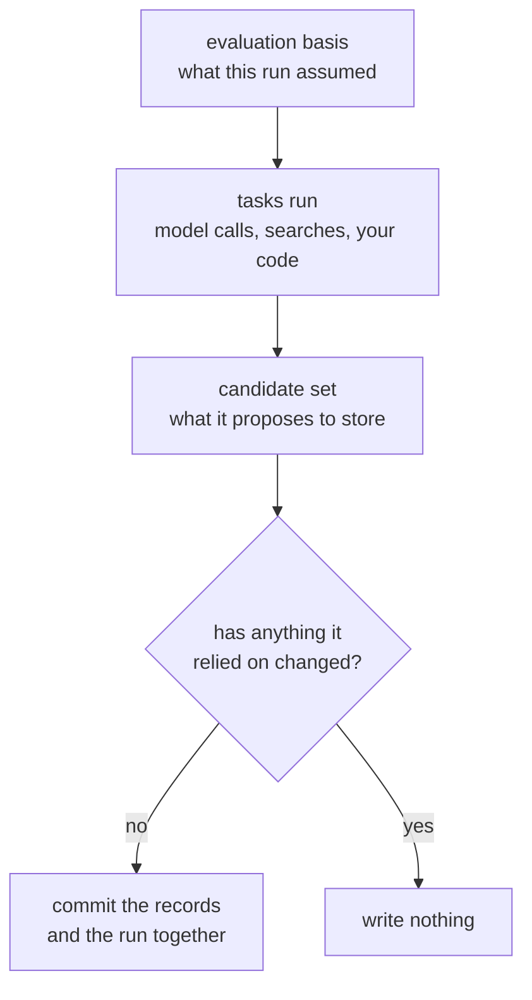
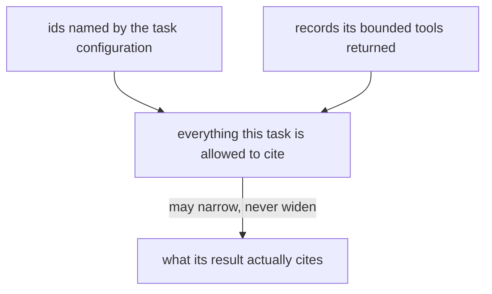

When a derivation runs, two things could go wrong that you would never notice:

- it reads a customer's profile, spends eight seconds thinking, and meanwhile
  another run updates that profile — so it writes a conclusion based on a value
  that is no longer true;
- it claims to have concluded something "from the evidence", but you have no way
  to check which records it actually read.

Memseek closes both holes with two internal records, created automatically on
every run. You never write them, and nothing in your YAML mentions them — but
they are why a derivation is safe to run unattended, and they are what you read
when you audit one.

- The **evaluation basis** is the *read receipt*, captured before any work
  starts: "this run assumed these records, at this point in time, with these
  values current."
- The **candidate set** is the *write proposal*, compiled after the work
  finishes: "given that receipt, here is what I propose to store."



The check at the bottom is the whole point. Everything slow happens between the
basis and the candidate set, and the world can move during that time — so the
run's assumptions are verified again before a single record is written.

The gap between those two moments is the dangerous part, and the receipt is what
makes it safe: before anything is written, the runtime re-checks that the world
still looks the way the run assumed. If it doesn't, nothing is written.

Both objects are kept for auditing and for approving reviewed output. Their
internal classifications are inferred from ordinary derivation intent — you
never choose them directly.

## The author-to-runtime mapping

| Derivation declaration | Internal result |
| --- | --- |
| driving source `kind: changes` | Incremental basis after the prior successful cursor. |
| driving source `kind: snapshot` | Complete bounded corpus basis through an exact checkpoint. |
| snapshot `window: {recent}` / `{since, until}` | Corpus narrowed to a recent tail or `occurred_at` range; `from_seq` records the lower bound. |
| `current` or `record` source | Guarded read IDs in the basis. |
| `emit.keys` | Expected active heads captured for every declared target key. |
| no `emit.keys` | Append candidate set. |
| `emit.keys`, `complete: false` | Partial keyed-update candidate set. |
| `emit.keys`, `complete: true` | Complete keyed-replacement candidate set. |
| no `emit.review` | Candidate records target active state. |
| `emit.review: required` | Candidate records target draft state and require approval. |

Detailed audit data uses shorter internal words for these — `changes`/`corpus`
and `append`/`patch`/`replace`. They are private classifications, not YAML
options and not filters you can query on. When listing runs, use the friendly
`source=changes|snapshot` filter; `snapshot` corresponds to the internal
`corpus` only inside a detailed audit record.

## Why the receipt is necessary

A task can run for seconds: calling a model, searching history, executing your
own code. In that window, another worker can update the same entity.

Without a read receipt, the later commit could silently combine:

- old current state read before computation;
- a new target head written during computation; and
- output derived from the old state.

The evaluation basis makes the assumptions explicit and recheckable. It
answers:

| Question | Receipt field |
| --- | --- |
| Which driving records were evaluated? | `input_ids` |
| What exact sequence range was selected? | `from_seq`, `through_seq` |
| Which current/record sources were read? | `reads` |
| Which active output rows existed at start? | `expected_heads` |
| Which incremental run preceded this one? | `predecessor_run_id` and its source-membership hash |

The receipt is deliberately broader than the prompt. A derivation may choose
*not* to show the model the current profile — an independent rebuild, for
instance, should not be anchored by what it is replacing. The runtime still
records those current values behind the scenes, purely as a safety check at
commit and approval time.

## Example 1: incremental partial profile maintenance

Consider this authoring fragment:

```yaml
sources:
  new_events:
    kind: changes
    collections: [crm_events]
    types: [crm_event]
    statuses: [active]
    keyed: false
    max_records: 100
    max_tokens: 12000

  current_profile:
    kind: current
    collections: [user_profiles]
    types: [profile]
    statuses: [active]
    keys: [role, preferences, goals]
    max_records: 10
    max_tokens: 4000

tasks:
  - id: result
    use: llm
    with:
      output_schema:
        type: object
        required: [records]
        properties:
          records:
            type: array
            items:
              type: object
              required: [citations]
              properties:
                key: {type: string}
                text: {type: string}
                content: {type: object}
                citations:
                  type: array
                  items: {type: string, format: uuid}
                retract: {type: boolean}
              additionalProperties: false
        additionalProperties: false
      prompt: |
        CURRENT: {{current_profile.rendered}}
        NEW: {{new_events.rendered}}
        Return {"records":[...]}.

emit:
  from: "{{result.records}}"
  collection: user_profiles
  type: profile
  keys: [role, preferences, goals]
```

Assume:

- the prior successful cursor is sequence `120`;
- new event records `E121`, `E122`, and `E123` are ready;
- current profile heads are `role=P20`, `preferences=P21`, and no `goals`
  record exists.

Before the task runs, Memseek records a receipt conceptually equivalent to:

```json
{
  "mode": "changes",
  "from_seq": 120,
  "through_seq": 123,
  "input_ids": ["E121", "E122", "E123"],
  "reads": {
    "current_profile": ["P20", "P21"]
  },
  "expected_heads": [
    {"collection": "user_profiles", "key": "role", "record_id": "P20"},
    {"collection": "user_profiles", "key": "preferences", "record_id": "P21"},
    {"collection": "user_profiles", "key": "goals", "record_id": null}
  ]
}
```

Suppose the task emits:

```json
[
  {
    "key": "role",
    "text": "Avery is VP of Product.",
    "citations": ["E121"]
  },
  {
    "key": "preferences",
    "text": "Avery prefers written updates before meetings.",
    "citations": ["E123"]
  }
]
```

The candidate set is internally a partial keyed update:

```json
{
  "effect": "patch",
  "coverage": "partial",
  "status": "active",
  "covered_keys": ["role", "preferences"]
}
```

`goals` is omitted and remains unchanged. Before inserting anything, the
commit re-verifies:

1. the derivation cursor is still `120` with the same predecessor;
2. the `current_profile` selected IDs are still `P20` and `P21`; and
3. all three declared emission heads still match the receipt.

Any mismatch rejects the whole run as stale. A successful commit advances the
cursor through `123` and queues another run if later matching records exist.

The successful run also persists `source_hash`, calculated only from fields
that decide membership in the changes stream. Prompt, task, emission, and
budget evolution may continue at the same cursor and remains auditable through
their separate hashes. Changing collections, versions, types, statuses, or
keyed membership is rejected with guidance to use a new derivation name or a
snapshot; otherwise one cursor could silently change what “already consumed”
means.

## Example 2: independent complete rebuild

A rebuild need not read the current profile:

```yaml
sources:
  crm_corpus:
    kind: snapshot
    collections: [crm_events]
    types: [crm_event]
    statuses: [active]
    keyed: false
    max_records: 200
    max_tokens: 24000
    allow_empty: true

tasks:
  - id: result
    use: llm
    with:
      output_schema:
        type: object
        required: [records]
        properties:
          records:
            type: array
            items:
              type: object
              required: [citations]
              properties:
                key: {type: string}
                text: {type: string}
                content: {type: object}
                citations:
                  type: array
                  items: {type: string, format: uuid}
                retract: {type: boolean}
              additionalProperties: false
        additionalProperties: false
      prompt: |
        Rebuild the profile through {{run.checkpoint}} from:
        {{crm_corpus.rendered}}
        Return exactly role, preferences, and goals.

emit:
  from: "{{result.records}}"
  collection: user_profiles
  type: profile
  keys: [role, preferences, goals]
  complete: true
  review: required
```

### What `snapshot` means here

`kind: snapshot` is a request to rebuild from one **complete, bounded corpus**.
It is not a database dump, a long-lived cursor, or a promise that the task sees
every record in the workspace. The runtime resolves it in this order:

```text
1. Apply this source's scope for this entity
2. Capture the highest matching canonical `seq` as `through_seq`
3. Select every matching row with `seq <= through_seq`, and require each
   selected row to be ready
4. Require the complete set to fit all declared bounds
5. Run tasks against exactly that set
6. Recheck guarded reads and target heads before commit/promotion
```

The checkpoint is a boundary, not an extra record. For example, if the
matching rows are `E247`, `E248`, and `E250` when the run starts:

```text
seq:       247   248   250 | 251
                         ^     ^
                 through_seq  arrives while the task runs

this run:  E247  E248  E250
next run:                    E251 (if it matches the source)
```

The row at `251` is deliberately excluded from this run even if it arrives
before the task finishes. A later run captures a new checkpoint and can include
it. Conversely, a matching row already at or below the checkpoint cannot be
silently left out: if the complete set exceeds `max_records`, the rendered
`max_tokens`, or the run's `max_visible_records`, the run fails and the source
must be narrowed, given a safe larger bound, or bounded with a `window` (see
[Bounding a large corpus with a window](#bounding-a-large-corpus-with-a-window)).
If a selected row is not ready, the run waits rather than treating that row as
absent.

This is why the receipt stores `mode: corpus`, `through_seq`, and the exact
`input_ids`. A snapshot run has no predecessor cursor to advance; each run
starts from its own checkpoint. `allow_empty: true` permits a zero-row corpus
to execute, while `allow_empty: false` records a cheap no-op. "Complete" always
means complete for this source's declared collection/version, type, status,
keyed shape, and entity—not complete for unrelated records.

The word `snapshot` is also used elsewhere for a materialized artifact record.
That artifact snapshot is an output persisted by an artifact endpoint. The
snapshot source described here is an **input selection rule** for a derivation;
it does not create a database copy or freeze writes outside this run.

### Bounding a large corpus with a window

A plain snapshot reads every matching record through the checkpoint. When a
corpus grows past what one run can carry, you do **not** have to keep widening
`max_records` or let the run fail. Declare a `window` to make the corpus itself
smaller, and completeness is asserted over that declared window rather than over
the whole scope. Two modes are available, and they are mutually exclusive:

```yaml
sources:
  crm_corpus:
    kind: snapshot
    collections: [crm_events]
    types: [crm_event]
    max_records: 200
    max_tokens: 24000
    window:
      recent: 200        # ── mode A: the most-recent 200 rows at/below the checkpoint
      # ── or mode B ──
      # since: 2026-01-01T00:00:00Z
      # until: 2026-07-01T00:00:00Z   # optional; defaults to the checkpoint
```

- **`recent: N`** rebuilds from the newest `N` records at or below the
  checkpoint. This directly bounds the record count that would otherwise
  overflow, so it is the usual answer to "there are simply too many rows."
- **`since` / `until`** rebuilds from records whose `occurred_at` falls in the
  range. `until` also moves the frozen checkpoint down to the newest in-range
  row; omit it to run through the live checkpoint. Use this for period rebuilds
  or reprocessing a historical slice.

A window narrows the corpus; it is **not** a silent truncation. The excluded
lower bound is recorded in the receipt as `from_seq`, so the run stays exactly
reproducible and honest about what it left out. Every guarantee still holds over
the window: rows in the window must be ready (else the run waits), and the
windowed set must still fit `max_records`, `max_tokens`, and
`max_visible_records`—a `recent` window only trips that ceiling when `recent`
itself exceeds `max_records`. "Complete" now means complete for
scope&nbsp;∩&nbsp;window.

One consequence is worth stating plainly: a `complete: true` keyed replacement
computed from a window reflects only the windowed evidence. A profile rebuilt
from the last 200 events is a replacement derived from those 200 events; the
receipt's `from_seq` is what keeps that auditable.

### What a task actually receives

The snapshot itself does not inject hidden database state into a task. It binds
one named value—in this example, `crm_corpus`—plus the run metadata:

| Reference | Value exposed to the task |
| --- | --- |
| `{{crm_corpus.records}}` | A typed list containing each selected row's `id`, `seq`, `collection`, `collection_version`, `entity`, `key`, `type`, `status`, `content`, `scores`, and `occurred_at`. |
| `{{crm_corpus.rendered}}` | The same rows rendered as deterministic, one-line records joined by newlines, with `&`, `<`, and `>` escaped. Each line includes the record ID, time, collection/type, optional key and rendered scores, and the record's full `content.text` (or `retracted` for a tombstone); it does not include the whole `content` object. The rows carry no wrapping element of their own — the prompt supplies that. |
| `{{run.checkpoint}}` | The captured `through_seq` integer. |
| `{{run.source_ids}}` | The selected canonical record UUIDs, for audit and citation validation. |

For a concrete run, suppose the checkpoint is `123` and the source selects
three ready rows:

```json
{
  "run": {
    "checkpoint": 123,
    "source_ids": [
      "11111111-1111-4111-8111-111111111111",
      "22222222-2222-4222-8222-222222222222",
      "33333333-3333-4333-8333-333333333333"
    ]
  },
  "crm_corpus": {
    "records": [
      {
        "id": "11111111-1111-4111-8111-111111111111",
        "seq": 121,
        "collection": "crm_events",
        "collection_version": 1,
        "entity": "contact:avery-chen",
        "key": null,
        "type": "crm_event",
        "status": "active",
        "content": {"text": "Avery became VP of Product."},
        "scores": {},
        "occurred_at": "2026-07-20T10:00:00Z"
      },
      {
        "id": "22222222-2222-4222-8222-222222222222",
        "seq": 122,
        "collection": "crm_events",
        "collection_version": 1,
        "entity": "contact:avery-chen",
        "key": null,
        "type": "crm_event",
        "status": "active",
        "content": {"text": "Avery prefers written updates."},
        "scores": {},
        "occurred_at": "2026-07-20T11:00:00Z"
      },
      {
        "id": "33333333-3333-4333-8333-333333333333",
        "seq": 123,
        "collection": "crm_events",
        "collection_version": 1,
        "entity": "contact:avery-chen",
        "key": null,
        "type": "crm_event",
        "status": "active",
        "content": {"text": "Avery plans to ship Northstar in Q3."},
        "scores": {},
        "occurred_at": "2026-07-20T12:00:00Z"
      }
    ]
  }
}
```

Because the example prompt references `{{crm_corpus.rendered}}`, the LLM sees
the corresponding rendered value—not the JSON above—inside the prompt:

```text
Rebuild the profile through 123 from:
<records untrusted="true">
[id=11111111-1111-4111-8111-111111111111] 2026-07-20T10:00:00Z | crm_events/crm_event | Avery became VP of Product.
[id=22222222-2222-4222-8222-222222222222] 2026-07-20T11:00:00Z | crm_events/crm_event | Avery prefers written updates.
[id=33333333-3333-4333-8333-333333333333] 2026-07-20T12:00:00Z | crm_events/crm_event | Avery plans to ship Northstar in Q3.
</records>
Return exactly role, preferences, and goals.
```

The three record lines are the substituted value of `{{crm_corpus.rendered}}`.
The `<records>` element around them is part of the prompt the author wrote, not
something rendering added — see [Derivations](derivations.md) for why that
boundary belongs in the definition.

Thus the prompt in this example feeds `{{run.checkpoint}}` and
`{{crm_corpus.rendered}}`. It does not feed `expected_heads` or the active
profile, because no `current` source is declared. Those target heads are still
captured privately and guarded at commit and approval. If a task instead
references `{{crm_corpus.records}}`, it receives the typed JSON-like list (with
the full `content`/`scores` mappings), escaped and substituted into the prompt.
For an `llm` task, this prompt is sent alongside Memseek's system instruction
that anything inside an element marked `untrusted="true"`, and any retrieved
record row, is data rather than instruction, and that the response must be the
requested JSON. Tasks never receive a database connection
or a canonical writer.

Assume the highest matching sequence at run start is `250`. The snapshot
Source must include every matching row through `250`; it cannot silently take
the first 200 if 201 rows exist.

The active target heads are still captured even though no current profile is
shown to the task. The task could emit:

```json
[
  {"key":"role", "text":"Avery is VP of Product.", "citations":["E121"]},
  {"key":"preferences", "retract":true, "citations":[]},
  {"key":"goals", "text":"Ship Northstar in Q3.", "citations":["E210"]}
]
```

This compiles to a complete draft candidate set:

```json
{
  "effect": "replace",
  "coverage": "complete",
  "status": "draft",
  "covered_keys": ["role", "preferences", "goals"]
}
```

Every declared key must appear exactly once. `preferences` is an explicit
retraction, not an omission. Its citations may be empty because the complete
bounded receipt—not a single event—supports the conclusion that no current
value exists.

The draft records do not alter the active profile. They remain reviewable
alongside their receipt and divergence.

## Example 3: append-only extraction

An event destination has no key universe:

```yaml
sources:
  transcripts:
    kind: changes
    collections: [transcripts]
    types: [transcript]
    keyed: false
    max_records: 5
    max_tokens: 30000

tasks:
  - id: result
    use: llm
    with:
      output_schema:
        type: object
        required: [records]
        properties:
          records:
            type: array
            items:
              type: object
              required: [citations]
              properties:
                key: {type: string}
                text: {type: string}
                content: {type: object}
                citations:
                  type: array
                  items: {type: string, format: uuid}
                retract: {type: boolean}
              additionalProperties: false
        additionalProperties: false
      prompt: |
        Extract durable observations from {{transcripts.rendered}}.
        Return {"records":[{"text":"...","citations":["uuid"]}]}.

emit:
  from: "{{result.records}}"
  collection: main
  type: observation
```

The candidate set is internally `append`. Every draft must omit `key`, include
schema-valid content, and cite evidence authorized by the producing task.
There are no active target heads because events do not supersede a keyed slot.

## What tasks can and cannot do to provenance

Tasks are general-purpose, but what they may claim as evidence only ever
narrows:



For the built-in `llm` task:

- transitive source IDs are the records represented by prompt references; and
- directly citable IDs are the subset whose complete UUIDs occur literally in
  the rendered prompt.

For `search`, selected canonical hit IDs become citable. An installed task may
return `TaskResult` to narrow the inherited sets. The runtime rejects any
attempt to add an ID that was not available to the task or to make a hidden ID
directly citable.

Task narrowing controls downstream values and direct citation authority. The
run's canonical lineage remains deliberately conservative: every admitted,
model-visible record stays a dependency so erasure invalidates the checkpoint
that consumed it rather than letting a cursor skip erased evidence.

At emission compile time, each `citations` UUID must be in the producing task
result's citation set. At commit time, every source record is reloaded under
the workspace lock; erased or cross-workspace parents cannot be smuggled into
lineage.

## Candidate validation

Before anything is written, every proposed record is checked:

- `emit.from` resolved to a list no larger than `emit.max_records`;
- every item is an object containing finite JSON;
- events omit `key`; keyed drafts use unique declared keys;
- complete output covers every key exactly once;
- retractions are keyed and do not also carry content;
- citations are unique, bounded, and were genuinely available to the task that
  produced them;
- your content does not try to set fields the system owns; and
- the final content satisfies the exact destination collection JSON Schema.

Only once all of that passes does the runtime assign ids to the proposed records
and work out how they differ from what is currently stored.

## Divergence

**Divergence** answers "what would actually change if I accepted this?" Every
proposed keyed value is compared against what was live when the run started:

| Classification | Meaning |
| --- | --- |
| `added` | No active row existed and the candidate proposes a value. |
| `changed` | An active row existed and candidate content differs. |
| `removed` | An active row existed and the candidate is a retraction. |
| `unchanged` | Candidate content equals active content, or retracts an already absent key. |

Example:

```json
{
  "collection": "user_profiles",
  "key": "goals",
  "change": "added",
  "active_record_id": null,
  "candidate_record_id": "..."
}
```

Divergence reports *difference*, and nothing more. It never claims a proposal is
correct, better, or safe to accept — that judgment is the reviewer's.

## Guarded commit

Model calls and task code run *outside* the final database transaction, because
they are slow and must not hold locks. The commit is where safety is
re-established.

At commit time the runtime takes the locks it needs and re-verifies the receipt.
For an incremental run it confirms its position and which run came before. For
every run it re-reads the current values the run depended on and every keyed slot
it intends to write, and it reloads all cited evidence. Then the run and its
output records are inserted together — or not at all.

The effect is "only write if nothing moved underneath me", achieved without your
task code ever having to know that locks, expected values, or record ids exist.

## Approval

Approving a reviewed run is what makes its output live. What gets approved is
**the records** — never your YAML, never an artifact definition, never the
receipt or the divergence report.

Suppose:

```text
T1  snapshot starts with goals head P22
T2  Pipeline commits draft candidate D30
T3  an incremental Pipeline commits new active goals head P23
T4  operator attempts to promote D30
```

By `T4` the live value no longer matches what the proposal was built against, so
approval fails with `409 promotion_stale` and writes nothing. This is the
intended outcome: the reviewer approved a change to a value that has since moved,
and should re-run against the newer state instead.

When everything still matches, approval:

1. checks the run and its draft records;
2. checks that a reviewed artifact covers every key it promised to;
3. records the approval itself as a run, so approvals are auditable too;
4. writes each selected draft as a new live record; and
5. commits all of it together, or none of it.

The drafts are left untouched in history, so you can always see what was
proposed next to what was approved. Repeating a completed approval is harmless.

## Reading the run audit

A detailed run retains friendly operational fields plus the private manifests:

```json
{
  "processor": "crm_profile_rebuild",
  "source_kind": "snapshot",
  "source_hash": "...",
  "basis": {
    "mode": "corpus",
    "from_seq": null,
    "through_seq": 250,
    "input_ids": ["..."],
    "reads": {"account_playbook": ["..."]},
    "expected_heads": ["..."],
    "predecessor_source_hash": null
  },
  "candidate_set": {
    "effect": "replace",
    "coverage": "complete",
    "status": "draft",
    "covered_keys": ["role", "preferences", "goals"],
    "divergence": ["..."]
  },
  "task_trace": [
    {
      "task": "result",
      "use": "llm",
      "implementation_hash": "...",
      "source_ids": ["..."],
      "citation_ids": ["..."],
      "output_hash": "..."
    }
  ]
}
```

The complete run also records definition and task implementation hashes, model
attempts, retrieval traces, token usage, output IDs, timing, and bounded error
information. It stores hashes rather than task values or prompt templates.

Run-list summaries expose `source_kind` but omit internal basis/effect summary
filters. The detailed fields support operators, provenance inspection, and
Approval. Derivation authors normally need only sources, tasks, record drafts,
and emission intent.

## Common questions

### Is `snapshot` a database snapshot?

No — the word does not mean a point-in-time copy of the database. It means: for
one run, take every record that matches this source's scope, up to a frozen
cutoff line. The cutoff is a sequence number (`seq`) captured at run start
(`{{run.checkpoint}}`); rows with a higher `seq` — anything that arrives after —
belong to the *next* run, not this one. The point of the cutoff is that "all
matching records" means the same thing for the whole run, so the result is
stable and reproducible. (Current and target-head guards still reject concurrent
changes that would make the result unsafe to commit or promote.)

### What if the corpus is too large for one run?

Don't just raise `max_records` until it fits, and don't let the run fail. Add a
`window` to the snapshot source: `recent: N` reads the newest `N` records, and
`since` / `until` reads a date range on `occurred_at`. The corpus becomes
smaller and "complete" is asserted over the window, with the excluded lower
bound recorded as `from_seq`. See
[Bounding a large corpus with a window](#bounding-a-large-corpus-with-a-window).

### Does `snapshot` mean every record in the workspace?

No. It means every record matching *this source's* scope — its collection,
version, type, status, keyed shape, and entity — at or below the checkpoint. A
snapshot over `crm_events` sees only `crm_events`, not the rest of the
workspace. "Complete" is always relative to the scope you declared.

### Why must keyed emissions declare their keys?

The bounded key universe is both a typing contract and a concurrency contract.
It prevents invented slots and lets Memseek capture every possible target head
before arbitrary task computation begins.

### Is a current source required for keyed output?

No. Include it only when computation needs current values. The runtime guards
the statically declared emission heads independently, which is why an
independent rebuild can omit current state without permitting blind overwrite.

### What does omitting a key mean?

For a normal keyed emission, omission means “leave unchanged.” For
`complete: true`, omission is invalid; emit a value or an explicit retraction
for every key.

### Can a task write records directly?

No. Even trusted installed tasks return JSON values. Only `emit.from` enters
the candidate set and guarded canonical commit Modules.

### Is every candidate set reviewed?

No. With no `review`, a valid candidate set commits active records immediately
after guard verification. `review: required` stages keyed drafts for explicit
Approval.

## Next

- Author sources, tasks, and emission: [derivations & triggers](derivations.md)
- See both maintenance and rebuild in context:
  [CRM profile walkthrough](crm-walkthrough.md)
