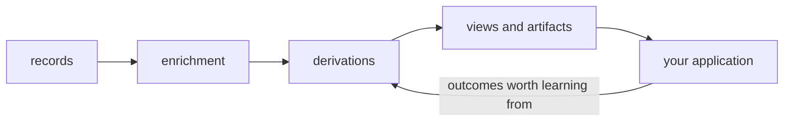
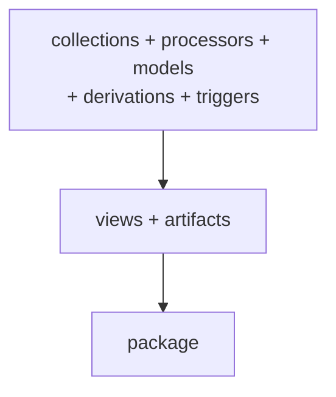

Memseek is a **declarative context engine for AI agents**: it turns changing
evidence into current, cited knowledge and assembles it for agents on demand.

Your app writes down what happens — messages, events, observations. Memseek
turns that raw stream into the context an agent should act on now:

- a **current profile that maintains itself**, instead of one your code has to
  keep patching,
- **context retrieval over everything ever recorded**, by meaning as well as by
  keyword,
- **prompt-ready context artifacts** assembled on demand under a token budget,
  so you stop hand-stuffing prompts.

Every fact Memseek concludes points back at the evidence behind it. Nothing is
ever silently overwritten. And the whole design is a few files of YAML you can
review the way you'd review a database migration.

The hierarchy is worth stating once, because the rest of these guides assume it:

1. **Memseek is a context engine** — it decides what an agent should know for
   the task in front of it.
2. **Durable memory is one core capability** inside it, not the whole product.
3. **[Derivations](derivations.md) maintain current state** from immutable
   evidence, and record what each conclusion superseded.
4. **[Views](views-search.md) retrieve relevant evidence**, by meaning and by
   keyword.
5. **[Artifacts](artifacts.md) assemble task-specific context** under a declared
   budget, with a manifest of exactly what went in.
6. **[MCP](mcp.md) and the [HTTP API](api-surface.md) deliver it to agents** —
   and decide which surfaces a given agent may see at all.

## How the pieces fit



Raw records come in. **Processors** enrich each one — score it, embed it,
classify it. **Derivations** combine enriched records into durable conclusions
like profiles and reflections. **Views** and **artifacts** hand those back to
your application as search results and finished prompts.

The loop at the bottom is what makes the system improve: when something an
agent did turns out badly, that outcome comes back as evidence — a
[learning signal](artifact-uses.md) that can draft a revision to the very
instructions that produced it, for a human to approve.

You describe each stage once, in YAML:



## Read in this order

New here? This path introduces the ideas before the configuration details.

1. [Getting started](getting-started.md) — run the service, publish a sample
   memory design, write a record, and read it back.
2. [Core concepts](concepts.md) — the data model: records, collections,
   entities, current facts, and history.
3. [Glossary](glossary.md) — the shared terms used throughout these guides,
   including the difference between a processor and a derivation.
4. [Catalog layout](catalog-layout.md) — build your own memory design, in the
   order the files depend on each other.
5. [Python SDK](sdk.md) or [HTTP API guide](api-surface.md) — connect the
   running service to your application.

If you are building an agent, read [MCP](mcp.md) after the API guide. It
explains how to expose only the tools that agent should have.

## Find the right page

| You want to… | Start with |
| --- | --- |
| Run the service locally | [Getting started](getting-started.md) |
| Understand a term used in these docs | [Glossary](glossary.md) |
| Understand the data model | [Core concepts](concepts.md) |
| Lay out your own memory design | [Catalog layout](catalog-layout.md) |
| Decide what a valid record looks like | [Collections](collections.md) |
| Configure LLMs, embeddings, and scores | [Model aliases](models.md) and [Processors](processors.md) |
| Turn raw evidence into a maintained profile | [Derivations](derivations.md) |
| Control when that reasoning runs | [Triggers](triggers.md) |
| Inspect what a run did, and approve its output | [Derivation execution and promotion](evaluation-bases.md) |
| Catch beliefs that disagree with each other | [Contradiction detection](contradiction-detection.md) |
| Save a search your whole app can reuse | [Views & search](views-search.md) |
| Model dependencies or relationships | [Graph data](graph-data.md) |
| Render prompts and reviewed snapshots | [Artifacts](artifacts.md) |
| Learn from what the agent actually did in production | [Artifact uses & feedback](artifact-uses.md) |
| Ship a complete, versioned memory design | [Packages](packages.md) |
| Integrate over HTTP | [HTTP API guide](api-surface.md) |
| Give an agent a curated set of tools | [MCP](mcp.md) |
| Use the async Python client | [Python SDK](sdk.md) |

## What makes it trustworthy

A memory system is only useful if you can trust what it tells you. Seven design
choices back that up.

- **Nothing is ever overwritten.** A correction is a new record that supersedes
  the old one; the old value stays in history. You can always ask "what did we
  believe last month, and why?"
- **Every conclusion is cited.** Records written by derivations point back at
  the evidence they came from — so "the customer committed to an August launch"
  is a traceable claim, not a guess.
- **Mistakes fail at deploy time, not in production.** A typo in a YAML key, a
  reference to something that doesn't exist, an option your model provider
  doesn't support — all of it stops before anything ships.
- **Old data never changes meaning.** Definitions carry exact versions
  (`customer_events@1`), and every record remembers which version it was written
  under, so shipping a new version cannot reinterpret old records.
- **Enrichment is a visible barrier.** Required enrichment must finish before a
  record can be searched or can set off reasoning. Optional enrichment fills in
  later without blocking. Nothing ever acts on a half-processed record.
- **Reasoning runs on a budget.** Every derivation declares up front what it
  reads, how many tokens and model calls it may spend, and how long it may run.
  No runaway loops, no surprise bills.
- **Results are reproducible.** The exact version of every definition is stamped
  onto every run and every rendered prompt, so any output traces back to what
  produced it — and a rollback is just republishing an earlier version.

## A small end-to-end shape

Two files, to show the scale of what a design actually looks like. One says
what a valid record is:

```yaml
# collections/events.yaml
collections:
  - name: customer_events
    version: 1
    active: true
    mode: event
    schema:
      type: object
      required: [text, channel]
      properties:
        text: {type: string}
        channel: {type: string}
    fields:
      channel: {path: content.channel, type: string, filter: true}
    search_profile: pg_default
```

The other bundles it for release:

```yaml
# packages/customer_memory.yaml
name: customer_memory
version: 1.0.0
collections: [customer_events@1]
search_profiles: [pg_default]
```

## Guides: real builds, end to end

Each guide is a runnable story built around a product you might actually be
shipping.

| You are building… | Guide |
| --- | --- |
| A sales copilot whose contact profiles maintain themselves, with every claim cited | [SDK CRM profile quickstart](sdk-user-profile-quickstart.md) |
| An agent whose production instructions improve from real outcomes, without deploying its own changes | [Real-LLM skill maintenance](skill-maintenance.md) |
| A multi-tenant SaaS where the memory design is code-reviewed and deployed per customer, like a schema migration | [Authoring a workspace catalog](authoring-definitions.md) |
| A long-running agent that observes, reflects, and forgets on request | [Generative Agents toy simulation](generative-agents-example.md) |

## What you need to run it

Memseek stores everything in **PostgreSQL 16 with pgvector**, which is the
system of record. **Turbopuffer** can optionally be added as an external search
index for larger corpora — it changes nothing about how you write your design.

For local development you do not need any model provider account: a built-in
deterministic fake stands in for the LLM and embedding calls, so the whole loop
runs offline and produces the same results every time. Real providers plug in
later by changing a model alias, not by changing your design.
