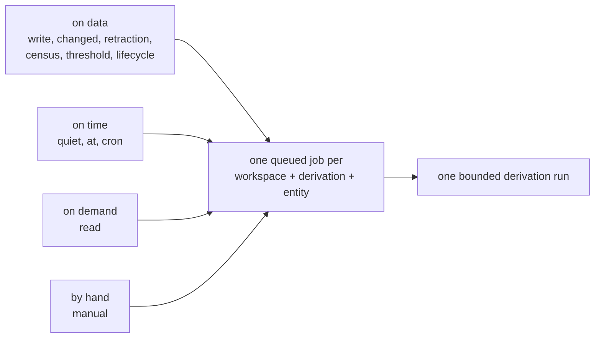

A trigger decides **when** a [derivation](derivations.md) runs. The derivation
decides **what** runs. Keeping those separate means you can change how often
reasoning happens without touching the reasoning itself.

A trigger is a named, versioned condition pointing at exactly one derivation. It
never does any work of its own, and it has no memory of its own progress.

That second point matters more than it sounds. You can attach several triggers
to the same derivation — "when something important is written, *and* nightly,
*and* whenever I ask" — and they do not race or duplicate work. All of them feed
a single queue entry per entity, and they all share that derivation's one
bookmark of how far it has read. Three triggers firing at once produce one run,
not three.

Some fields still use the older word *pipeline* for a derivation; see the
[Glossary](glossary.md#derivation-also-called-a-pipeline).



However many triggers fire, they coalesce into **one** job and **one** run.

## Taxonomy

A jump index to everything on this page. Conditions are grouped by the
question they answer; the machinery below applies to all of them. To pick a
condition by intent instead, see [Choosing a condition](#choosing-a-condition).

**[Data conditions](#data-conditions)** — react to records and standing state

| Condition | Fires when |
| --- | --- |
| [`write`](#write-react-to-matching-records) | A matching record arrives (the workhorse). |
| [`changed`](#changed-react-to-real-value-changes) | A keyed value actually changes, not a byte-identical rewrite. |
| [`retraction`](#retraction-react-to-tombstones) | A keyed value is retracted (a tombstone lands). |
| [`accumulator`](#accumulator-react-to-a-threshold) | Pending records aggregate past a metric threshold. |
| [`census`](#census-react-to-current-state) | Standing current state crosses a floor *and* new data arrived. |
| [`lifecycle`](#lifecycle-react-to-entity-milestones) | The entity is brand new, or its history reaches N records. |

**[Time conditions](#time-conditions)** — react to the clock

| Condition | Fires when |
| --- | --- |
| [`quiet`](#quiet-run-when-activity-settles) | A burst of activity has settled for `after_s` seconds. |
| [`at`](#at-run-at-a-records-datetime) | A datetime stored inside a record comes due. |
| [`cron`](#cron-run-on-a-schedule) | A wall-clock schedule fires. |

**Pull & operator**

| Condition | Fires when |
| --- | --- |
| [`read`](#read-stale-while-revalidate) | Someone reads the derived state (stale-while-revalidate). |
| [manual](#manual-runs) | An operator or application enqueues a run directly. |

**Machinery** — applies across every condition

- [The readiness gate](#the-readiness-gate) — why triggers only ever see ready rows
- [`where` predicates](#where-predicates) — filtering any scoped condition
- [One coalescing mailbox per entity](#one-coalescing-mailbox-per-entity) — how stimuli merge
- [Pacing: cooldown and debounce](#pacing-cooldown-and-debounce) — rate-limit and settle
- [Compile-time validation](#compile-time-validation) — what the catalog rejects
- [Observing triggers](#observing-triggers) — the surfaces that report trigger activity

## Where triggers live

There are two authoring locations with one condition schema.

**Inline.** The `trigger:` block inside a derivation document is sugar. Catalog
compilation normalizes it into a trigger named `<processor>.default`:

```yaml
name: profile
trigger:
  accumulator: {metric: importance, threshold: 100}
  cooldown_s: 60
```

**Standalone.** A file under `triggers/` is one mapping that names an existing
processor. It attaches additional conditions without copying any computation:

```yaml
name: profile.nightly
processor: profile
cron:
  expr: "0 3 * * *"
  entities: any
```

Trigger names match `^[a-z][a-z0-9._-]{0,63}$` and are immutable semantic
identities. Changing conditions under the same name requires a new name or an
explicit operator migration. When a trigger contributes a reason to a run, its
normalized hash is recorded in that run's definition references.

## Choosing a condition

Pick the condition by the question it answers. Conditions combine freely in
one trigger, and a processor may have many triggers.

| You want to run… | Condition | Reason string |
| --- | --- | --- |
| …when matching records arrive | [`write`](#write-react-to-matching-records) | `write` |
| …when a keyed value actually changes | [`changed`](#changed-react-to-real-value-changes) | `changed` |
| …when a keyed value is retracted | [`retraction`](#retraction-react-to-tombstones) | `retraction` |
| …when pending records accumulate past a threshold | [`accumulator`](#accumulator-react-to-a-threshold) | `threshold` |
| …when the entity's current state crosses a floor | [`census`](#census-react-to-current-state) | `census` |
| …when an entity is new, or has grown large | [`lifecycle`](#lifecycle-react-to-entity-milestones) | `lifecycle` |
| …once a burst of activity has settled | [`quiet`](#quiet-run-when-activity-settles) | `quiet` |
| …at a time written inside a record | [`at`](#at-run-at-a-records-datetime) | `at` |
| …on a wall-clock schedule | [`cron`](#cron-run-on-a-schedule) | `cron` |
| …because someone read the derived state | [`read`](#read-stale-while-revalidate) | `read` |
| …because an operator or application said so | [manual](#manual-runs) | `manual` |

Conditions absent from YAML are disabled. A declared trigger must enable at
least one condition. Manual execution requires no trigger at all. Two pacing
modifiers, [`cooldown_s` and `debounce_s`](#pacing-cooldown-and-debounce),
apply per trigger.

## The readiness gate

A record becomes trigger-visible only after it is ready
(`enriched_at IS NOT NULL`). Data conditions are evaluated inside the
transaction that marks records ready, so a trigger can never see an unready
row or enqueue work for a readiness transition that rolls back. PostgreSQL is
the only trigger truth; the external search index is never consulted.

`_system` run and erasure rows are trigger-silent audit records. Public
relation records — for example the rows emitted by
[contradiction detection](contradiction-detection.md) — activate ordinary
explicitly scoped triggers.

Most data conditions also declare a **record scope** — collections, types,
statuses, an optional keyed shape, and optional
[`where` predicates](#where-predicates). Scopes that *consume* records
(`write`, `changed`, `retraction`, `quiet`) must be a subset of the target's
driving source, so a triggering row can never sit forever above a cursor that
never consumes it. Observational scopes (`at`, `census`) may name any
collections. Omitted collection versions resolve to the active version.

---

## Data conditions

### `write`: react to matching records

```yaml
trigger:
  write:
    collections: [main]
    types: [observation]
    statuses: [active]
    where:
      importance: {gte: 0.8}                        # annotation-backed field
      tags: {contains_any: [commitment, deadline]}  # an array field you declared
```

The field names here are illustrative: `where` accepts any field the scoped
collections declare filterably (see [`where` predicates](#where-predicates)).
`tags` is not built in — it stands for an author-declared array field, and
`contains_any` works only because that field is an array.

A write condition fires when at least one ready matching record exists above
the target processor's cursor. It is evaluated on the ready transition and
again after every successful run, so one busy period drains in bounded
sequential batches without losing records that arrived mid-run.

This is the workhorse: use it whenever "new evidence arrived" is reason
enough to recompute.

#### `where` predicates

`where` filters on fields declared by the scoped collections, and is accepted
by every scoped condition (`write`, `changed`, `retraction`, `quiet`, `at`,
`census`). Every scoped collection version must declare the field with one
compatible filterable type, and annotation-backed fields must come from
**required** processors — optional annotations could change after readiness
and are rejected.

| Operator | Applies to | Meaning |
| --- | --- | --- |
| `exists` | any field | Field is present (`true`) or absent (`false`). |
| `eq` | scalar or array | Exact scalar equality, or exact array equality. |
| `in` | scalar | Value is one of the listed values. |
| `gt`, `gte`, `lt`, `lte` | scalar | Typed comparison for number, integer, datetime, or string. |
| `contains_any` | array | At least one listed value is an element. |
| `contains_all` | array | Every listed value is an element. |

### `changed`: react to real value changes

```yaml
trigger:
  changed:
    collections: [profiles]
    statuses: [active]
    keys: [role, commitments]      # optional; omit to watch every key
    transitions: [added, changed]  # default: [added, changed, removed]
```

A changed condition watches **keyed heads**. It fires only when a ready keyed
record above the watermark differs from the previous head for the same
collection and key:

| Transition | Meaning |
| --- | --- |
| `added` | No previous head existed, or the previous head was a tombstone. |
| `changed` | The previous head existed and the content differs. |
| `removed` | The new record is a tombstone retracting a live head. |

A byte-identical rewrite is `unchanged` and never fires. This is the precise
form of cross-derivation chaining: "when `profiles.role` actually changes,
re-derive the skills summary" — without re-firing every time an upstream
derivation re-emits the same value.

The field name is `transitions`, not `on`: unquoted `on` is a YAML boolean
and would silently become `true`.

### `retraction`: react to tombstones

```yaml
trigger:
  retraction:
    collections: [profiles, plans]
    statuses: [active]
```

#### What a tombstone is

A **keyed** collection holds one current value per `(entity, collection, key)`
slot — the latest active row by sequence wins, and older rows stay in history.
So a slot like `profiles.role` always has exactly one live answer.

The question is: how do you *remove* that answer? You never destructively
delete a keyed row. Instead you write a **new version of the slot whose only
job is to say "this key no longer holds a value."** That successor record is a
**tombstone**. It becomes the current head, so the belief is gone from the
present while the full edit history — including the tombstone itself — is
retained. It is a soft delete, not a `DELETE`.

A tombstone is unusual as records go:

| Property | Tombstone |
| --- | --- |
| Content | Canonical, system-written: `content.tombstone = true`, empty text. |
| Provenance | Keyed, and requires at least one parent (the head it retracts). |
| Readiness | Ready the instant it commits — there is no text to embed or score. |
| Visibility | Omitted from `/document` beliefs and default search; surfaced in the `retractions` list, `/history`, and `/delta` so caches can drop the key. |

You do not hand-write the `tombstone` field. Two paths produce one:

- **From a derivation** — emit the key with `retract: true` (supplying neither
  `text` nor `content`); the system writes the standard retraction record for you.
- **From the API** — insert with `tombstone=true`, which requires a `key`,
  empty text, and at least one parent.

The retraction marker is system-owned. The runtime writes its minimal
shape and does not apply the normal collection content schema or declared
fields to that retraction row; public `content` may not set `tombstone` or
carry any additional content. A collection schema may declare the marker for
clarity, but does not need to do so.

Tombstones are soft deletes by default. A package may opt a keyed collection
into delayed, permanent removal with a worker-only
[tombstone retention policy](packages.md#tombstone-retention). That policy
uses `created_at` rather than a timestamp you supply, and hands off to the same erasure path as everything else.

#### The trigger

A retraction condition fires when a ready tombstone lands above the watermark
within its scope. Declare it on repair derivations that must rebuild summaries,
reflections, or downstream state after a belief is withdrawn.

It is equivalent to `changed` with `transitions: [removed]` but reads as
intent. Note that *erasure* restores prior heads without writing new rows, so
erasure is not a retraction stimulus; pair with `cron: {entities: dirty}` when
erasure repair must also be automatic.

### `accumulator`: react to a threshold

```yaml
trigger:
  accumulator: {metric: importance, threshold: 100}
```

An accumulator condition aggregates ready records that match the derivation's
**driving source** scope above the watermark and fires when the metric
crosses the threshold. Four metric forms are accepted:

| Form | Meaning |
| --- | --- |
| `metric: count` | Count matching records. |
| `metric: <scorer>` | Shorthand for `sum` over `scores.<scorer>`. |
| `metric: {scorer: <name>, aggregate: …}` | Aggregate one score. |
| `metric: {annotation: <name>, path: <dotted.path>, aggregate: …}` | Aggregate one leaf of a required annotation. |

`aggregate` is one of `sum`, `count`, `avg`, `max`, `min`, or
`distinct_count`, and `comparison` is `gte` (default) or `lte`:

```yaml
# One sufficiently important event fires immediately.
accumulator:
  metric: {scorer: importance, aggregate: max}
  threshold: 9

# Mood drift: average sentiment of pending events fell below the floor.
accumulator:
  metric: {annotation: sentiment_v1, path: valence, aggregate: avg}
  threshold: -0.25
  comparison: lte
```

The condition never fires when no matching rows exist above the watermark, so
an `lte` comparison cannot loop on an empty backlog. Missing numeric values
contribute zero to `sum`; `avg`, `max`, and `min` ignore them and do not fire
when every value is missing. A `gte` threshold must be positive; an `lte`
threshold may be any finite number. Nothing is explicitly reset — a
successful run advances the watermark, which is the reset. This is the
classic reflection pattern: accumulate importance until it justifies an LLM
pass.

### `census`: react to current state

```yaml
trigger:
  census:
    collections: [relations]
    types: [contradiction]
    statuses: [active]
    threshold: 3
```

A census condition counts the entity's **current** matching records — the
latest head per key for keyed rows, every row for event rows, tombstones
excluded — and fires when the count reaches `threshold` *and* new
driving-source data arrived above the watermark. Unlike every other data
condition it looks at total standing state, not just pending rows.

The freshness guard is what keeps it sound: a standing census can never
re-enqueue itself after its own run, because the run consumes the driving
rows that armed it. Read it as "when new data arrives *and* there are already
at least N …".

Use it for state-shaped thresholds: "≥ 3 open contradictions → run
reconciliation", "≥ 5 unprocessed complaints on file → escalate summary".
The census scope may name any collections — it observes state rather than
consuming it.

### `lifecycle`: react to entity milestones

```yaml
trigger:
  lifecycle:
    first_record: true
```

```yaml
trigger:
  lifecycle:
    total_records: 500
```

A lifecycle condition watches the entity's relationship to the derivation
rather than any one record:

- `first_record` fires when driving-source data exists and the derivation has
  **never successfully run** for this entity — the bootstrap moment. Use it
  to initialize profile slots or seed onboarding state the moment a new
  entity appears.
- `total_records: N` fires when the driving source's total matching history
  reaches N records *and* new data arrived. Use it as a compaction cue: the
  spec's answer to "the complete history no longer fits one snapshot run" is
  a compacted upstream collection, and this condition tells you when to build
  it.

Both forms are gated on fresh driving-source data, so neither can re-fire
after its own run without new records.

---

## Time conditions

### `quiet`: run when activity settles

```yaml
trigger:
  quiet:
    collections: [main]
    types: [chat]
    statuses: [active]
    after_s: 900
```

A quiet condition fires once matching records exist above the watermark **and
no further matching record has arrived for `after_s` seconds**. Every
matching ready arrival pushes the shared job deadline forward to
`now + after_s`; when the burst ends, the deadline stops moving and the run
executes exactly once over the whole batch.

This is the episodic-memory primitive: summarize a conversation when the user
goes quiet, close a session, consolidate an episode — one run at the natural
boundary instead of one per message or a polling cron.

Two properties worth knowing:

- The settle deadline extends the shared mailbox. A later non-quiet stimulus
  with an earlier permitted time (a manual run, a plain write trigger) can
  still pull the job earlier; quiet then simply re-arms for whatever arrives
  next.
- `after_s` accepts 1 second through 7 days.

### `at`: run at a record's datetime

```yaml
trigger:
  at:
    collections: [calendar_events]
    statuses: [active]
    field: starts_at
    offset_s: -3600      # one hour before; positive offsets run after
```

An at condition schedules the run from a **datetime stored in the records
themselves**. `field` must be a filterable datetime scalar declared by every
scoped collection version (content-backed or required-annotation-backed).
Among matching ready records, the earliest deadline
(`field + offset_s`) that has not yet been handled becomes the job's
`run_after`.

A deadline is *handled* once a successful run completes at or after it.
Post-run re-evaluation then schedules the next future deadline, so a chain of
future-dated records produces a chain of on-time runs with no polling.

This unlocks prospective memory: reminders, commitment due-dates, follow-ups,
belief expiry ("re-verify this fact when `expires_at` passes"). Two authoring
notes:

- The at scope is observational — it need not be consumable by the driving
  source. Since a `changes` cursor may have consumed the dated record long
  before its deadline, read the dated records through a `snapshot`,
  `current`, or `view` source so the run can see them at fire time.
- Any successful run for the processor handles all deadlines at or before its
  completion — the coalescing guarantee is one current-state refresh, not one
  run per record.

### `cron`: run on a schedule

```yaml
trigger:
  cron:
    expr: "0 3 * * *"
    entities: dirty
```

`expr` is a standard cron expression evaluated in UTC. `entities` selects the
scan population:

- `dirty` (default) — only entities with matching driving-source records above
  their cursor;
- `any` — every non-system entity ever seen in the workspace.

Cron scans are persisted, deduplicated jobs keyed by
`cron:<processor>:<scheduled-time>`. The scheduler records the last completed
bucket and backfills missed buckets after a restart, bounded by
`MAX_CRON_CATCHUP`; a brand-new schedule starts at its latest due bucket
rather than replaying history. A scan pages entities in lexical order, 500 per
page, chaining a follow-up job per page — progress is durable and a restart
never silently truncates a large scan.

Pair `entities: any` with a driving source declaring `allow_empty: true` for
absence-style derivations that must run from guarded state and time alone, such
as "flag accounts with no activity this week".

---

## `read`: stale-while-revalidate

```yaml
trigger:
  read: true
```

Data and time conditions are push: they react when data arrives or time
passes, whether or not anyone consumes the result. A read condition is pull:
the derivation is refreshed **because someone read it**. Declare it when
derived state only needs to be current at the moment of consumption, so
entities nobody reads never spend a run.

The commitment is stale-while-revalidate, never a synchronous derivation.
`GET /document`:

1. assembles the document from current keyed rows and returns it
   immediately, whatever its age;
2. computes `freshness` per read-triggered derivation — watermark, dirtiness,
   last successful completion, job state;
3. enqueues or coalesces a derive job when revalidation is warranted, writing
   only the durable queue entry — no task or model work happens while your request is waiting;
4. reports what it did in `freshness`.

Two independent signals warrant revalidation:

| Signal | Meaning |
| --- | --- |
| dirty | Matching driving-source records exist above the watermark: the output is behind its inputs. |
| stale | The last successful run is older than the request's `max_staleness` seconds, or the derivation never ran — even with no new inputs. |

Staleness tolerance belongs to the caller, not the catalog: each request
picks its own `max_staleness`, and omitting it means only dirtiness
revalidates. A stale-but-clean revalidation is cheap — with
`allow_empty: false` the run finds no driving rows and completes as an
audited noop, refreshing `last_run_at` without executing tasks.

### A concrete timeline

Take a `profile` derivation with `trigger: {read: true, cooldown_s: 60}`. Its
last successful run for `user:mia` finished at 09:00, consuming through
sequence 40.

| Time | What happens |
| --- | --- |
| 09:14 | Three chat events ingest and become ready (seq 41–43). Nothing runs: there is no write condition and nobody has read the profile. |
| 09:15:00 | An agent calls `GET /document?entity=user:mia&max_staleness=900`. It receives the 09:00 profile immediately, with `dirty: true` and `job: "enqueued"` — the read itself enqueued the job. Concurrent reads coalesce into the same job. |
| 09:15:02 | A worker claims the job, runs the derivation over seq 41–43, commits the updated slots, and advances the watermark to 43. |
| 09:15:30 | The next read returns the refreshed profile: `dirty: false`, `job: null`. |
| 13:00 | A read arrives after hours of silence. `dirty` is false, but `last_run_at` is older than 900 seconds, so it revalidates anyway; the run is a cheap noop that refreshes `last_run_at`. |

The `freshness` entry the 09:15:00 caller sees:

```json
{
  "derivation": "profile",
  "last_run_at": "2026-07-19T09:00:00Z",
  "watermark": 40,
  "dirty": true,
  "pending_unready": false,
  "job": "enqueued",
  "error_kind": null
}
```

`pending_unready: true` reports that the oldest pending input is still
awaiting enrichment, so the enqueued run will wait rather than skip it. A
dead-lettered derive job is reported as `job: "dead"` until a later
successful run supersedes it; a manual run is the retry lever.

## Manual runs

Every derive processor can be enqueued directly, with or without triggers:

```bash
curl -sS -X POST http://127.0.0.1:8000/processors/profile/run \
  -H "$MEMSEEK_AUTH" -H 'content-type: application/json' \
  -d '{"entity": "contact:avery-chen"}'
```

The response reports the job ID, whether the request coalesced into an
existing job, and the effective `run_after`. An optional timezone-aware
`run_after` defers execution. Manual requests use the reason `manual` and
bypass cooldown, which also makes them the operator's retry lever after a
dead-lettered job.

## One coalescing mailbox per entity

All stimuli converge on at most one active job per
`(workspace, processor, entity)`. The job payload stores each reason as a
monotonic boolean key — `trigger:profile.default:threshold`,
`trigger:profile.nightly:cron`, `manual` — so concurrent stimuli merge without
counters. The committed run stores the sorted reason strings as
`trigger_reasons`.

When stimuli disagree about timing, the merge rule depends on the stimulus:

- most stimuli keep the **earliest** permitted `run_after`;
- settle-style stimuli — `quiet`, and any condition under `debounce_s` —
  **extend** the shared deadline instead, so an ongoing burst keeps pushing
  the run out until it ends.

Coalescing is a mailbox, not proof that every stimulus was consumed. After
every successful run the runtime re-evaluates every trigger targeting that
processor against the advanced watermark; records that arrived during the run
enqueue a successor, and the next pending `at` deadline re-arms. The
guarantee is one current-state refresh, not one LLM call per stimulus — and
no stimulus is ever dropped.

## Pacing: cooldown and debounce

```yaml
trigger:
  write: {collections: [main], statuses: [active]}
  cooldown_s: 300   # at most one run per 5 minutes after a success
  debounce_s: 30    # and let arrivals settle for 30 s before running
```

The two modifiers pace a trigger from opposite ends:

| Modifier | Question it answers | Mechanics |
| --- | --- | --- |
| `cooldown_s` | "Not again *so soon after the last run*." | Pushes `run_after` to `last success + cooldown_s`. Trailing-edge rate limit. |
| `debounce_s` | "Not yet — *the burst may not be over*." | Pushes `run_after` to `now + debounce_s` and extends it while stimuli keep arriving. Leading-edge settle window, up to 7 days. |

Both delay work; neither drops data. A stimulus that fires early coalesces
with its `run_after` pushed to the due time; reasons still cooling remain
discoverable from the records and are re-evaluated after the run. Manual runs
bypass cooldown.

`debounce_s` applies to the data conditions (`write`, `accumulator`,
`changed`, `retraction`, `census`, `lifecycle`). It never delays `read` (a
pull should answer promptly), `cron` (already scheduled), or `at` (the record
names its own time); `quiet` carries its own `after_s`. Prefer `quiet` when
"the burst ended" is the *reason* to run; use `debounce_s` when another
condition is the reason and you only want to avoid re-running inside a
chatty window.

## Compile-time validation

Catalog compilation rejects, before anything runs:

- a declared trigger with no enabled conditions;
- an invalid cron expression;
- a consuming scope (`write`, `quiet`, `changed`, `retraction`) that is not a
  subset of the target's driving source, including non-consumable collection
  versions;
- `where` fields that are undeclared, incompatibly typed, non-filterable, or
  backed by optional annotations — on any scoped condition;
- an `at` field that is not a filterable datetime scalar declared by every
  scoped collection version;
- an accumulator metric that names an unknown scorer or annotation leaf, a
  non-numeric leaf under a numeric aggregate, both a scorer and an
  annotation, or a non-positive `gte` threshold;
- a `changed` or `retraction` scope declared `keyed: false`, or a `lifecycle`
  block with neither `first_record` nor `total_records`;
- a standalone trigger naming an unknown processor;
- two triggers sharing one name; and
- cycles in the automatic dependency graph — every scoped condition
  contributes edges, so trigger → derivation → emission chains cannot
  self-feed indefinitely.

## Observing triggers

| Surface | What it shows |
| --- | --- |
| `GET /triggers` | The normalized trigger catalog — inline defaults plus standalone files — with every condition and semantic hashes. |
| `GET /document` | Per-entity `freshness` for every read-triggered derivation. |
| `GET /runs`, `GET /runs/{id}` | The `trigger_reasons` that produced each run. |
| `GET /jobs/{job_id}` | Queued, running, retrying, or dead-lettered job state. |

## Next

- Author the computation triggers schedule: [Derivations](derivations.md)
- Understand runs, receipts, and commits:
  [Runtime receipts and Candidate Sets](evaluation-bases.md)
- Operate the queue: [Operations](operations.md)
